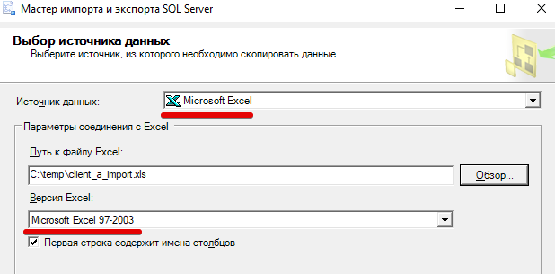
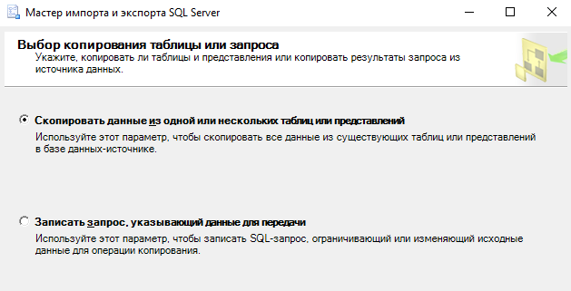

<table><tr>
<td><a href="../articles/demo_restore_from_sql.md"> Восстановление БД</a></td>
<td><a href="../articles/demo_toc.md">Содержание</a></td>
<td><a href=""></a></td>
<tr></table>

# Импорт данных

>Файлы я грузил в алфавитном порядке, но получилось ещё и в порядке возрастания сложности. Если подсчёт баллов будет аналогичен предыдущему демо-экзамену, то за первый файл будет 1 балл, а за остальные по 2.

* [Импорт клиентов](#Импорт-клиентов)
* [Импорт услуг](#Импорт-справочника-услуг)
* [Импорт оказанных услуг](#Импорт-оказанных-услуг)

Перед импортом подгатавливаем данные (информация в файлах данных намеренно искажена: могут быть "кривые" даты, ФИО без разделения по полям, более 2-х вариантов у логических полей, слово "руб" в цене и т.п.)

>Если при загрузке файла в Excel *мастер импорта* не открылся и показывает "кракозябры", то можно принудительно вызвать мастер: *Данные - Получение внешних данных - Из текста*
>
>

## Импорт клиентов 

>Файл client_a_import.txt

1. Подготовка данных

    * обращаем внимание на кодировку файла, текст должен быть читаемым. На просторах exUSSR могут встретиться форматы: UTF-8, Windows-1251, CP866

        

    * разделитель полей обычно запятая, но могут быть и другие - смотрите что в файле:

        

    * в этом файле разные обозначения пола ("м" и "мужской") и некоторые ФИО без разделителей - правим ручками. Не забываем убирать лидирующие и замыкающие пробелы. Если поля с датами не соответсвует шаблону `YYYY-MM-DD`, то сделать эти поля типом "дата" и задать шаблон, чтобы при загрузке поля нормально распарсились.

    * сохраняем как "Книга Excel 97-2003" (не обязательно именно эта версия, главное чтобы вы точно знали в каком формате сохранили)

        

2. Загрузка во временную таблицу

    Как я уже писал, просто загрузить теперь не получится.

    Придется сначала загрузить в НОВУЮ таблицу *client_a_import*, а затем перенести в нужную таблицу запросом `INSERT ... SELECT ...`

    * В контекстном меню **базы данных** *Задачи -> Импорт данных*

        


    * выбор источника данных

        Источник данных: *Microsoft Excel*

        Версия Excel: *Microsoft Excel 97-2003* (та, в которой вы сохранили)

        

    * выбор назначения

        Назначение: *SQL Server Native Client...*

        Имя сервера/Имя пользователя/Пароль/База данных: дадут на демо-экзамене

        

    * Выбор копрования... - оставляем по-умолчанию 

        

    * Выбор исходных таблиц...

        Убираем спец.символы из названия таблицы назначения

        

        

    Дальше всё по-умолчанию

3. Перенос данных

    Перед переносом меняем типы полей у "даты рождения", "даты регистрации" и "пола", чтобы они соответствовали типам в таблице "Client".

    В таблицу *Gender* внестите справочные данные 

    

    Для переноса данных используем SQL-запрос:

    ```sql
    INSERT INTO [Client] (FirstName, LastName, Patronymic,Birthday, RegistrationDate, Email, Phone, GenderCode) 
    SELECT * FROM client_a_import
    ```

    Обратите внимание! Из таблицы *client_a_import* мы читаем все поля в том порядке, в котором они описаны (\*). Поэтому список загружаемых в таблицу *Client* полей (FirstName,LastName,Patronymic...) пишем в том порядке, который в таблице *client_a_import*

## Импорт справочника услуг

>Файл service_a_import.csv

Обратите внимание, в этом файле разделители точка с запятой:


1. В таблице *Service* поле продолжительность целое в **секундах**. 

    

    А наши данные в часах и минутах...

    Пишем формулу в Excel-е:

    ```
    =ЛЕВСИМВ(C2;НАЙТИ(" ";C2;2)-1)*ЕСЛИ(ПРАВСИМВ(C2;4)="час.";3600;60)
    ```

    * функция `НАЙТИ(" ";C2;2)` ищет в строке (ячейка C2) **пробел** начиная со 2-го символа (первые у меня все пробелы, сам не сделал обрезку пробелов)

    * `ЛЕВСИМВ(ячейка; количество)` - возвращает левую часть строки с количеством символов, которое мы посчитали предыдущей функцией

    * `ПРАВСИМВ(C2;4)` делает то же самое справа, только тут мы используем фиксированное количество знаков (4)

    * `ЕСЛИ(условие;3600;60)` возвращает 3600 если справа **час.** и 60, если **мин.**

    В итоге число слева умножается на количество секунд в часе и минуте соответственно и получаем нужную цифру

    Два поля нам в таблице не нужны, поэтому копируем столбец с секундами и *специальной вставкой* вставляем только текст без формул, а исходный столбец и столбец с формулами удаляем

    

2. Убираем "рублей" и "руб." в поле "Стоимость" (Поиск и замена `Ctrl+F`)

    

3. В поле "Действующая скидка" меняем формат ячеек на "Проценты" и слова "нет" на цифру "0"

4. Сохраняем как книгу Excel (нам тут важны проценты)

    

5. Загружаем в базу как в предыдущем примере

    

    Обратите внимание, поле "проценты" автоматически преобразовалось в число (если бы мы не установили тип ячеек, то тут были бы строки типа "25%")

    

    Тип поля "проценты" нас устраивает, а вот стоимость нужно перевести в тип "money" и "продолжительность" в целое

    

6. Переносим данные в таблицу Service SQL-запросом (учитывая порядок полей в исходной таблице)

    ```sql
    INSERT INTO [Service] (Title, MainImagePath, Cost, Discount, DurationInSeconds)
    SELECT * FROM service_a_import
    ```

## Импорт оказанных услуг

>Файл `serviceclient_a_import.xlsx`

1. Убеждаемся, что ячейки с датой содержат формат даты

    

2. Грузим как обычно (не забывая *сохранить как* в нужной версии)

3. Перенос данных в таблицу *ClientService*

    Проблем с загрузкой здесь нет, но это компенсируется повышенной сложностью переноса. Дело в том, что в таблице *ClientService* два поля с внешними ключами (*ClientID*, *ServiceID*). То есть мы должны в неё загружать не названия, а ключи из соответствующих таблиц

    

    Сначала переобзовём поля во временной таблице (делать это не обязательно, но писать длинные русские названия влом):

    

    Пишем запрос вставки данных:

    ```sql
    -- в [] скобках пишутся названия таблиц или столбцов, которые совпадают с ключевыми словами MsSQL
    INSERT INTO ClientService (ClientID, ServiceID, StartTime)
    SELECT c.ID, s.ID, sc.[begin] 
	    FROM serviceclient_a_import sc, [Client] c, [Service] s
	    WHERE sc.[name]=s.Title AND sc.client=c.FirstName
    ```

    И смотрим внимательно сколько строк будет загружено. Если вы при подготовке данных не уберете пробелы до или после фамилии, то в выборку такие записи не попадут и, соответственно, не будут загружены.

    На данном этапе трепыхаться с повторной загрузкой уже не стоит. Можно просто выполнить SQL-запрос, перечислив все текстовые поля:

    ```sql
    UPDATE [Client] SET FirstName=TRIM(FirstName), Email=TRIM(Email), Phone=TRIM(Phone)
    ```

    Функция *TRIM* как раз обрезает пробелы.

    Затем удалить все записи из *ClientService*

    ```sql
    delete from ClientService
    ```

    И повторить запрос вставки (если не удалить загруженные в прошлый раз данные, то будут дубли).

    ```
    (затронуто строк: 100)
    ```

## Завершение загрузки

***УДАЛЯЕМ*** временные таблицы (*client_a_import*, *service_a_import*, *serviceclient_a_import*). Если этого не сделать, то могут насчитать штрафных баллов за не нормализованную БД.

<table><tr>
<td><a href="../articles/demo_restore_from_sql.md"> Восстановление БД</a></td>
<td><a href="../articles/demo_toc.md">Содержание</a></td>
<td><a href=""></a></td>
<tr></table>
