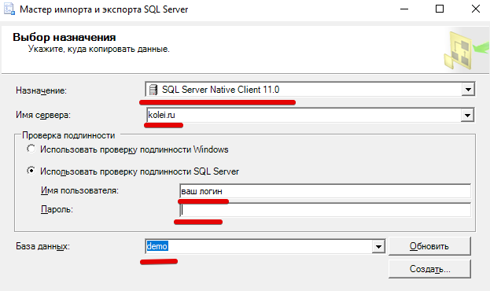

<table><tr>
<td><a href="../articles/demo_restore_from_sql.md"> Восстановление БД</a></td>
<td><a href="../articles/demo_toc.md">Содержание</a></td>
<td><a href=""></a></td>
<tr></table>

# Импорт данных

1. Подгатавливаем данные (информация в файлах данных намеренно искажена: могут быть "кривые" даты, ФИО без разделения по полям, более 2-х вариантов у логических полей, слово "руб" в цене и т.п.)

    Рассмотрим на примере файла `client_a_import.txt`:

    * обращаем внимание на кодировку файла, текст должен быть читаемым. На просторах exUSSR могут встретиться форматы: UTF-8, Windows-1251, CP866

        

    * разделитель полей обычно запятая, но могут быть и другие - смотрите что в файле:

        

    * в этом файле разные обозначения пола ("м" и "мужской") и некоторые ФИО без разделителей - правим ручками. Не забываем убирать лидирующие и замыкающие пробелы. Если поля с датами не соответсвует шаблону `YYYY-MM-DD`, то сделать эти поля типом "дата" и задать шаблон, чтобы при загрузке поля нормально распарсились.

    * сохраняем как "Книга Excel 97-2003" (не обязательно именно эта версия, главное чтобы вы точно знали в каком формате сохранили)

        

2. Загрузка во временную таблицу

    Как я уже писал, просто загрузить теперь не получится.

    Придется сначала загрузить в НОВУЮ таблицу *client_a_import*, а затем перенести в нужную таблицу запросом `INSERT ... SELECT ...`

    * В контекстном меню **базы данных** *Задачи -> Импорт данных*

        


    * выбор источника данных

        Источник данных: *Microsoft Excel*

        Версия Excel: *Microsoft Excel 97-2003* (та, в которой вы сохранили)

        

    * выбор назначения

        Назначение: *SQL Server Native Client...*

        Имя сервера/Имя пользователя/Пароль/База данных: дадут на демо-экзамене

        

    * Выбор копрования... - оставляем по-умолчанию 

        

    * Выбор исходных таблиц...

        Убираем спец.символы из названия таблицы назначения

        

        

    Дальше всё по-умолчанию

3. Перенос данных

    Перед переносом меняем типы полей у "даты рождения", "даты регистрации" и "пола", чтобы они соответствовали типам в таблице "Client".

    В таблицу *Gender* внестите справочные данные 

    

    Для переноса данных используем SQL-запрос:

    ```sql
    INSERT INTO [Client] (FirstName, LastName, Patronymic,Birthday, RegistrationDate, Email, Phone, GenderCode) 
    SELECT * FROM client_a_import
    ```

    Обратите внимание! Из таблицы *client_a_import* мы читаем все поля в том порядке, в котором они описаны (\*). Поэтому список загружаемых в таблицу *Client* полей (FirstName,LastName,Patronymic...) пишем в том порядке, который в таблице *client_a_import*

Аналогично загружаем остальные данные.

>Не обязательно грузить *TXT* и *CSV* файлы через Excel. Можно загрузить их и как *неструктурированные данные*. Но в этом случае нужно убедиться что файлы в кодировке **UTF-8** и даты в нормальном виде.

<table><tr>
<td><a href="../articles/demo_restore_from_sql.md"> Восстановление БД</a></td>
<td><a href="../articles/demo_toc.md">Содержание</a></td>
<td><a href=""></a></td>
<tr></table>
