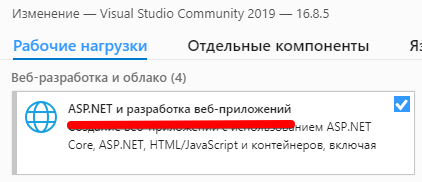

# Разное

Задания, разбираемые в этой части, взяты из WorldSkills. Т.е. они вполне могут появиться и на Демо-экзамене.

- [Интернет запросы, разбор JSON](#Интернет-запросы-разбор-JSON)

## Интернет запросы, разбор JSON

>**Работа со штрафами**
>
>Для организации работы со штрафами Вам предстоит получать данные с сервера в формате JSON с пакетом штрафов на транспортные средства или водительские удостоверения. Вашей задачей является сохранение этих данных и их привязка к  существующим в базе транспорту и водителям. Некоторые данные могут приходить без распознанного номерного знака. В таком случае Вам необходимо предусмотреть интерфейс, в котором инспектор может самостоятельно просмотреть изображение и вписать номер, если его возможно распознать. В случае, если номер невозможно распознать, необходимо отправить соответствующий запрос на сервер. 
Всю информацию по работе с сервером можете подробнее узнать в файле api_info.

Я не стал делать реализацию этого API. У нас есть API работы с сервером MsSQL, на котором расположены ваши базы:

```http
http://kolei.ru/api/<ваш логин>/<название таблицы>
```

Например, запрос `http://kolei.ru/api/ekolesnikov/sklad` вернет содержимое таблицы Sklad:

```json
{"success":true,"data":[{"Num":1,"Adress":"д.Крутово","Vid":"сыпучие","Rast":5},{"Num":2,"Adress":"пос.Веканово ","Vid":"отделочные","Rast":10},{"Num":3,"Adress":"пос.Заскочиха","Vid":"отделочные","Rast":15},{"Num":4,"Adress":"д.Орлово","Vid":"отделочные","Rast":8},{"Num":5,"Adress":"д.Комарова","Vid":"кирпич","Rast":12}]}
```

### Интернет запросы

Для посылки простого GET-запроса (и получения данных) можно вопользоваться WebClient-ом:

```cs
var client = new WebClient();
// вам в URL-е нужно прописать свои названия баз и таблиц
var ResponseBuffer = client.DownloadData("http://kolei.ru/api/ekolesnikov/Sklad");

// можно получить строку и вывести ее в TextBox
var ResponseString = Encoding.UTF8.GetString(ResponseBuffer);
ResponseTextBox.Text = ResponseString;
```

Если по ТЗ нужно передавать какие-то параметры в GET-запросе, то их добавляют прямо в URL. Параметры от адреса запроса отделяются символом `?` (вопрос), а друг от друга символом `&`:

```http
http://kolei.ru/api/ekolesnikov/Sklad?first=первый параметр&second=второй параметр&other=следующие параметры
```

В примере выше мы получили JSON-строку, а нам в программе нужны классы. Для преобразования JSON в объекты есть класс сериализации.

C# может автоматически сгенерировать классы по имеющейся JSON-строке. Но для этого должен быть установлен компонент "ASP.NET и разработка веб-приложений"



### Десериализация

* Откройте вашу ссылку (у меня это `http://kolei.ru/api/ekolesnikov/Sklad`) в браузере. 
* Скопируйте полученный текст в буфер обмена.
* В *Visual Studio*, находясь в классе окна работы с данными, откройте пункт меню *Правка - Специальная вставка - Вставить JSON как классы*. Visual Studio сгенерирует вам в текущем файле два класса:

    ```cs
    public class Rootobject
    {
        public bool success { get; set; }
        public Datum[] data { get; set; }
    }

    public class Datum
    {
        public int Num { get; set; }
        public string Adress { get; set; }
        public string Vid { get; set; }
        public int Rast { get; set; }
    }
    ```
* Теперь, имея классы, можно делать десериализацию:

    ```cs
    var serializer = new DataContractJsonSerializer(typeof(Rootobject));

    // сериализуем полученный ответ сервера (обратите внимание, не строку, а буфер)
    var respObj = serializer.ReadObject(new MemoryStream(ResponseBuffer));
    if((respObj as Rootobject).success)
    {
        foreach(Datum item in (respObj as Rootobject).data)
        {
            // тут уже делаем то, что требуется по ТЗ
            // я просто вывожу в TextBox адреса складов
            ResponseTextBox.Text += $"{item.Adress}\n";
        }
    }
    ```
