# Программирование

+ [Создание приложения](#Создание-приложения)
+ [Фреймы, страницы, таймер](#Фреймы-страницы-таймер)
+ [Стили, иконки, логотипы](#Стили-иконка-логотип)
+ [Создание модели даных](#Создание-модели-даных)
* [Список услуг/товаров](#Список-услуг/товаров)
    + [Отображение списка услуг в табличном виде с выводом миниатюр (изображений)](#Отображение-списка-услуг-в-табличном-виде)
    + [Режим администратора](#Режим-администратора)
        + модальное окно (создание, возвращаемый результат)
        + обратная связь с окном (INotifyPropertyChanged)
        + условное отображение кнопок в панели и в *DataGrid*-е
    - ~~Макет "плиткой"~~
    + [Сортировка](#Сортировка)
    + [Фильтры](#Фильтры)
    + [Поиск](#Поиск) (по нескольким полям)
    + [Количество отображаемых записей](#Количество-отображаемых-записей)
    + [Удаление](#Удаление) (с проверкой)
* [Добавление и редактирование услуг](#Добавление-и-редактирование-услуг)
    - проверка на дубль по названию
* Дополнительные фото (CRUD)
* [Запись на услугу](#Запись-на-услугу)
* [Ближайшие записи](#Ближайшие-записи)
    - выделение цветом по времени
    - автообновление 

## Создание приложения

Тип приложения: **WPF, .NET Framefork**

**Внимание!** По **заданию** название приложения (т.е. проекта) должно совпадать с названием огранизации. Русскими буквами, конечно, писать не нужно. Пишите латиницей либо русскую транскрипцию либо по-английски. Например: DoeduSam, SchoolGreatBritain...

>Нигде в задании не нашел как называется компания, пусть будет *AutoService*

В *WPF* подразумевается использование фрейма (*Frame*) с навигацией по страницам (*Page*) и если вы будете использовать этот механизм, то получите сколько то баллов, но можно не мудрить и прямо на главном окне показывать **DataGrid** с основной таблицей (в нашем задании это услуги). А дополнительные таблицы открывать в новых окнах.

Для начала разметка должна быть примерно такой:

```xml
        ...
        Title="Услуги авто сервиса" 
        MinHeight="300" MinWidth="300"
        Height="450" Width="800">
    <Grid>
        <Grid.ColumnDefinitions>
            <ColumnDefinition Width="150"/>
            <ColumnDefinition Width="1*"/>
        </Grid.ColumnDefinitions>

        <StackPanel 
            Orientation="Vertical"
            Margin="5"
            VerticalAlignment="Bottom">
            <Button 
                x:Name="ExitButton"
                Content="Выход"
                Click="ExitButton_Click"/>
        </StackPanel>
    </Grid>
</Window>
```

Сразу задали название окна, разбили *Grid* на две колонки, задали минимальный размер окна (минимальная ширина больше левой колонки, остальное пока не важно)

В компоненте *StackPanel* я задал границу (*Margin*), чтобы кнопки не прилипали к границам грида.

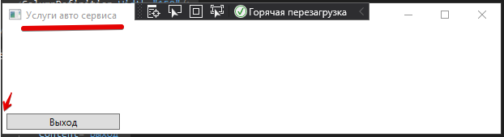

В конструкторе сразу задем *DataContext*

```cs
this.DataContext = this;
```

И реализуем обработчик для кнопки *Выход*:

```cs
private void ExitButton_Click(object sender, RoutedEventArgs e)
{
    Application.Current.Shutdown();
}
```

## Фреймы, страницы, таймер

В задании регионального чемпионата WS нужно было сделать таймер, по которому надо сбросить авторизацию и вернуться на страницу ввода логина/пароля. 

Для решения этой задачи в приложении с окнами придется запоминать какие окна открыты и закрывать их вручную, поэтому вернёмся к истокам и всё-таки рассмотрим структуру приложения с фреймами и страницами.

<!-- https://habr.com/ru/post/140749/ -->

### Фреймы и страницы

Windows Presentation Foundation имеет много вариантов создания многооконного приложения. Среди них выделяются два типа: "стандартный" привычный Window и "браузерный" Page. В данном разделе будут описаны основные этапы создания "браузерного" варианта.

Контейнером для страниц является компонент **Frame**, который мы размещаем как обычно в Grid-e:

```xml
    ...
    <Frame x:Name="MainFrame" 
        Grid.Column="2" 
        Background="GreenYellow"/>
</Grid>
```

**Frame** - это компонент, который позволяет перемещаться между страницами, созданными в проекте.

Cоздадим страницу **MainPage**:


И в конструкторе главного окна создадим и отобразим эту страницу:

```cs
public MainWindow()
{
    InitializeComponent();
    this.DataContext = this;
    MainFrame.Navigate( new MainPage() );
}
```

Главная фишка фрейма в том, что он позволяет отображать несколько страниц поочередно, храня историю (как в браузере).

Создайте еще одну страницу, *SettingsPage*.

И в обработчике *SettingsButton_Click*, вместо создания отдельного окна, создайте страницу и перейдите на неё:

```cs
private void SettingsButton_Click(object sender, RoutedEventArgs e)
{
    MainFrame.Navigate(new SettingsPage());
}
```


Вверху элемента **Frame** появляются кнопки навигации, но нам они могут не подходить по дизайну.

Для начала добавьте в StackPanel две кнопки: "Вперед" и "Назад" для реализации ручной навигации.

В обрабочиках события Click этих кнопок напишите:

```cs
private void BackButton_Click(object sender, RoutedEventArgs e)
{
    if(MainFrame.CanGoBack)
        MainFrame.GoBack();
}

private void ForwardButton_Click(object sender, RoutedEventArgs e)
{
    if(MainFrame.CanGoForward)
        MainFrame.GoForward();
}
```

>Перед навигацией проверяем есть ли куда переходить, если этого не делать, то произойдет исключение.

А во **Frame** добавить атрибут NavigationUIVisibility="Hidden"

```xml
<Frame x:Name="MainFrame" 
    Grid.Column="2" 
    NavigationUIVisibility="Hidden"/>
```

Внутри созданной страницы можно обратиться к родительскому фрейму через свойство `this.NavigationService`.

Например в коде страницы *SettingsPage* мы можем перейти ещё на одну страницу:

```cs
NavigationService.Navigate( new OtherSettingsPage() );
```

### Таймер

Теперь, имея SPA-интерфейс (Single Page Application), мы можем управлять навигацией из кода главного окна:

```cs
public MainWindow()
{
    ...
    // создаем таймер
    var Timer = new DispatcherTimer();
    // задаем интервал 
    Timer.Interval = TimeSpan.FromMinutes(1);
    // задаем обработчик события таймера (их может быть несколько)
    Timer.Tick += onTimerEvent;
    // и запускаем таймер
    Timer.Start();
}

private void onTimerEvent(object Sender, EventArgs ea) {
    // в обработчике события таймера просто возвращаемся на первую страницу
    while (MainFrame.CanGoBack){
        MainFrame.GoBack();
        // можно, хотя и не обязательно, удалить страницу из истории
        MainFrame.RemoveBackEntry();
    }
}
```

>При реализации страницы авторизации не забудьте очищать логин и пароль, чтобы при возврате на страницу они были пустыми.

>Таймер можно остановить командой *Stop()*, и запускать его нужно только после авторизации.

## Стили, иконка, логотип

### Фирменный стиль (цвет и шрифт)

В заданиях WorldSkills и в Демо-экзамене в частности есть требование о соблюдении фирменного стиля. 

Для создания стиля нужно открыть разметку приложения (*App.xaml*)

И в тег `<Application.Resources>` добавить стили, например:

```xml
<Application.Resources>
    <Style TargetType="Button">
        <Setter Property="Background" Value="#ff9c1a"/>
    </Style>
</Application.Resources>
```

, где:

* **TargetType** - тип элемента, которому задаем стиль. В нашем случае кнопкам;
* **Property** - свойство, которое меняем
* **Value** - значение

Теперь у всех **Кнопок** в нашем приложении **фон** будет рыжим.

Таким образом мы можем менять любое свойство элементов.

Для того, чтобы какой-то стиль подействовал на все элементы окна, его нужно задать окну. Например, зададим шрифт:

```xml
...
FontFamily="Arial Black"
Title="Услуги авто сервиса" 
MinHeight="100" MinWidth="300"
Height="450" Width="800">
```

Обратите внимание, для кнопки мы задавали только фон, шрифт наследуется от окна:

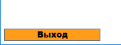


Но что, если нужно задать стиль не всем кнопкам, а только некоторым?

Для этого стилю нужно задать аттрибут ``x:Key``:

```xml
<Style TargetType="Button" x:Key="BrownButtonStyle">
...
```

и назначить этот стиль нужным элементам:

```xml
<Button 
    Name="ExitButton" 
    Content="Exit" 
    Click="ExitButton_Click"
    Style="{StaticResource BrownButtonStyle}"/>
```

Обратите внимание, мы указываем не просто название стиля, а выражение в фигурных скобках. Фигурные скобки означают, что внутри не фиксированное значение, а вычисляемое. В нашем случае указание получить статичный ресурс с указанным названием.

### Установка иконки

В контекстном меню **приложения** выбираете *свойства*

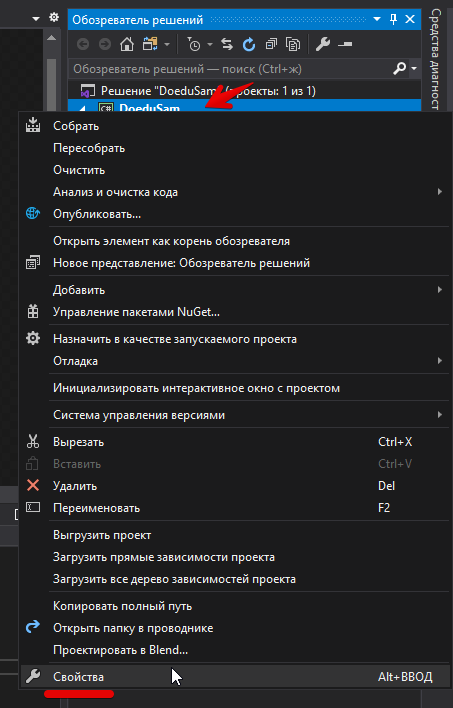

В первом же пункте "приложение" через "обзор" находите иконку (она есть в "общих ресурсах"). Студия автоматически скопирует файл иконки в корень проекта, руками его копировать не нужно.

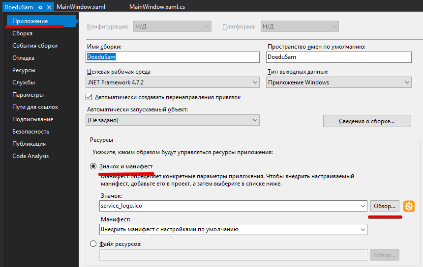

### Добавление логотипа

Для добавления ресурсов в проект можно создать в нем каталог (в контекстном меню проекта выбрать *Добавить* - *Создать папку*) и скопировать в него нужный ресурс, в нашем случае логотип `service_logo.png`.


>Обратите внимание, копировать нужно именно в IDE, а не средствами ОС в папку, иначе VS будет искать ресурс не в папке проекта, а в текущей папке VS.

И добавим картинку в сетку:

```xml
    ...
    </StackPanel>

    <Image 
        Margin="5"
        Source="./images/service_logo.png" 
        VerticalAlignment="Top"/>
</Grid>
```

Если сейчас попробовать изменить размер окна, то увидим, что во-первых минимальную высоту надо увеличивать и, во-вторых, логотип нужно размещать в вёрстке до кнопок

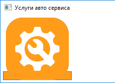

Новый вариант верстки:

```xml
    ...
    Title="Услуги авто сервиса" 
    MinHeight="300" MinWidth="300"
    Height="450" Width="800">
<Grid>
    <Grid.ColumnDefinitions>
        <ColumnDefinition Width="150"/>
        <ColumnDefinition Width="1*"/>
    </Grid.ColumnDefinitions>

    <Image 
        Margin="5"
        Source="./images/service_logo.png" 
        VerticalAlignment="Top"/>

    <StackPanel 
    ...
```

Теперь кнопки на логотип не наезжают (но кнопок еще добавится в процессе разработки, поэтому вариант не окончательный)


## Создание модели даных

В **C#** для работы с БД используется ORM **Entity**. Т.е. нам в коде не нужно писать запросы к базе, а просто оперировать объектами, которые сгенерирует для нас **Entity**

>ORM (Object-Relational Mapping) – технология программирования, которая связывает базы данных с концепциями объектно-ориентированных языков программирования, создавая «виртуальную объектную базу данных»

Сначала в *Management Studio* запоминаем как называется наш сервер:

В контекстном меню **сервера** выбираем *свойства* 


и запоминаем **имя** сервера (у вас на демо-экзамене будет другой)


### Подключаем БД

1. В контекстном меню проекта выбираем пункты *Добавить -> Создать элемент*

    

2. Выбираем в разделе *Данные* элемент *Модель ADO.NET EDM*, не забывая отредактировать *имя* модели:

    

    

    Далее выбираем источником данных *Microsoft SQL Server*

    

3. В мастере моделей *создаем соединение*

    

    **Имя сервера** вставляем то, которое запомнили в Management Studio 

    **Проверка подлинности** *SQL Server*

    Имя и пароль вам выдавали в начале курса.

    **Проверяем подключение**, если все нормально, то выбираем свою базу данных (должна быть та же что и логин).

    

    Ставим галочку "Да, включить конфиденциальные данные в строку подключения".

4. После выбора подключения мастер спросит какие объекты базы данных нам нужны, выбираем все таблицы:

    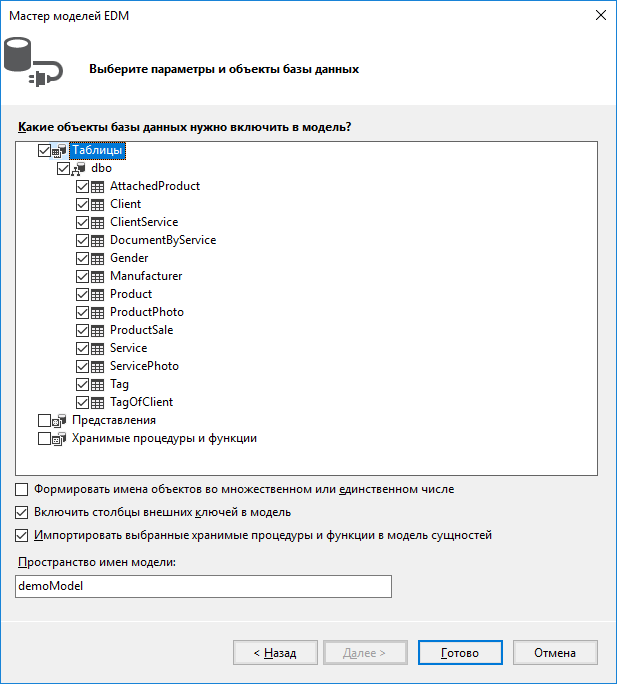

5. При формировании модели система может выдать предупреждения, что скрипт может быть потенциально вредоносным - соглашаемся.

После формирования модели отобразится диаграмма и создадутся файлы модели:

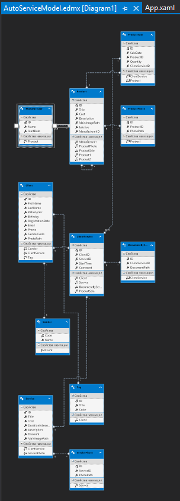

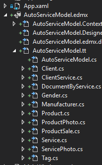

>Если в процессе разработки вы что-то измените в структуре БД, то заново модель создавать не нужно, а просто в модели кликнуть правой кнопкой мыши и *Обновить модель из базы данных*


## Список услуг/товаров

Перед выводом данных нужно получить сам объект вывода (в нашем случае это список услуг). Чтобы не создавать каждый раз новое подключение к БД создадим класс **Core**, который будет содержать статический метод получения экземпляра БД. Т.е. реализуем шаблон "Одиночка". Помимо того, что это экономит ресурсы приложения и сервера, это позволяет модели отслеживать изменения отдельных сущностей (таблиц).

Добавим в приложение класс:

Помня, что нужно соблюдать логическую структуру проекта, создадим папку *classes* в проекте и добавим в неё класс (контекстное меню каталога -> Добавить -> Класс)

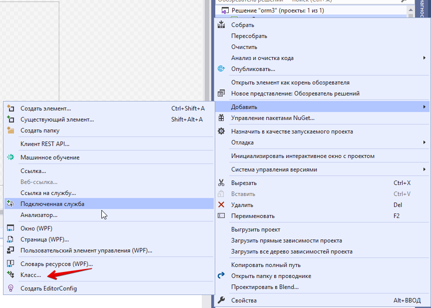

Пусть класс назвается **Core**:

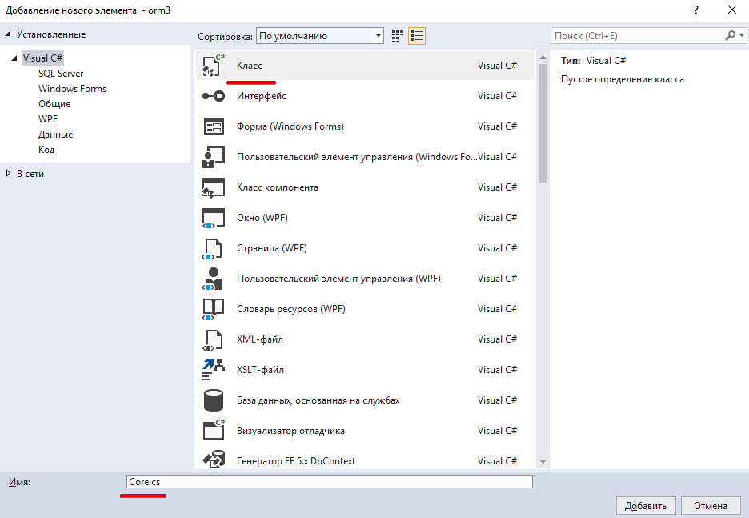

и в нем объявим статическую переменную

```cs
class Core
{
    // demoEntities это название подключения, которое вы дали при создании модели
    public static demoEntities DB = new demoEntities();
}
```

В классе главного окна объявляем приватное свойство для хранения списка услуг *_ServiceList* и публичное свойство *ServiceList* для доступа к этому списку:

```cs
private List<Service> _ServiceList;
public List<Service> ServiceList {
    get { return _ServiceList;  }
    set { _ServiceList = value; }
}
```

В конструкторе главного окна получаем список услуг (т.к. мы поместили класс в отдельный каталог, то нужно включить его *namespace* в зависимости `using AutoService.classes;`):

```cs
ServiceList = Core.DB.Service.ToList();
```

### Отображение списка услуг в табличном виде

В разметку добавляем компонент **DataGrid** (во вторую колонку)

```xml
<DataGrid 
    Grid.Column="1"
    ItemsSource="{Binding ServiceList}"/>
```

Если все сделано правильно, то при запуске приложения будет выведено содержимое таблицы:

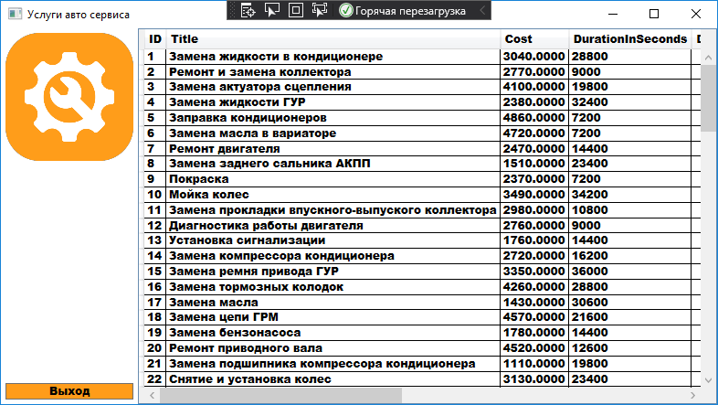

Видим, что информация выводится не в том виде, который нам нужен. 

1. Отключаем автоматическую генерацию колонок и запрещаем пользователю добавлять строки

    ```xml
    <DataGrid 
        Grid.Column="1"
        ItemsSource="{Binding ServiceList}"
        CanUserAddRows="false"
        AutoGenerateColumns="False"/>
    ```

2. Добавляем в **DataGrid** описание для нужных колонок (*У каждой  услуги должны отображаться следующие данные: наименование услуги,  стоимость, продолжительность, миниатюра главного изображения, размер скидки*)

Каталог с картинками должен лежать там же где **EXE**-файл. Скорее всего это подкаталог `bin\Debug`.

```xml
<DataGrid 
    Grid.Column="1"
    CanUserAddRows="false"
    AutoGenerateColumns="False"
    ItemsSource="{Binding ServiceList}">

    <DataGrid.Columns>
        <!-- колонкам я задаю фиксированную ширину, чтобы они не ёрзали при прокрутке -->
        <DataGridTextColumn
            Width="250"
            Header="Наименование услуги"
            Binding="{Binding Title}"/>
        <DataGridTextColumn 
            Width="100"
            Header="Стоимость"
            Binding="{Binding Cost}"/>
        <DataGridTextColumn 
            Width="150"
            Header="Продолжительность"
            Binding="{Binding DurationInSeconds}"/>
        <DataGridTemplateColumn 
            Width="64"
            Header="">
            <DataGridTemplateColumn.CellTemplate>
                <DataTemplate>
                    <!-- для отображения изображения использую геттер, который определен в МОДЕЛИ Service -->
                    <Image 
                        Height="64" 
                        Width="64" 
                        Source="{Binding ImageUri}" />
                </DataTemplate>
            </DataGridTemplateColumn.CellTemplate>
        </DataGridTemplateColumn>

        <DataGridTextColumn 
            Width="60"
            Header="Скидка"
            Binding="{Binding Discount}"/>
    </DataGrid.Columns>
</DataGrid>
```

#### Partial class

>В C# один класс может быть размазан по нескольким файлам. Это бывает полезно для улучшения читабельности и разделения кода между несколькими разработчиками.
>
>Нам этот подход позволит добавлять вычисляемые поля (геттеры) для таблиц (иначе, при обновлении модели мы можем потерять свой код).
>
>Такие классы должны быть в одном пространстве имен и иметь ключевое слово *partial* в объявлении:
>
>```cs
>public partial class Service
>       ^^^^^^^
>```

Геттер для картинки (добавляем в файл главного окна):

```cs
namespace AutoService
{
    public partial class Service
    {
        public Uri ImageUri {
            get { 
                return new Uri(Path.Combine(Environment.CurrentDirectory, MainImagePath));
            }
        }
    }

    public partial class MainWindow : Window
    {
        ...
```

**URI (Uniform Resource Identifiers)**. URI нужны, чтобы идентифицировать и запросить новый вид ресурса. Используя URI, можно обращаться не только к Web-страницам, но и к FTP-серверу, Web-сервису и **локальным файлам**.

**Path.Combine** - метод, который склеивает текущий каталог (*Environment.CurrentDirectory*) и путь к картинками

В текущей разметке мне не нравится, что у цены 4 знака после запятой. К тому же читая задание дальше видим, что нужно рядом вывести цену со скидкой. Завернем оба эти параметра в геттеры класса Service:

```cs
public string CostString
{
    get
    {
        // тут должно быть понятно - преобразование в строку с нужной точностью
        return Cost.ToString("#.##");
    }
}

public string CostWithDiscount
{
    get
    {
        // Convert.ToDecimal - преобразует double в decimal
        // Discount ?? 0 - разнуливает "Nullable" переменную
        return (Cost * Convert.ToDecimal(1 - Discount ?? 0)).ToString("#.##");
    }
}

// ну и сразу пишем геттер на наличие скидки
public Boolean HasDiscount
{
    get
    {
        return Discount > 0;
    }
}

// и перечёркивание старой цены
public string CostTextDecoration
{
    get
    {
        return HasDiscount ? "None" : "Strikethrough";
    }
}
```

Для раскраски строк *DataGrid*-а используем стиль с триггером. Т.е. стиль применяется только к тем строкам, в которых выполняется условие `HasDiscount = True`

```xml
...
ItemsSource="{Binding ServiceList}">

<DataGrid.RowStyle>
    <Style TargetType="DataGridRow">
        <Style.Triggers>
            <DataTrigger 
                Binding="{Binding HasDiscount}" 
                Value="True">
                <Setter 
                    Property="Background" 
                    Value="LightGreen"/>
            </DataTrigger>
        </Style.Triggers>
    </Style>
</DataGrid.RowStyle>

<DataGrid.Columns>
...
```

Обычная *DataGridTextColumn* не поддерживает перечеркивания, приходится заворачивать как картинку в шаблон:

```xml
<DataGridTemplateColumn 
    Width="100"
    Header="Стоимость">

    <DataGridTemplateColumn.CellTemplate>
        <DataTemplate>
            <!-- TextBlock поддерживает перечеркивание -->
            <TextBlock 
                TextDecorations="{Binding CostTextDecoration}"
                Text="{Binding CostString}"/>
        </DataTemplate>
    </DataGridTemplateColumn.CellTemplate>
</DataGridTemplateColumn>
```

Вроде про отображение списка услуг все расказал (админка, фильтрация и сортировка будут дальше). На текущий момент приложение должно выглядеть примерно так:

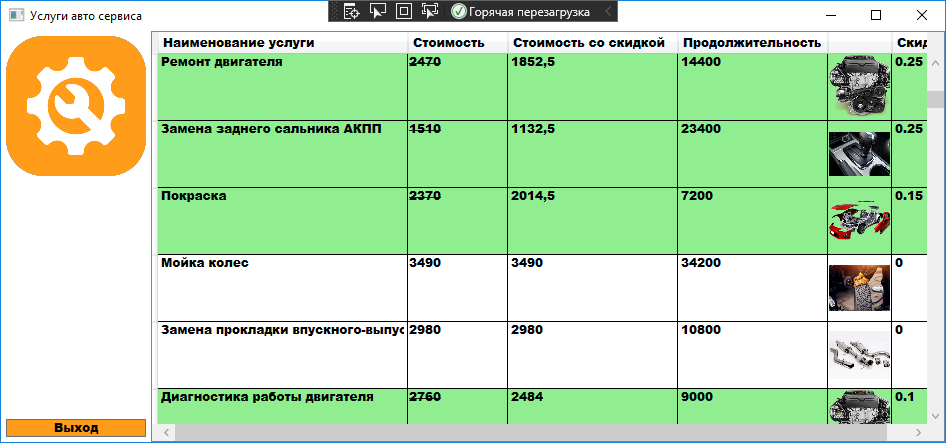

### Режим администратора

>В данной подсистеме необходимо добавить режим администратора. Для активации данного режима необходимо ввести код (на этапе разработки код всегда будет одинаковый = 0000). Список услуг должен быть виден всем в клиентской зоне (обычный режим), а функции добавления, удаления, редактирования данных об услуге, а также запись клиента на услугу и просмотр ближайших записей должен быть доступен только администратору (режим администратора).

1. Создание окна для ввода пароля *InputBoxWindow*:

    Окно буду делать универсальным - название окна буду передавать в конструкторе.

    * Создаем отдельный каталог для окон и добавляем **namespace** в зависимости:

        ```cs
        using AutoService.windows;
        ```

    * В каталоге проекта *windows* создаем новое окно (*контекстное меню -> добавить -> Окно WPF*) *InputBoxWindow*

    * Разметка окна *InputBoxWindow* примерно такая:

        ```xml
            MinHeight="110" MinWidth="530"
            Title="{Binding WindowCaption}" Height="110" Width="530">
        <Grid>
            <StackPanel 
                Orientation="Vertical">
                <TextBox 
                    x:Name="TextBox" 
                    Margin="10" 
                    Text="{Binding InputText}"/>
                <StackPanel 
                    Orientation="Horizontal"
                    HorizontalAlignment="Center">
                    <Button 
                        x:Name="OkButton"
                        Content="Ok"
                        Margin="5"
                        Click="OkButton_Click"/>
                    <Button
                        x:Name="CancelButton"
                        Content="Cancel"
                        Margin="5"
                        Click="CancelButton_Click"/>
                </StackPanel>
            </StackPanel>
        </Grid>
        ```

        - заголовок окна (*Title*) будет задаваться в конструкторе
        - не забываем про минимальные размеры окна
        - вводимый текст привязываем к свойству (*{Binding InputText}*)

        Остальное должно быть понятно без комментариев.

    * Код окна *InputBoxWindow*:

        ```cs
        // в классе объявляем свойства для заголовка окна и введенного текста
        public string WindowCaption { get; set; }
        public string InputText { get; set; }
        ```

        ```cs
        public InputBoxWindow(string Caption)
        {
            InitializeComponent();
            // заголовок окна берем из параметров конструктора
            WindowCaption = Caption;
            this.DataContext = this;
        }
        ```

        ```cs
        // в обработчиках кнопок "Ok" и "Cancel" задаем результат модального окна
        private void OkButton_Click(object sender, RoutedEventArgs e)
        {
            DialogResult = true;
        }

        private void CancelButton_Click(object sender, RoutedEventArgs e)
        {
            DialogResult = false;
        }
        ```

2. Изменения в главном окне (*MainWindow*):

    * в левую панель добавим кнопку для входа в режим администратора (я добавил еще и выход, но это вроде как не обязательно)

        ```xml
        <Button
            Content="{Binding AdminModeCaption}"
            Name="AdminButton"
            Click="AdminButton_Click"/>
        ```

        У меня текст кнопки будет меняться в зависимости от текущего режима, поэтому он сделан привязкой к свойству класса окна. 

    * добавляем необходимые свойства в код:

        ```cs
        private Boolean _IsAdminMode = false;
        // публичный геттер, который меняет текущий режим (Админ/не Админ)
        public Boolean IsAdminMode
        {
            get { return _IsAdminMode; }
            set
            {
                _IsAdminMode = value;
                if (PropertyChanged != null)
                {
                    PropertyChanged(this, new PropertyChangedEventArgs("AdminModeCaption"));
                }
            }
        }
        // этот геттер возвращает текст для кнопки в зависимости от текущего режима
        public string AdminModeCaption {
            get {
                if (IsAdminMode) return "Выйти из режима\nАдминистратора";
                return "Войти в режим\nАдминистратора";
            }
        }
        ```   

        Тут появляется новая *фича* C# - обратная связь с окном (*PropertyChanged*). Дело в том, что окно прорисовывается один раз при создании и дальше существует само по себе. Содержимое свойств класса автоматически не отслеживается.

        Чтобы дать знать визуальной части что какое-то свойство изменилось (и, соответсвенно, перерисовать его) используется интерфейс *INotifyPropertyChanged*.

        Для того, чтобы окно реализовывало этот интерфейс нужно добавить его в описание класса:

        ```cs
        public partial class MainWindow : Window, INotifyPropertyChanged
                                                ^^^^^^^^^^^^^^^^^^^^^^^^     
        ```


        Интерфейс *INotifyPropertyChanged* определен в пространстве имен *System.ComponentModel*, если оно еще не подключено, то добавьте в заголовке using System.ComponentModel (можно это сделать выбрав нужное действие в выпадающем списке возможных решений, как это сделано ниже)

        После добавления интерфейса IDE нас предупредит, что для этого интерфеса нет реализации - добавляем:

        

        в классе у нас появится событие *PropertyChanged*, которое мы и вызываем, когда хотим перерисовать какой-то визуальный элемент
    
        ```cs
        public event PropertyChangedEventHandler PropertyChanged;
        ```

        В нашем случае мы сообщаем окну, что изменилось свойство *AdminModeCaption* (проверка `PropertyChanged != null` нужна, т.к. на момент создания окна это свойство еще не создано):

        ```cs
        if (PropertyChanged != null)
        {
            PropertyChanged(this, new PropertyChangedEventArgs("AdminModeCaption"));
        }
        ```

    * и в обработчике клика кнопки *AdminButton* реализуем логику переключения режима:

        ```cs
        private void AdminButton_Click(object sender, RoutedEventArgs e)
        {
            // если мы уже в режиме Администратора, то выходим из него 
            if (IsAdminMode) IsAdminMode = false;
            else {
                // создаем окно для ввода пароля
                var InputBox = new InputBoxWindow("Введите пароль Администратора");
                // и показываем его как диалог (модально)
                if ((bool)InputBox.ShowDialog())
                {
                    // если нажали кнопку "Ok", то включаем режим, если пароль введен верно
                    IsAdminMode = InputBox.InputText == "0000";
                }
            }
        }
        ```
3. Добавление кнопок для режима Администратора

    * в классе главного окна создаем геттер *AdminVisibility*, чтобы отображать нужные кнопки только в режиме Администратора:

        ```cs
        public string AdminVisibility {
            get {
                if (IsAdminMode) return "Visible";
                return "Collapsed";
            }
        }
        ```

    * в сеттер свойства *IsAdminMode* добавим вызов уведомления:

        ```cs
        PropertyChanged(this, new PropertyChangedEventArgs("AdminVisibility"));
        ```

    * окну даем название `x:Name="Root"` (в разметке, там же где задаем Title)

    * кнопки редактирования/удаления записи добавляем прямо в *DataGrid*:

        ```xml
        <DataGridTemplateColumn
            Header="Действия">
            <DataGridTemplateColumn.CellTemplate>
                <DataTemplate>
                    <StackPanel 
                        Visibility="{Binding DataContext.AdminVisibility, ElementName=Root}"
                        Orientation="Horizontal">
                        <Button 
                                Content="Редактировать" 
                                Name="EditButton" 
                                Click="EditButton_Click"/>
                        <Button 
                                Content="Удалить" 
                                Name="DeleteButton" 
                                Click="DeleteButton_Click"/>
                    </StackPanel>
                </DataTemplate>
            </DataGridTemplateColumn.CellTemplate>
        </DataGridTemplateColumn>
        ```

        Обратите внимание:
            - кнопки "завернуты" в элемент *StackPanel* т.к. у *DataTemplate* может быть только один потомок
            - *StackPanel* виден только если включен режим администратора (запоминать значения свойства "Visibility" не обязательно, их подскажет Intellisence при вводе);
            - привязка (*Binding*) производится не напрямую к свойству *AdminVisibility*, а через свойство *DataContext* окна. Дело в том, что текущим контекстом в DataGridTemplate будет экземпляр класса **Service**.
    
    * и в боковую панель добавляем кнопку "Добавить услугу" (кнопки "Запись на услугу" и "просмотр записей" сделаете позже, если успеете):

        ```xml
        <Button
            Content="Добавить услугу"
            Visibility="{Binding AdminVisibility}"
            Click="Button_Click"/>
        ```

На текущий момент приложение должно выглядеть примерно так:


Т.е. после входа в режим администратора должны быть видны кнопки "Добавить услугу" в левой панели и "Редактировать", "Удалить" в таблице услуг.

---

### Сортировка

>Реализуйте возможность сортировки списка услуг по их стоимости (по возрастанию и по убыванию). Сортировка  должна  быть  реализована  отдельно  (не  с  помощью стандартных  функций  элементов управления), потому что в дальнейшем планируется усложнение этого функционала путем добавления дополнительных условий.

Мы, в качестве усложнения функционала, будем сортировать по "цене со скидкой".

Для начала над таблицей услуг выделим область для элементов. Пока нам нужны радиокнопки для переключения режима сортировки, в перспективе там добавятся выпадающий список и текстовое поле для фильтрации.

В разметке главного окна добавляем вложенный **Grid**, который разделим на три строки:

```xml
<!-- выводим во вторую колонку основного Grid-a -->
<Grid Grid.Column="1">
    <Grid.RowDefinitions>
        <RowDefinition Height="30"/>
        <RowDefinition Height="1*"/>
        <RowDefinition Height="30"/>
    </Grid.RowDefinitions>

    <!-- сюда перенести DataGrid и сразу запретить автоматическую сортировку -->
    <DataGrid 
        Grid.Row="1"
        CanUserSortColumns="False"
        ...
</Grid>    
```

В первой строке, как я уже говорил, будут элементы управления. Во вторую перезжает DataGrid. И в третей будет количество записей в БД (позже).

Радиокнопки заворачиваем в StackPanel:

```xml
<StackPanel 
    Orientation="Horizontal" 
    VerticalAlignment="Center">
    <Label Content="Цена: "/>
    <RadioButton 
        GroupName="Price"
        Tag="1"
        Content="по возрастанию" 
        IsChecked="True" 
        Checked="RadioButton_Checked"
        VerticalContentAlignment="Center"/>
    <RadioButton 
        GroupName="Price" 
        Tag="2"
        Content="по убыванию" 
        Checked="RadioButton_Checked"
        VerticalContentAlignment="Center"/>
</StackPanel>
```

Аттрибуты элемента *RadioButton*:

**GroupName** - позволяет группировать несколько радиокнопок в одну группу. Т.е. выбор только одного варианта.

**Tag** - по этому полю мы будем определять какой вариант выбран.

**IsChecked** - эта радиокнопка будет выбрана по-умолчанию.

В классе объявляем переменную, отвечающую за режим сортировки и геттер, сеттер для неё:

```cs
private Boolean _SortPriceAscending = true;
public Boolean SortPriceAscending {
    get { return _SortPriceAscending;  }
    set
    {
        _SortPriceAscending = value;
        if (PropertyChanged != null)
        {
            PropertyChanged(this, new PropertyChangedEventArgs("ServiceList"));
        }
    }
}
```

Реализуем обработчик *RadioButton_Checked*:

```cs
private void RadioButton_Checked(object sender, RoutedEventArgs e)
{
    SortPriceAscending = (sender as RadioButton).Tag.ToString() == "1";
}
```

Осталось сделать сортировку списка в геттере в зависимости от режима сортировки:

```cs
public List<Service> ServiceList {
    get { 
        if (SortPriceAscending)
            return _ServiceList
                .OrderBy(item => Double.Parse(item.CostWithDiscount))
                .ToList();
        else
            return _ServiceList
                .OrderByDescending(item => Double.Parse(item.CostWithDiscount))
                .ToList();
    }
    set { _ServiceList = value; }
}
```

[ссылку на ОАП]: //TODO

В лекциях по тестированию я уже рассказывал про **LINQ**. Здесь используется эта же технология. В зависимости от выбранного режима список сортируется по полю *CostWithDiscount* (само поле текстовое, поэтому при сортировке приходится преобразовывать его в число)

---

### Фильтры

>Реализуйте фильтрацию списка услуг по размеру скидки. В ***выпадающем списке*** для фильтрации должны быть следующие варианты: от 0 до 5%, от 5% до 15%, от 15% до 30%, от 30% до 70%, от 70% до 100%, где нижняя граница включается в поиск, а верхняя -нет (min <= x < max). Например, услуга со скидкой 30% будет в диапазоне от 30% до 70%, а не от 15% до 30%. Должна быть возможность сбросить параметры фильтрации (например, с помощью выбора значения “Все”). Фильтрация должна работать в реальном времени (то есть без необходимости нажатия кнопки “найти”).

Данные для *выпадающего списка* можно получать разными способами. В предыдущем варианте ("Доеду Сам") данные мы брали из таблицы словаря, ниже мы этот вариант рассмотрим и в рамках этой методички. 

Но пока делаем по текущему заданию: список мы должны создать вручную. Причем в этом списке должны храниться и строка, для отображения в *выпадающем списке*, и граничные условия для фильтрации, т.е три значения.

Можно под это дело создать отдельный класс, но мы не будем плодить лишних сущностей, а реализуем с помощью кортежей.

[вставить ссылку на лекцию в ОАП]: //TODO

Так как поле *Discount* в таблице нуллабельное, то в модели **Service** (напоминаю, что вычисляемые поля для этой модели мы пишем в коде главного окна) надо добавить вычисляемое поле, которое разнуливает скидку и, заодно, конвертирует во *float* (я сразу не посмотрел какого типа поле в таблице, а потом лень стало переделывать, но вы сразу всё делайте в *double*)

```cs
public float DiscountFloat {
    get {
        return Convert.ToSingle( Discount ?? 0 );
    }
}
```

Для начала нужно создать этот список в коде (главное окно):

>Вместо *float* используйте *double*

```cs
private List<Tuple<string, float, float>> FilterByDiscountValuesList = 
    new List<Tuple<string, float, float>>() {
        Tuple.Create("Все записи", 0f, 1f),
        Tuple.Create("от 0% до 5%", 0f, 0.05f),
        Tuple.Create("от 5% до 15%", 0.05f, 0.15f),
        Tuple.Create("от 15% до 30%", 0.15f, 0.3f),
        Tuple.Create("от 30% до 70%", 0.3f, 0.7f),
        Tuple.Create("от 70% до 100%", 0.7f, 1f)
    };
```

Команда `new List<Tuple<...>>()` создает список, элементами которого являются кортежи. Каждый кортеж состоит из строки и двух чисел. В фигурных скобках после создания списка сразу вводятся значения этого списка.

Так как для выпадающего списка нам нужен список строк, то пишем публичный геттер для этого списка:

```cs
public List<string> FilterByDiscountNamesList {
    get {
        return FilterByDiscountValuesList
            .Select(item => item.Item1)
            .ToList();
    }
}
```

Метод *Select* возвращает только указанные элементы объекта - в нашем случае первый элемент кортежа.

В разметку главного окна в панель над таблицей добавляем элемент выпадающего списка:

```xml
<Label Content="Фильтр по скидке: "
        Margin="10,0,0,0"
        VerticalAlignment="Center"/>
<ComboBox
    Name="DiscountFilterComboBox"
    SelectedIndex="0"
    SelectionChanged="DiscountFilterComboBox_SelectionChanged"
    ItemsSource="{Binding FilterByDiscountNamesList}"/>

```

Обратите внимание, в метке перед выпадающим списком я добавил границу слева, чтобы визуально отделить от радиокнопок. 

>Атрибут *Margin* может содержать 1, 2 или 4 цифры, разделенные запятыми.
>* 1 цифра - размер границы со всех сторон элемента;
>* 2 цифры - одинаковые границы слева/справа и сверху/снизу;
>* 4 цифры - разные границы слева, сверху, справа, снизу

**SelectedIndex** в выпадающем списке означает, что по-умолчанию будет выбран указанный элемент списка.

Для хранения **текущего** значения фильтра объявляем приватное свойство и геттер/сеттер для него:

```cs
private Tuple<float, float> _CurrentDiscountFilter = Tuple.Create(float.MinValue, float.MaxValue);

public Tuple<float, float> CurrentDiscountFilter { 
    get
    {
        return _CurrentDiscountFilter;
    }
    set
    {
        _CurrentDiscountFilter = value;
        if (PropertyChanged != null)
        {
            // при изменении фильтра список перерисовывается
            PropertyChanged(this, new PropertyChangedEventArgs("ServiceList"));
        }
    }
}

```

В обработчике *DiscountFilterComboBox_SelectionChanged* задаем значения фильтра:

```cs
private void DiscountFilterComboBox_SelectionChanged(object sender, SelectionChangedEventArgs e)
{
    CurrentDiscountFilter = Tuple.Create(
        FilterByDiscountValuesList[DiscountFilterComboBox.SelectedIndex].Item2,
        FilterByDiscountValuesList[DiscountFilterComboBox.SelectedIndex].Item3
    );
}
```

И переписываем геттер списка сервисов:

```cs
var FilteredServiceList = _ServiceList.FindAll(item =>
    item.DiscountFloat >= CurrentDiscountFilter.Item1 &&
    item.DiscountFloat < CurrentDiscountFilter.Item2);

if (SortPriceAscending)
    return FilteredServiceList.OrderBy(item => Double.Parse(item.CostWithDiscount)).ToList();
else
    return FilteredServiceList.OrderByDescending(item => Double.Parse(item.CostWithDiscount)).ToList();
```

Т.е. сначала мы выбираем (*FindAll*) элементы списка удовлетворяющие условию, а затем сортируем получившийся список.

---

### Поиск

>... необходимо добавить возможность поиска услуг по названию и описанию товара. Поиск должен работать в реальном времени (то есть без необходимости нажатия кнопки “найти”).

Тут всё просто: текстовое поле (*TextBox*) для фильтра и по событию ввода символа (*KeyUp*) запоминать строку фильтра и перерисовывать список услуг.

При поиске в описании сервиса (Description) нужно учитывать, что поле нуллабельное, т.е. написать для него геттер:

```cs
public string DescriptionString
{
    get {
        return Description ?? "";
    }
}
```

И в геттере для *ServiceList* добавить фильтр:

```cs
if (SearchFilter != "")
    FilteredServiceList = FilteredServiceList.Where(item =>
        item.Title.IndexOf(SearchFilter, StringComparison.OrdinalIgnoreCase) != -1 ||
        item.DescriptionString.IndexOf(SearchFilter, StringComparison.OrdinalIgnoreCase) != -1).ToList();
```

Здесь метод *Where* фильтрует список по условию.

В условии мы ищем вхождение строки фильтра в названии или описании сервиса. Метод *IndexOf* возвращает позицию подстроки в строке и `-1`, если подстрока не найдена. Параметр `StringComparison.OrdinalIgnoreCase` включает регистронезависимый поиск.

### Количество отображаемых записей

Тут тоже все просто: в нижней трети вложенного грида (под таблицей) добавляем StackPanel с двумя метками (*Label*), аттрибут *Content* которых привязан (*Binding*) к геттерам *ServicesCount* и *FilteredServicesCount*, которые просто возвращают размер полного и отфильтрованного списка соответсвенно:

```cs
return _ServiceList.Count;
```

```cs
// ServiceList сам по себе геттер и он вернёт отфильтрованный список
return ServiceList.Count;
```

После этого не забыть добавить обратную связь во все места, где меняется список:

```cs
PropertyChanged(this, new PropertyChangedEventArgs("ServicesCount"));
PropertyChanged(this, new PropertyChangedEventArgs("FilteredServicesCount"));
```

>Чтобы не искать каждый раз куда добавлять **PropertyChanged** можно вынести **ВСЕ** вызовы в отдельную функцию и вызывать при любом изменении свойств.

### Удаление

При разработке [режима администратора](#Режим-администратора) мы уже добавили кнопки удаления, осталось написать реализацию:

**Во-первых**, нужно задать название нашему DataGrid-у

```xml
<DataGrid
    x:Name="MainDataGrid"
    ...
```

И, **во-вторых**, реализовать обработчик *DeleteButton_Click*:

```cs
private void DeleteButton_Click(object sender, RoutedEventArgs e)
{
    // у DataGrid-a есть свойство SelectedItem - его приводим к типу Service
    var item = MainDataGrid.SelectedItem as Service;

    // по условиям задачи нельзя удалять только те услуги, которые уже оказаны
    // свойство ClientService ссылается на таблицу оказанных услуг
    if (item.ClientService.Count > 0) {
        MessageBox.Show("Нельзя удалять услугу, она уже оказана");
        return;
    }

    // метод Remove нужно завернуть в конструкцию try..catch, на случай, если 
    // база спроектирована криво и нет каскадного удаления - это сделайте сами
    Core.DB.Service.Remove(item);

    // сохраняем изменения
    Core.DB.SaveChanges();

    // перечитываем изменившийся список, не забывая в сеттере вызвать PropertyChanged
    ServiceList = Core.DB.Service.ToList();
}
```

## Добавление и редактирование услуг

Для добавления и редактирования мы будем использовать одно и то же окно. Название окна будем вычислять по наличию ID у услуги (у новой записи это поле = 0)

1. Создайте новое окно: *ServiceWindow*

2. В классе окна *ServiceWindow* добавьте свойство *CurrentService*, в котором будет храниться добавляемый/редактируемый экземпляр услуги:

    ```cs
    public Service CurrentService { get; set; }
    ```

    И геттер для названия окна:

    ```cs
    public string WindowName {
        get {
            return CurrentService.ID == 0 ? "Новая услуга" : "Редактирование услуги";
        }
    }
    ```

3. В конструктор окна добавьте параметр типа *Service* и присвойте его ранее объявленному свойству:

    ```cs
    public ServiceWindow(Service service){
        ...
        CurrentService = service;
    }
    ```

4. В разметку окна добавьте *StackPanel* с границами (чтобы визуальные компоненты не прилипали к границам окна)

    ```xml
    <StackPanel Margin="5">
    </StackPanel>
    ```

    И добавьте биндинг в название окна:

    ```
    Title="{Binding WindowName}"
    ```

5. В *StackPanel* добавьте редактируемые поля из таблицы **Service** по шаблону:

    ```xml
    <Label Content="Наименование услуги"/>
    <TextBox Text="{Binding CurrentService.Title}"/>
    ...
    ```

    И кнопки для выбора изображения и сохранения услуги.

6. Для смены картинки воспользуемся стандартным диалогом Windows. В обработчике клика кнопки выбора изображения откройте диалог выбора файлов. При успешном выборе присвойте полученную картинку свойству *MainImagePath*:

    ```cs
    private void GetImageButton_Click(object sender, RoutedEventArgs e)
    {
        OpenFileDialog GetImageDialog = new OpenFileDialog();
        // задаем фильтр для выбираемых файлов
        // до символа "|" идет произвольный текст, а после него шаблоны файлов раздеренные точкой с запятой
        GetImageDialog.Filter = "Файлы изображений: (*.png, *.jpg)|*.png;*.jpg";
        // чтобы не искать по всему диску задаем начальный каталог
        GetImageDialog.InitialDirectory = Environment.CurrentDirectory;
        if (GetImageDialog.ShowDialog() == true)
        {
            // перед присвоением пути к картинке обрезаем начало строки, т.к. диалог возвращает полный путь
            // (тут конечно еще надо проверить есть ли в начале Environment.CurrentDirectory)
            CurrentService.MainImagePath = GetImageDialog.FileName.Substring(Environment.CurrentDirectory.Length+1);
            if (PropertyChanged != null)
            {
                PropertyChanged(this, new PropertyChangedEventArgs("CurrentService"));
            }
        }
    }
    ```

7. Сохраните изменения при клике на кнопку **Сохранить**

    >По ТЗ перед сохранением нужно проверить Стоимость (>0) и скидку (0..100)

    ```cs
    private void SaveButton_Click(object sender, RoutedEventArgs e)
    {
        if (CurrentService.Cost <= 0)
        {
            MessageBox.Show("Стоимость услуги должна быть больше ноля");
            return;
        }

        if (CurrentService.Discount < 0 || CurrentService.Discount>1)
        {
            MessageBox.Show("Скидка на услугу должна быть в диапазоне от 0 до 1");
            return;
        }

        // если запись новая, то добавляем ее в список
        if (CurrentService.ID == 0)
            classes.Core.DB.Service.Add(CurrentService);

        // сохранение в БД
        try
        {
            classes.Core.DB.SaveChanges();
        }
        catch
        { 
        }
        DialogResult = true;
    }
    ```

8. В главном окне в обработчике кнопки редактирования услуги открываем окно с текущей услугой:

    ```cs
    private void EditButton_Click(object sender, RoutedEventArgs e)
    {
        var SelectedService = MainDataGrid.SelectedItem as Service;
        var EditServiceWindow = new windows.ServiceWindow(SelectedService);
        if ((bool)EditServiceWindow.ShowDialog())
        {
            // при успешном завершении не забываем перерисовать список услуг
            PropertyChanged(this, new PropertyChangedEventArgs("ServiceList"));
            // и еще счетчики - их добавьте сами
        }
    }
    ```

9. И в обработчике кнопки создания услуги создаем новую услугу и открываем в том же окне:

    ```cs
    private void AddService_Click(object sender, RoutedEventArgs e)
    {
        // создаем новую услугу
        var NewService = new Service();

        var NewServiceWindow = new windows.ServiceWindow(NewService);
        if ((bool)NewServiceWindow.ShowDialog())
        {
            // список услуг нужно перечитать с сервера
            ServiceList = Core.DB.Service.ToList();
            PropertyChanged(this, new PropertyChangedEventArgs("FilteredProductsCount"));
            PropertyChanged(this, new PropertyChangedEventArgs("ProductsCount"));
        }
    }
    ```

    При добавлении может выскочить исключение, если путь к картинке нуллабельный. Исправьте геттер ImageUri (добавьте разнуливание):

    ```cs
    public Uri ImageUri
    {
        get
        {
            return new Uri(System.IO.Path.Combine(Environment.CurrentDirectory, MainImagePath ?? ""));
        }
    }
    ```

У меня получилось примерно так:

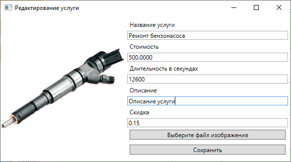

В ТЗ кода 1.1 нужно было вывести ID редактируемой записи, но не показывать его для новой. Для этого нужно нарисовать геттер *NewProduct*, который будет скрывать **StackPanel**, если `ID == 0`. Это реализуйте самостоятельно. Пример управления видимостью компонентов есть в реализации режима администратора.

```xml
<StackPanel Orientation="Horizontal" Visibility="{Binding NewProduct}">
    <Label Content="Идентификатор услуги: "/>
    <Label Content="{Binding CurrentService.ID}"/>
</StackPanel>
```

Проверку на дубль тоже реализуйте самостоятельно. Намекну, что можно в конструктор окна передать вторым параметром полный список услуг и перед сохранением услуги искать в нем  название.

## Запись на услугу

Здесь нужно сделать добавление записи в таблицу **ClientService**

Создание окна повторять не буду, это вы уже можете сделать сами.

Рассмотрим как заполнять поля *Клиент* и *Сервис*. Эти поля словарные (это видно по структуре БД - в этих полях связи к соответствующим таблицам).

>Я, как обычно, сначала сделал, потом прочитал ТЗ:
>
>При выборе определенной услуги необходимо реализовать возможность добавления записи клиента на
определенную услугу.   
>На форме добавления записи на услугу должны отображаться данные о ней (наименование и длительность в минутах).
>
>Вы реализуйте как надо. Т.е. кнопка "записаться на услугу" должна быть в таблице услуг и тогда выбор услуги уже не нужен, ее передать как параметр вместо списка.

1. При создании окна нужно получить списки клиентов и сервисов:

    ```cs
    public List<Client> ClientList { get; set; }
    public ClientService CurrentClientService { get; set; }
    public List<Service> ServiceList { get; set; }

    public ClientServiceWindow(List<Service> serviceList)
    {
        InitializeComponent();
        DataContext = this;

        // список услуг можно передать в параметрах окна, чтобы не плодить сущностей
        ServiceList = serviceList;

        // список клиентов 
        ClientList = classes.Core.DB.Client.ToList();

        // у нас нет задачи редактировать записи на услуги, поэтому 
        // в окне всегда создаем новую услугу
        CurrentClientService = new ClientService();

        // время записи устанавливаем текущее, чтобы меньше было править
        CurrentClientService.StartTime = DateTime.Now;
    }
    ```

2. Разметка окна:

    ```xml
    <StackPanel Margin="5">
        <Label Content="Клиент"/>
        <!-- 
            Для выбора клиента из списка используем компонент ComboBox
            ItemsSource - список клиентов
            SelectedItem - сюда запомнится выбранный клиент. Обратите внимание, сохраняем
                выбор в виртуальное поле Client
            FullName - самописанный геттер, возвращающий полное ФИО клиента    
        -->
        <ComboBox 
            ItemsSource="{Binding ClientList}"
            SelectedItem="{Binding CurrentClientService.Client}">
            <ComboBox.ItemTemplate>
                <DataTemplate>
                    <Label Content="{Binding FullName}"/>
                </DataTemplate>
            </ComboBox.ItemTemplate>
        </ComboBox>
        <Label Content="Услуга"/>
        <!-- 
            Выбор услуги аналогичен
        -->
        <ComboBox 
            ItemsSource="{Binding ServiceList}"
            SelectedItem="{Binding CurrentClientService.Service}">
            <ComboBox.ItemTemplate>
                <DataTemplate>
                    <Label Content="{Binding Title}"/>
                </DataTemplate>
            </ComboBox.ItemTemplate>
        </ComboBox>
        <Label Content="Время записи"/>
        <!-- 
            Вот тут засада - в WPF нет своей реализации DateTimePicker
            - Использовать сторонние библиотеки нам нельзя - нет интернета
            - Использовать компонент из Windows.Form не советуют, не будет работать биндинг
            Поэтому я реализую через строку с геттером и сеттером. 
            В сеттере мы с помощью регулярного выражения разберем эту строку и запишем нормальную
            дату в поле StartTime
        -->
        <TextBox Text="{Binding CurrentClientService.StartTimeText}"/>
        <Label Content="Комментарий"/>
        <TextBox Text="{Binding CurrentClientService.Comment}"/>
    </StackPanel>
    ```

3. Сеттер для даты/времени

    ```cs
    public partial class ClientService
    {
        public string StartTimeText
        {
            get
            {
                // в принципе то же самое вернет и просто ToString(), но его значение зависит
                // от культурной среды, поэтому лучше задать жестко
                return StartTime.ToString("dd.MM.yyyy hh:mm:ss");
            }
            set
            {
                // в круглых скобках регуляного выражения те значения, которые попадут в match.Groups
                // точка спецсимвол, поэтому ее экранируем
                // \s - пробел (любой разделитель)
                // \d - цифра
                // модификатор "+" означает что должен быть как минимум один элемент (можно больше)
                Regex regex = new Regex(@"(\d+)\.(\d+)\.(\d+)\s+(\d+):(\d+):(\d+)");
                Match match = regex.Match( value );
                if (match.Success)
                {
                    try
                    {
                        StartTime = new DateTime(
                            Convert.ToInt32(match.Groups[3].Value),
                            Convert.ToInt32(match.Groups[2].Value),
                            Convert.ToInt32(match.Groups[1].Value),
                            Convert.ToInt32(match.Groups[4].Value),
                            Convert.ToInt32(match.Groups[5].Value),
                            Convert.ToInt32(match.Groups[6].Value)
                            );
                    }
                    catch {
                        MessageBox.Show("Не верный формат даты/времени");
                    }
                }
                else
                {
                    MessageBox.Show("Не верный формат даты/времени");
                }
            }
        }
    } 
    ```

Кнопку **Сохранить** добавьте и реализуйте сохранение в БД сами.

## Ближайшие записи

