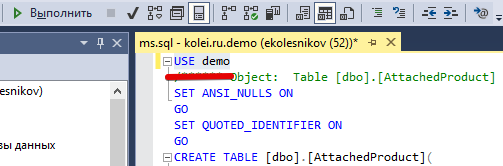
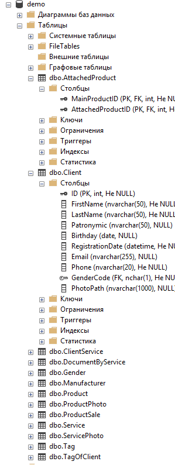

<table><tr>
<td><a href="../articles/demo_sql.md">Основы SQL</a></td>
<td><a href="../articles/demo_toc.md">Содержание</a></td>
<td><a href="../articles/demo_import.md">Импорт данных</a></td>
<tr></table>

# Восстановление БД из SQL-скрипта

1. В *SQL Management Studio* открываем файл (*Файл ⇾ Открыть ⇾ Файл*) с SQL-скриптом (должен быть в ресурсах сессии). В нашем случае это **`ms.sql`**.

2. В начале скрипта дописываем или меняем строку выбора базы данных (указывайте название своей БД):

    

3. **Выполняем** скрипт (зеленый треугольник на картинке выше)

4. В итоге у вас в БД будут созданы таблицы и связи между ними. 

    
