# Сессия 1

* диаграмма прецедентов (Use Case)
* спецификации к UseCase
* UML-диаграммы (диаграмма последовательности)
* проектирование ERD
* словарь данных
* разработка баз данных по ERD
* [импорт данных](#импорт-данных-реализация)
* создание объектов базы данных
    * триггер
    * [представление](#представление-реализация)

## Проектирование требований

>Для согласования процесса разработки с заказчиком Вам необходимо ознакомиться с описанием предметной области и сделать диаграмму прецедентов (Use Case) для основных пользователей системы.
>
>Сохраните файл с диаграммой в удобном для вас формате (PDF или Visio), используя в качестве названия следующий шаблон: UseCase_XX, где XX - номер вашего рабочего места.

Это тема Девятовой. Поднимите ее лекции, вопросы тоже сначала задавайте ей.

## Спецификации к UseCase

>Создайте спецификации к 3 самым важным прецедентам предметной области по вашему мнению. Не забудьте указать в каждой спецификации название прецедента, актера, цель выполнения прецедента, предусловия, главную последовательность по шагам, альтернативные последовательности и постусловия.

Эта тема тоже у Девятовой

## Проектирование UML-диаграмм

>На основании описания процесса оказания услуги в описании предметной области Вам необходимо создать диаграмму последовательности (Sequence) для моделирования отношений между объектами.
>
>Обратите внимание на объекты, участвующие в данном процессе, их линии жизни, сообщения и действия (методы), которые передают друг другу объекты, а также на последовательность обмена этими
сообщениями. Сохраните файл с диаграммой в удобном для вас формате (PDF или Visio), используя в качестве названия следующий шаблон: `Sequence_XX`, где XX - номер вашего рабочего места.

Эта тема у Пинешкина

## Проектирование ERD

>На основе описания предметной области Вам необходимо спроектировать ER-диаграмму для будущей системы. Обязательна 3 нормальная форма с обеспечением ссылочной целостности. При разработке диаграммы обратите внимание на согласованную осмысленную схему именования, создайте необходимые первичные и внешние ключи, определите ограничения внешних ключей, отражающие характер предметной области. Сохраните файл с диаграммой в удобном для вас формате (PDF или Visio), используя в качестве названия следующий шаблон: `ERD_XX`, где XX - номер вашего рабочего места.

Эта тема у Ахматова. Он скинул [лекцию](../docs/Основные%20понятия%20ER-диаграмм.pdf) по этой теме (если ссылка не работает, то искать в папке `docs` этого репозитория).

## Словарь данных

>Для диаграммы ER необходимо создать словарь данных – набор информации, описывающий, какой тип данных хранится в базе данных, их формат, структуру и способы использования данных. Обратите внимание на соответствие вашей диаграммы и словаря данных. Используйте подходящие типы данных, ограничения и форматы. Отразите в документе ограничения, определенные в таблицах, включая первичные ключи, отношения внешнего ключа с другими таблицами и ненулевые ограничения. Не забудьте сделать необходимые пояснения и комментарии к неоднозначным полям. В качестве шаблона словаря необходимо использовать файл `DataDictionary_Template.xlsx`. Сохраните итоговый документ со словарем данных в удобном для вас формате (PDF или Excel), используя в качестве названия следующий шаблон: `DD_XX`, где XX - номер вашего рабочего места.

Нужно просто описать все таблицы (см. шаблон)

## Разработка базы данных по ERD

>На основании созданной вами ER-диаграммы создайте базу данных в выбранной СУБД. На данном этапе нет необходимости воспроизводить все сущности, выделенные на этапе проектирования, достаточно будет создания таблиц, полей с подходящими типами данных и связей, непосредственно относящихся к разрабатываемой подсистеме и функционалу, который был определен во введении.

Здесь обратите внимание, что ограничения (внешние ключи) по-умолчанию не дают удалять записи из таблицы продуктов, если есть данные в связанных таблицах (дополнительные товары, дополнительные картинки, продажи). 

Это свойство называется ссылочной целостностью и в принципе полезно. Но в задании на вторую сессию написано, что нельзя удалять только те товары у которых есть продажи, а наличие дополнительных товаров и изображений не должно мешать удалению. Тут есть два варианта: либо перед удалением товара удалять записи из таблиц дополнительных товаров и изображений (такой подход имеет место быть, если администратор базы недоступен, а проблему надо решать срочно). 

Но правильнее в таких случаях в ограничении указать **каскадное** правило удаления - в этом случае автоматически удаляются данные в связанной таблице

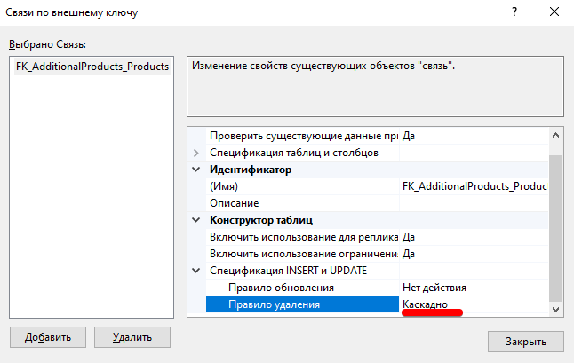

В первой сессии вы про это органичение еще не знаете, но должны помнить где искать, когда столкнетесь с задачей во второй сесии. 

## Импорт данных

>Заказчик системы предоставил файлы с данными (с пометкой import в ресурсах) для переноса в новую систему. Подготовьте данные файлов для импорта и загрузите в разработанную базу данных.

Импорт на примере таблицы товаров [рассмотрен ниже](#Импорт-данных-реализация)

## Создание объектов базы данных

### Триггер (Trigger)

>Реализуйте триггер, который будет срабатывать на добавление данных в таблицу прикрепленных товаров и отменять данную операцию при попытке прикрепить неактивный товар. Название триггера должно соответствовать шаблону `TR_<TableName>_<ActionName>`, например, `TR_OrderDetails_AfterUpdate`.

Я пока не разбирался досконально зачем там триггер и вы, если времени не хватает, можете этот раздел пропустить.

### Представление (View)

>Создайте в базе данных представление (View) с названием `vw_ProductDetails` для отображения списка товаров со следующими столбцами: Наименование, Стоимость (с округлением до целых), Активность (со значениями ДА или НЕТ), Производитель (наименование), Количество изображений (дополнительно
прикрепленных к товару), Количество товаров (дополнительно прикрепленных к этому), Дата последней продажи, Объем последних продаж (общее количество проданных товаров за последние 3 месяца), Среднее количество продаж в год. При создании представления сохраняйте названия столбцов в соответствии с описанием, используя алиасы.

Создание представления в визуальном конструкторе Management Studio [рассмотрен ниже](#представление-реализация)

## Импорт данных (реализация)

Рассмотрю на примере файла `product_a_import.csv`

1. Так как файл содержит словарное поле "Производитель", то сначала надо импортировать файл `manufacturer_a_import.txt`, делаете по этой же инструкции, только обратите внимание, что даты там кривые - их надо привести к совместимому виду. К вашему счастью *Managment Studio* умеет это сама:

    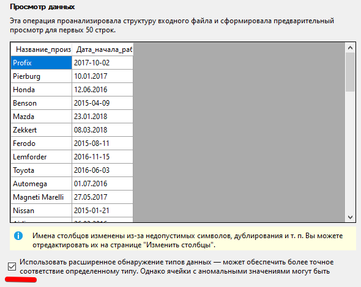

    После импорта также переименовываем таблицу и поля, добавляем первичный ключ:

    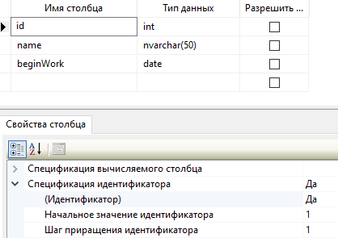

2. Содержимое файла надо нормализовать (привести к единообразному виду). Из того что я увидел:
    * поле "Активен?" заполнено в двух вариантах "да"/"нет" и "активен"/"не активен" - нужно привести к одному варианту (я это делаю в FAR-e, вы можете в Excel-e)
    * поле "цена" содержит хвосты "руб."/"рублей"/"₽" - это все вырезаем
    * не видно сразу, но символ `"\"` в поле "Главное изображение" при импорте воспринимается как служебный и вырезается - меняем его на `"/"`

3. Импортируем в таблицу `product_a_import` 

4. Переименовываем в "Products" (или как вы ее назвали в ERD)

5. Создаем первичный ключ

    * название у первичных ключей всегда "id"
    * тип ВСЕГДА целое (кто-то умудрился вставить nvarchar)
    * нужно в "свойствах столбца" настроить "спецификацию идентификатора", чтобы был автоинкремент

    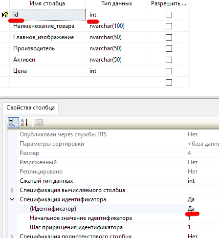

6. Меняем названия и типы остальных полей в соответствии с ERD. Должно получиться примерно такое:

    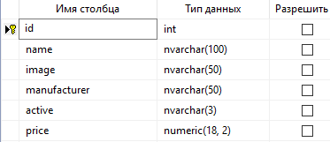

7. При импорте я не видел, чтобы спрашивало про связи - добавляем вручную:

    * создаем поле `manufacturer_id` для связи с таблицей производителей (естественно целое), пока разрешаем NULL

        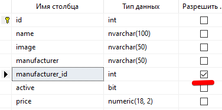

    * заполняем связи, пишем SQL-запрос:

        ```sql
        UPDATE dbo.products 
            SET manufacturer_id=manufacturer.id
            FROM manufacturer
            WHERE products.manufacturer=manufacturer.name        
        ```

        т.е. мы устанавливаем поле `manufacturer_id` в соответствии с `id` из таблицы `manufacturer` связывая их по имени производителя (операция эта одноразовая и на больших данных может сильно тормозить, т.к. у производителя нет индекса по названию, но в контексте нашей задачи это не существенно)
    
    * удаляем не нужное больше поле `manufacturer` в таблице `products` и создаем связь между таблицами (это, надеюсь сможете сделать сами)

# Представление (реализация)
 
Как мы выяснили на прошлом занятии, для создания представления нужно 5 таблиц (названия полей могут отличатся от предыдущей главы - делал я на другом сервере и уже придерживаясь соглашения *CamelCase*):

>Внимание! За неверные "алиасы" полей в представлении штрафуют, поэтому думайте, когда назваете поля. **Алиас** это альтернативное название поля в SQL-запросе, дело в том, что у нас в нескольких базах есть поле *Name*, и *Management Studio* обзывает их Expr1, Expr2... Вам нужно задать нормальные названия. Ниже я перечисляю таблицы и поля, которые должны попасть в представление. Алиасы буду указывать в скобках

* Products
    * id (в задании на создание представления про id не написано, но мы помним, что фреймворку оно нужно, да и при редактировании/удалении записей оно тоже понадобится)
    * Наименование (**Name**, но этот алиас можно не писать - оно так и буде называться)
    * Стоимость (**Price**)
    * Активность (**Active**)
* Manufacturers
    * Производитель (**Manufacturer**)
* Images    
    * Количество изображений (**ImagesCount**)
* AdditionalProducts
    * Количество товаров (**ProductsCount**)
* ProductSales
    * Дата последней продажи (**DateLastSale**)
    * Объем последних продаж (**VolumeLastSales**)
    * Среднее количество продаж в год (**AverageCountSalesInYear**)

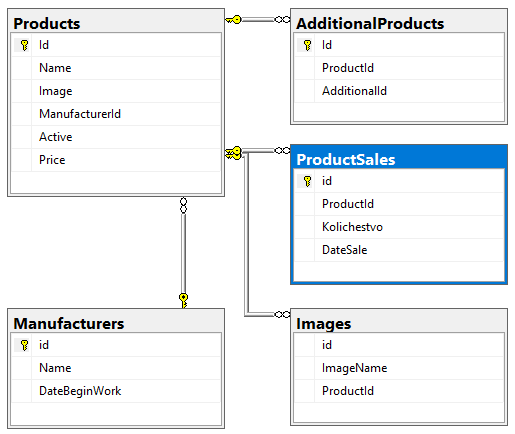

**Products** - основная таблица товаров

**AdditionalProducts** (в прошлый раз мы её назвали **p2p**) - промежуточная таблица для добавления дополнительных товаров к основному 

**ProductSales** - продажи

>В продажах мы должны заменить название товара на его ID:
>
>```sql
>UPDATE dbo.ProductSales
>    SET ProductId=Products.id
>    FROM Products
>    WHERE ProductSales.ProductName=Products.Name
>```

**Images** - дополнительные изображения товара

**Manufacturers** - справочник производителей

## Создание представления

Везде в инете описываются SQL-команды для создания представления, мы попробуем через визуальный нитерфейс:

1. В контекстном меню "Представления" Вашей БД выбираете "создать представление" и добавляете необходимые таблицы

    >Как оказалось, *Management Studio* делает JOIN-ы в порядке добавления таблиц в представление, поэтому добавлять надо по одной, начиная с **Products**

    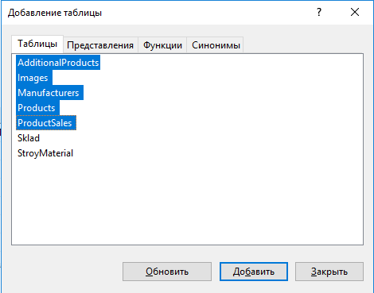

2. Добавляем "простые" поля

    

    Добавляя поля из связанных таблиц не забываем задавать "алиас" (производитель => Manufacturer)

    >На скрине ниже название не верное, верное **Manufacturer**

    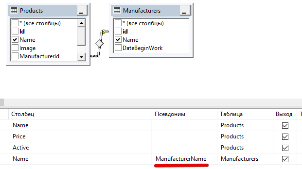

    В списке полей не указано *ManufacturerId*, но это поле нам понадобится для фильтрации - добавляйте его тоже.

3. Добавление "агрегатных" (количество, минимум, среднее...) полей

    Сначала нужно включить группировку для представления - в контекстном меню диаграммы представления выбрать "Добавить Group By"

    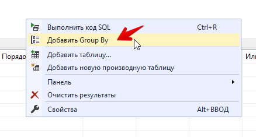

    Поля представления на данный момент должны выглядеть примерно так:

    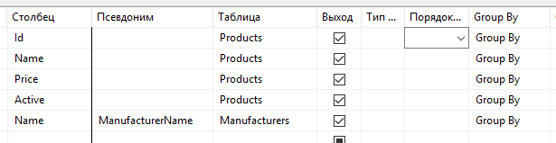

    * добавляем количество дополнительных изображений

        Добавляем ЛЮБОЕ поле из таблицы Images (можно даже *, но лучше id) и в колонке "Group By" выбираем агрегатную функцию "Count"

        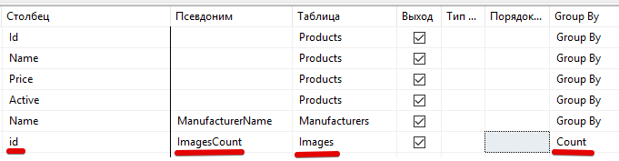

        Если сейчас попробовать выбрать данные из представления (предварительно сохранив его), то увидим, что выборка пустая. 

        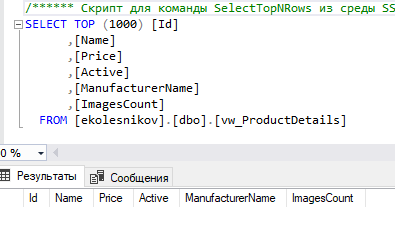

        Дело в том, что *Management Studio* при добавлении таблицы в выборку по-умолчанию устанавливает связь **INNER JOIN**, т.е. данные попадают в выборку только если они есть в связанных таблицах, а у нас таблица дополнительных картинок пока пустая. 

        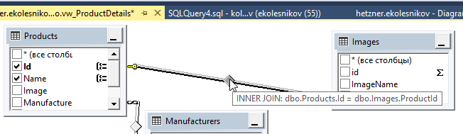

        Нужно в контекстном меню этой связи (тыкаем прямо по ромбику) "выбрать все строки из Products"

        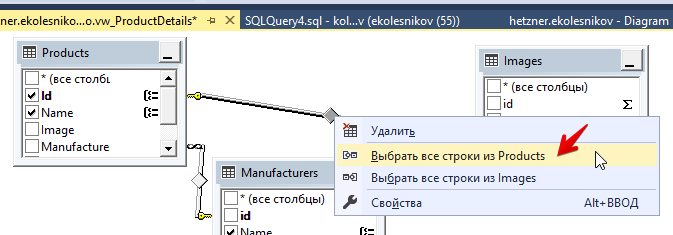

        Теперь выборка работает как надо:

        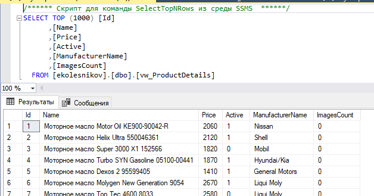

    * Аналогично добавляем "количество дополнительных товаров" и "Дату последней продажи" (для нее, естественно, выбираем агрегатную функцию **MAX**)

    На этот момент конструктор представления должен выглядеть примерно так (на ProductSale_1 не обращайте внимания, это у меня уже подселекты сделаны и там алиас таблицы поменялся)   

    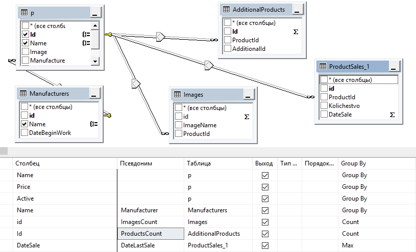

4. Добавление "сложных" полей

    Поля "Объем последних продаж" и "Среднее количество продаж в год" агрегатными функциями не посчитать, тут нужно делать вложенные выборки (SELECT). Как это сделать в конструкторе я не нашел, пришлось писать прямо в SQL-запросе, который формируется в нижнем окне

    ```sql
    SELECT p.Id, p.Name, p.Price, p.Active, dbo.Manufacturers.Name AS Manufacturer, COUNT(dbo.Images.id) AS ImagesCount, COUNT(dbo.AdditionalProducts.Id) AS ProductsCount, MAX(ProductSales_1.DateSale) AS DateLastSale,
        -- все что выше, не трогаем, а ниже пишем подселекты для двух полей (не забыв поставить запятую, разделитель полей)
        (SELECT SUM(ps1.Kolichestvo) AS Expr1
            FROM dbo.ProductSales AS ps1
            WHERE (ps1.ProductId = p.Id) AND (ps1.DateSale >= DATEADD(mm, - 3, GETDATE()))) AS VolumeLastSales,

        (SELECT AVG(ps2.Kolichestvo) AS Expr2
            FROM dbo.ProductSales AS ps2
            WHERE (ps2.ProductId = p.Id) AND (ps2.DateSale >= DATEADD(mm, - 12, GETDATE()))) AS AvgCountSaleInYear

        -- ниже тоже не трогаем
    FROM dbo.Products AS p 
    INNER JOIN dbo.Manufacturers ON p.ManufacturerId = dbo.Manufacturers.id 
    LEFT OUTER JOIN dbo.ProductSales AS ProductSales_1 ON p.Id = ProductSales_1.ProductId 
    LEFT OUTER JOIN dbo.AdditionalProducts ON p.Id = dbo.AdditionalProducts.ProductId 
    LEFT OUTER JOIN dbo.Images ON p.Id = dbo.Images.ProductId
    GROUP BY p.Id, p.Name, p.Price, p.Active, dbo.Manufacturers.Name    
    ```

    Рассмотрим подробнее один подселект:

    ```sql
    -- подселекты обязательно должны быть в круглых скобках
    (
        -- тут мы выбираем объем продаж (сумму по полю Kolichestvo)
        -- алиас Expr1 подставила Management Studio, его можно не трогать, итоговое название поля задается после подселекта
        SELECT SUM(ps1.Kolichestvo) AS Expr1
            -- таблице задаем алиас "ps1" - в рамках одного запроса повторно используемые таблицы должны иметь уникальные названия (алиасы)
            FROM dbo.ProductSales AS ps1
            -- выбираем продажи соответствующие текущему товару (да, подселекты срабатывают для каждой строки таблицы)
            -- и указываем фильтр по дате, заданный в ТЗ
            WHERE (ps1.ProductId = p.Id) AND (ps1.DateSale >= DATEADD(mm, - 3, GETDATE()))
    -- после подселекта задаем название полученному полю        
    ) AS VolumeLastSales,
    ```

    Итоговый конструктор выглядит примерно так. Вроде бы можно подселект писать прямо в столбец, но студии чем-то не понравилась функция DATEADD, ругалась на что-то, так что запоминайте куда вписать подселект в основном запросе

    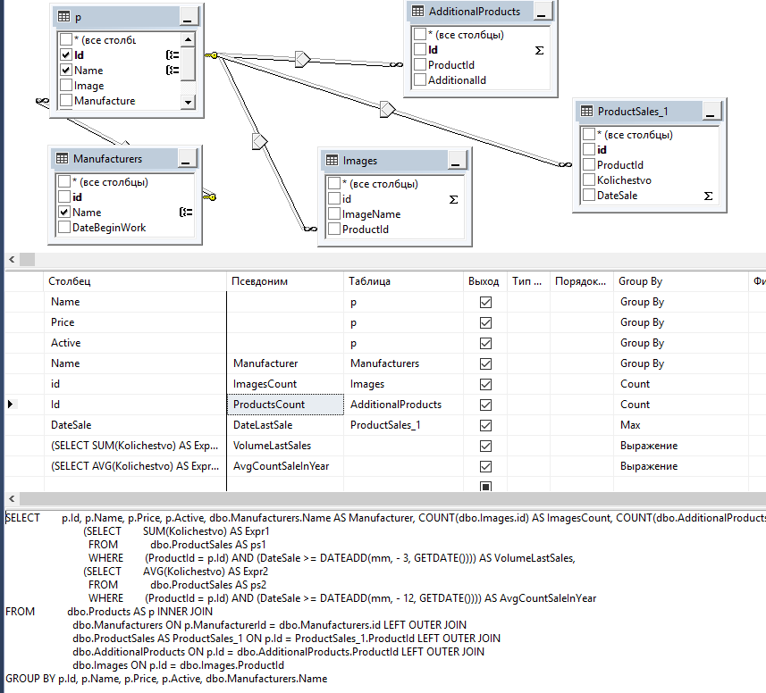

5. В задании сказано, что поле *Active* должно в представлении возвращать "да" или "нет" и в принципе я разобрался как это делать: вместо названия поля вписать выражение `CASE WHEN p.Active = 0 THEN 'нет' ELSE 'да' END AS Active`. НО MsSQL походу всё еще пишет команды в ANSI кодировке, поэтому на выход попадают "???" и "??". Предлагаю хранить активность текстом (а не как я "1" и "0"). Учитывайте это при импорте данных и в программе.

# Триггер (реализация)

По ТЗ мы не должны добавлять дополнительный товар, если он не активен. Нарисуем триггер. Часть сгенерится автоматически, но логику всё-равно придется писать руками. 

- Созадем триггер в таблице **дополнительных товаров** (у меня это *AdditionalProducts*). В контекстном меню "Триггеры" выбираем "Создать триггер"

    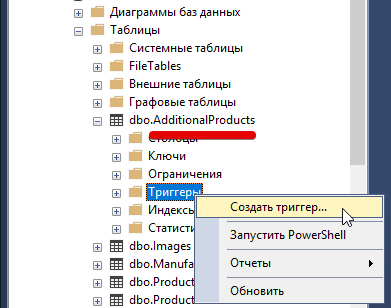

- Задаем параметры шаблона

    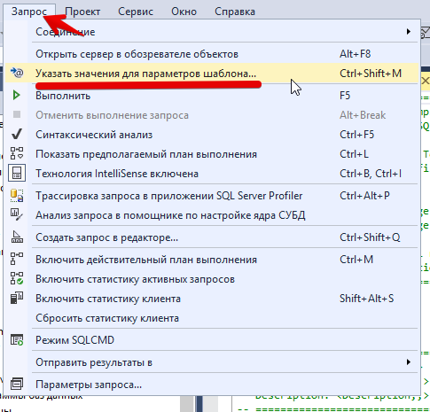

    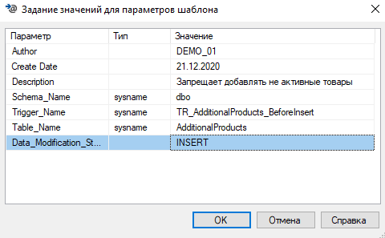

    - с автором понятно - ваш номер
    - схема: **dbo**
    - правило наименования триггера описано в ТЗ
    - в последнем параметре то действие, которое надо отследить по ТЗ. Нам надо отслеживать добавление записей, поэтому следим за **INSERT**

- Меняем условие срабатывания триггера. По-умолчанию стоит "After", вместо него пишем "INSTEAD OF"

    ```sql
    ...
    CREATE TRIGGER dbo.TR_AdditionalProducts_AfterInsert 
        ON  dbo.AdditionalProducts 
        INSTEAD OF INSERT
        ^^^^^^^^^^^
    AS 
    ...
    ```

- В редакторе запросов замените комментарий `-- Insert statements for trigger here` следующей инструкцией:    


    ```sql
    -- Insert statements for trigger here

    -- объявляем переменную NewId
	DECLARE @NewId INT

    -- ищем значение Id добавляемого дополнительного товара
    -- (здесь "inserted" это виртуальная таблица, в которой хранятся данные, которые пытаются добавить)
	SELECT @NewId = (SELECT AdditionalId FROM inserted)

    -- если ДОБАВЛЯЕМЫЙ товар АКТИВЕН (=1)
	IF (SELECT Active FROM dbo.Products WHERE id=@NewId) = 1
	BEGIN
        -- то добавляем запись в таблицу
		INSERT INTO dbo.AdditionalProducts SELECT ProductId,AdditionalId FROM inserted
	END
    ```

- Чтобы проверить синтаксис, в меню "Запрос" выберите пункт "Синтаксический анализ".

- Чтобы создать триггер, в меню "Запрос" нажмите "Выполнить". Триггер создается как объект в базе данных. ОБРАТИТЕ ВНИМАНИЕ!!! в базу триггер добавляется только при нажатии "Выполнить" и успешном выполнении.

- проверьте работу триггера попробовав добавить активный и не активный товар.
