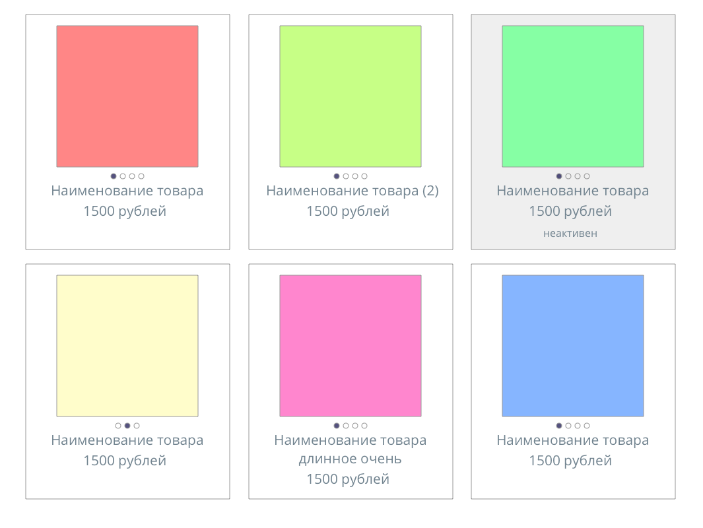
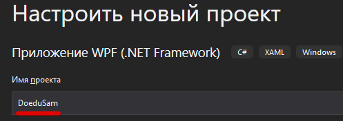
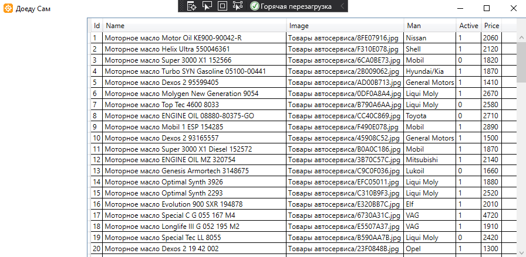
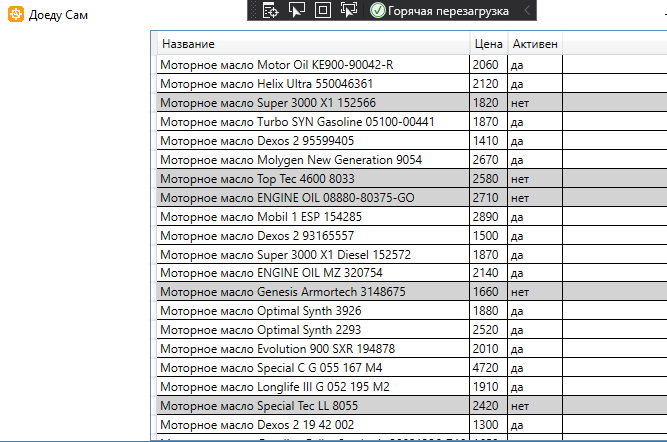

# Сессия 2

Рекомендации и куски кода [смотри ниже](#Рекомендации-по-реализации)

## Разработка

### Список товаров

>Необходимо отобразить список товаров (в виде плитки), который должен соответствовать макету, предоставленному в ресурсах к заданию (пример в файле products_grid.png). Однако это не означает, что необходимо следовать макету в точности до пикселя - это всего лишь схема расположения элементов, на которую нужно ориентироваться при разработке пользовательского интерфейса.
>
>
>
>Каждый товар должен содержать следующую информацию: главное изображение, наименование, стоимость и отметку об активности (является товар на данный момент актуальным или нет).
Если товар не активен, то фон элемента должен быть серого цвета, в остальных случаях - белого.
>
>Около названия товара в круглых скобках должно отображаться количество дополнительных товаров, которые могут идти вместе с этим товаром.
>
>При наведении на карточку товара необходимо реализовать эффект изменения изображений как на примере (product_image_change_example.mov). Область с изображением товара делится на равные части с таким же количеством, как и количество изображений у товара. При перемещении мыши по горизонтали изображения должны меняться, а также иконки точек должны показывать текущую позицию в рамках списка изображений.
На странице со списком товаров необходимо добавить возможность поиска товаров по названию и описанию. Поиск должен работать в реальном времени (то есть без необходимости нажатия кнопки
“найти”).
>
>[//TODO]: фильтрация
>
>На странице со списком товаров необходимо добавить возможность фильтрации списка по производителю. Все производители из базы данных должны быть выведены в выпадающий список для
фильтрации. Первым элементом в выпадающем списке должен быть “Все элементы”, при выборе которого настройки фильтра сбрасываются. Фильтрация должна работать в реальном времени (то есть без необходимости нажатия кнопки “найти”).
>
>Функции фильтрации и поиска должны применяться совместно к итоговой выборке.
>
>[//TODO]: отдельная_сортировка
>
>Добавьте возможность отсортировать список по убыванию и возрастанию стоимости товара. Сортировка должна быть реализована отдельно (не с помощью стандартных функций элементов управления), потому что в дальнейшем планируется усложнение этого функционала путем добавления дополнительных условий.
>
>В нижней части окна необходимо показывать количество выведенных данных и общее количество записей в базе. Например, 230 из 450. В случае если данные в таблицу выводятся после фильтрации или поиска, количество выведенных данных необходимо обновить исходя из размера выборки.
>
>Должна быть реализована возможность удаления выбранного товара. При этом должны соблюдаться следующие условия. Если у товара есть прикрепленные дополнительные товары, то информация по этим прикрепленным товарам может быть удалена вместе с основным. Но если у товара есть информация о его продажах, то удаление товара из базы данных должно быть запрещено.

### Добавление/редактирование товара

>Необходимо добавить возможность редактирования данных существующего товара, а также добавление нового товара в новом окне - форме для добавления/редактирования товара.
>
>[//TODO]: описание_товара
>
>На форме должны быть предусмотрены следующие поля: идентификатор, наименование товара, стоимость, описание товара, главное изображение, производитель товара.
>
>При открытии формы для редактирования все поля выбранного объекта должны быть подгружены в соответствующие поля из базы данных.
>
>При добавлении нового товара идентификатор должен автоматически генерироваться, а поле для идентификатора отсутствует. В случае если пользователь редактирует товар, то поле с идентификатором доступно только для чтения.
>
>[//TODO]: проверку_на_минус
>
>Стоимость товара может включать сотые части, а также не может быть отрицательной.
>
>[//TODO]: выпадающий_список_да_нет
>
>При изменении данных о товаре у пользователя должна быть возможность сделать товар неактивным или наоборот (поставить/снять соответствующую галочку). Это означает, что в предложениях дополнительных товаров он не будет показан администратору, но в списке товаров он должен быть.
>
>Пользователь может добавить/заменить главное изображение у товара. На экране должна показываться миниатюра выбранной фотографии. Размер фотографии не должен превышать 2 мегабайта.
Для того чтобы администратор случайно не изменял несколько товаров (тем более связанных), предусмотрите невозможность открытия более одного окна редактирования товара.
>
>После редактирования/добавления товара данные в окне списка товаров должны быть обновлены.

### Предложение дополнительных товаров

>[//TODO]: добавление_дополнительных_товаров
>
>В окне добавления/редактирования товара необходимо указывать связанные товары, чтобы администратор при работе с клиентом мог предложить товары, которые так или иначе связаны с покупкой. Для примера вспомните, как в одном популярном ресторане для детей, менеджер вам предлагает дополнительный пирожок или картошку фри к вашему заказу? Так вот они это делают, так как у них на экране появляется надпись (например, “предложить клиенту пирожок”) в зависимости от списка товаров, которые вы заказали.
>
>При открытии формы для редактирования ранее прикрепленные товары должны подгружаться из базы данных.
>
>Для каждого прикрепленного товара должна выводиться миниатюра (главное изображение). При наведении на миниатюру в подсказке должны отображаться название и стоимость данного товара. По
клику можно перейти в окно добавления/редактирования товара со всей подробной информацией.
>
>Необходимо предусмотреть функционал для добавления определенных дополнительных товаров к выбранному (причем не только один, но и несколько). Имейте в виду, что нельзя добавить товар в качестве дополнительного к самому себе (не пытайтесь нарушить покой вселенной), а также должен быть реализован запрет на прикрепление неактивных товаров.
>
>Предусмотрите также возможность удаления прикрепленных товаров из списка.
>
>Прикрепленные товары должны сохраняться в базе данных для каждого выбранного товара.

### История продаж товаров

>[//TODO]: история_продаж
>
>В окне списка товаров необходимо предусмотреть возможность перейти на окно для получения списка всех продаж этого товара.
На данном окне должна быть возможность посмотреть информацию о конкретном товаре, дате и времени продажи, а также количестве проданного товара.
>
>Записи должны быть по умолчанию отсортированы по дате и времени по убыванию.
>
>Необходимо предусмотреть фильтр по товарам. Данные для фильтрации в выпадающий список должны быть подгружены из БД. По умолчанию в выпадающем списке должен быть выбран товар, переход по которому был осуществлен на данное окно.

# Рекомендации по реализации

## Название приложения

В "Требованиях и рекомендациях" сказано, что наименование приложения должно ОБЯЗАТЕЛЬНО включать название компании заказчика, поэтому никаких "Demo", "doom" не должно быть:



>Называть лучше латиницей, хз как поведет себя система с кириллицей в названии

## Установка иконки

В контекстном меню **приложения** выбираете *свойства*


В первом же пункте "приложение" через "обзор" находите иконку (она есть в "общих ресурсах"). Студия автоматически скопирует файл иконки в корень проекта, руками его копировать не нужно.


## Цветовая схема и логотип

Это было в лекциях и многие это даже сделали, останавливаться не буду.

## Заголовки окон

Для главного окна можно написать название компании (*.xaml - Window - Title), для остальных по назначению окна. Например, если открываете окно со справочником товаров, то так и называейте "Справочник товаров"

```xml
<Window
    ...
    Title="Доеду Сам">
```

## Ограничение размера окна

Про это я тоже говорил, но многие не сделали... Добавляете к тегу **Window** атрибуты *MinHeight* и *MinWidth*. Размеры эти нужно подбирать по содержимому, чтобы не терялись кнопки и другие визуальные компоненты.

```xml
<Window
    MinHeight="400" MinWidth="700"
    Title="Доеду Сам" Height="450" Width="800">
```

## Список товаров

Из МРМТ **никто** не сделал интерфейс "плиткой", так что и вы не впадайте в ступор, а тупо рисуйте **DataGrid**, мы его проходили.

*"Каждый товар должен содержать следующую информацию: главное изображение, наименование, стоимость и отметку об активности"* - т.е. в DataGrid-e отображаете только эти поля таблицы товаров.

*Если товар не активен, то фон элемента должен быть серого цвета*

Можно также не рисовать навигатор со страницами, а сразу в главном окне вывести таблицу товаров (это, правда, будет нарушением логики, т.к. каждая сущность должна быть в своем файле)

Ниже как раз приведен до предела упрощенный код такого приложения который, тем не менее, рисует таблицу в нужном месте:

```xml
<Grid>
    <Grid.ColumnDefinitions>
        <ColumnDefinition Width="150"/>
        <ColumnDefinition Width="1*"/>
    </Grid.ColumnDefinitions>

    <DataGrid Grid.Column="1" ItemsSource="{Binding MyProducts}"/>
</Grid>
```

```cs
public partial class MainWindow : Window
{
    private List<Products> _MyProducts;
    public List<Products> MyProducts
    {
        get
        {
            return _MyProducts;
        }
        set
        {
            _MyProducts = value;
        }
    }

    public MainWindow()
    {
        InitializeComponent();
        this.DataContext = this;
        MyProducts = Core.DB.Products.ToList();
    }
}
```



Это была программа минимум для тех, кому достаточно тройки и кто надеется набрать баллов в других сессиях.

## Продвинутый вариант

Читаем ТЗ и записываем требования:

* товар должен содержать следующую информацию
    * ~~главное изображение~~ (пока пропустим)
    * наименование (с количеством дополнительных товаров)
    * стоимость
    * отметку об активности
* поиск по названию в реальном времени
* фильтр по производителю в реальном времени
* ~~сортировка по полям~~ (это DataGrid делает сам)
* в нижней части окна нужно показывать сколько выведено и сколько всего товаров

>Показ количества дополнительных товаров требует выборки с группировкой, делать это в приложении моветон, это нужно делать в *представлении* (пока пропустим)

[Хабр. Отношения.](https://habr.com/ru/post/488054/)

https://code.tutsplus.com/ru/articles/sql-for-beginners-part-3-database-relationships--net-8561


Настраиваем отображаемые колонки. Нового для вас тут ничего нет, это было в лекциях - нужно тупо запомнить. Единственно, что у меня в таблице поле *Active* типа **int**, поэтому я его значение вычисляю геттером:

```xml
<DataGrid 
    Grid.Column="1" 
    ItemsSource="{Binding MyProducts}"
    AutoGenerateColumns="False">

    <!-- а это раскраска строк в зависимости от активности товара -->
    <DataGrid.RowStyle>
        <Style TargetType="DataGridRow">
            <Style.Triggers>
                <DataTrigger Binding="{Binding Active}" Value="0">
                    <Setter Property="Background" Value="LightGray"/>
                </DataTrigger>
            </Style.Triggers>
        </Style>
    </DataGrid.RowStyle>

    <DataGrid.Columns>
        <DataGridTextColumn 
            Header="Название"
            Binding="{Binding Name}"/>
        <DataGridTextColumn 
            Header="Цена" 
            Binding="{Binding Price}"/>
        <DataGridTextColumn 
            Header="Активен" 
            Binding="{Binding ActiveStr}"/>
    </DataGrid.Columns>
</DataGrid>
```

```cs
public partial class Products
{
    ...
    public int Active { get; set; }
    public string ActiveStr { 
        get {
            if (Active == 1) return "да";
            else return "нет";
        } 
    }
}
```



После этого я нарисовал "Представление" в БД и, соответственно, в программе считываю из базы не таблицу, а представление (естественно переделал модель и т.д.):

```cs
public List<vw_ProductDetails> MyProducts
...
MyProducts = Core.DB.vw_ProductDetails.ToList();
```

Ещё в модели представления создал вычисляемое свойство и отображаю его вместо названия продукта (по ТЗ мы должны в скобках показывать количество дополнительных товаров):

```cs
public string NameWithAdds
{
    get
    {
        return Name + " (" + ProductsCount.ToString() + ")";
    }
}
```

## Реализуем CRUD (Create Read Update Delete)

### Добавление товаров (Create)

Над таблицей товаров я оставил место для фильтра и сортировки, поэтому кнопку "добавить" расположим в левой колонке:

```xml
<StackPanel 
    VerticalAlignment="Bottom" 
    Orientation="Vertical">
    <Button 
        x:Name="CreateProductButton"
        Click="CreateProductButton_Click"
        Content="Добавить товар"/>
</StackPanel>
```

Про навигатор со страницами мы пока вспоминать не будем, добавление/редактирование товара делаем в окне (как создавать окно вы уже знаете).

```cs
/// <summary>
/// Обработчик клика по кнопке "Добавить товар". Открывает окно, при сохранении обновляет таблицу
/// </summary>
private void CreateProductButton_Click(object sender, RoutedEventArgs e)
{
    // в параметрах передаем новый товар (при редактировании будет существующий)
    var NewProduct = new ProductWindow( new Products() );

    /* 
        тут новое для вас - метод ShowDialog может возвращать логическое значение 
        (позже в коде окна увидим как его задать). 
        При закрытии "крестиком" вернет false, а при нажатии "сохранить" - true. 
        В прошлом проекте у нас не было обратной связи, а теперь после добавления товара мы будем перечитывать таблицу и обновлять визуальные компоненты
    */
    if ((bool)NewProduct.ShowDialog())
    {
        MyProducts = Core.DB.vw_ProductDetails.ToList();
        UpdateValues();
    }
}

/// <summary>
/// Обновляет таблицу продуктов и счетчики записей
/// </summary>
private void UpdateValues() {
    PropertyChanged(this, new PropertyChangedEventArgs("MyProducts"));
    PropertyChanged(this, new PropertyChangedEventArgs("ProductsCount"));
    PropertyChanged(this, new PropertyChangedEventArgs("FilteredProductsCount"));
}
```

Про *PropertyChanged* я раньше рассказывал:

```cs
using System.ComponentModel;

namespace DoeduSam
{
    public partial class MainWindow : Window, INotifyPropertyChanged
                                              ^^^^^^^^^^^^^^^^^^^^^^
    {
        public event PropertyChangedEventHandler PropertyChanged;
        ...
```

**Окно редактирования товара**

В разметке ничего нового, мы это проходили на стройматериалах. Не забывайте менять заголовок окна (я это сделал геттером).

```xml
    ...
    Title="{Binding WindowTitle}" Height="450" Width="800">
    <Grid>
        <StackPanel>
            <Label Content="Название товара"/>
            <TextBox Text="{Binding CurrentProduct.Name}"/>
            <Label Content="Название главного изображения"/>
            <TextBox Text="{Binding CurrentProduct.Image}"/>
            <Label Content="Производитель"/>
            <ComboBox 
                ItemsSource="{Binding ManufacturersList}"
                SelectedItem="{Binding CurrentProduct.Manufacturers}">
                <ComboBox.ItemTemplate>
                    <DataTemplate>
                        <Label Content="{Binding Name}"/>
                    </DataTemplate>
                </ComboBox.ItemTemplate>
            </ComboBox>
            <Label Content="Активен"/>
            <TextBox Text="{Binding CurrentProduct.Active}"/>
            <Label Content="Цена"/>
            <TextBox Text="{Binding CurrentProduct.Price}"/>
            <Button x:Name="SaveButton" Content="Сохранить" Click="SaveButton_Click"/>
        </StackPanel>
```

В коде тоже все по-старому, добавилась только одна строчка в конце

```cs
public partial class ProductWindow : Window
{
    public Products CurrentProduct { get; set; }
    public List<Manufacturers> ManufacturersList { get; set; }

    // геттер для названия окна
    public string WindowTitle {
        get {
            if (CurrentProduct.Id == 0) return "Добавление товара";
            return "Редактирование товара";
        }
    }

    public ProductWindow(Products Product)
    {
        InitializeComponent();
        this.DataContext = this;
        CurrentProduct = Product;
        ManufacturersList = Core.DB.Manufacturers.ToList();
    }

    private void SaveButton_Click(object sender, RoutedEventArgs e)
    {
        // добавляем только новые
        if (CurrentProduct.Id == 0)
            Core.DB.Products.Add(CurrentProduct);
        // сохранение в БД
        Core.DB.SaveChanges();

        // эта команда как раз и задает результат диалога и автоматически закрывает его
        DialogResult = true;
    }
}
```

### Чтение (Read) товаров вроде в ТЗ не прописано, достаточно общего списка.

### Удаление (Delete) товара

Кнопки для редактирования и удаления мы поместили в таблицу, но надо помнить, что при клике по этим кнопкам мы получаем экземпляр не **Products** а **vw_ProductDetails**. Поэтому перед редактированием и удалением нужно найти оригинальный **Product** по id (я обращал внимание при создании представления, что это поле нам понадобится, хотя оно и не указано в задании)

```cs
private void DeleteButton_Click(object sender, RoutedEventArgs e)
{
    var item = MainDataGrid.SelectedItem as vw_ProductDetails;

    // ищем Products по id
    var DeletedProduct = Core.DB.Products.Find(item.Id);

    if (DeletedProduct != null)
    try
    {
        // связи не дадут удалить товар, поэтому проверяем

        // по ТЗ НУЖНО удалять товар с доп.товарами, насколько я помню это в связи задается - надо копнуть
        if (DeletedProduct.AdditionalProducts.Count > 0) {
            MessageBox.Show("Нельзя удалять товар, есть дополнительные товары");
            return;
        }

        // с этим скорее всего тоже можно удалять
        if (DeletedProduct.Images.Count > 0)
        {
            MessageBox.Show("Нельзя удалять товар, есть дополнительные изображения");
            return;
        }

        // а вот эта проверка должна быть
        if (DeletedProduct.ProductSales.Count > 0)
        {
            MessageBox.Show("Нельзя удалять товар, есть продажи");
            return;
        }

        Core.DB.Products.Remove(DeletedProduct);
        Core.DB.SaveChanges();

        // и опять перечитываем представдение и обновляем визуальные компоненты
        MyProducts = Core.DB.vw_ProductDetails.ToList();
        UpdateValues();
    }
    catch (Exception ex)
    {
        MessageBox.Show("Не смог удалить товар: "+ex.Message);
        //throw;
    }
}
```

### Изменение (Update) товара

При клике на кнопку редактирования тоже ищем оригинальный товар, в разметке и коде окна товара ничего не меняется

```cs
private void EditButton_Click(object sender, RoutedEventArgs e)
{
    var item = MainDataGrid.SelectedItem as vw_ProductDetails;
    var EditProduct = Core.DB.Products.Find(item.Id);

    if (EditProduct != null) {
        var NewProduct = new ProductWindow( EditProduct );
        if ((bool)NewProduct.ShowDialog())
        {
            MyProducts = Core.DB.vw_ProductDetails.ToList();
            UpdateValues();
        }
    }
}
```

### Отображение/скрытие идентификатора в окне добавления/редактирования

По заданию поле "Id" должно быть видно (без возможности изменения) на экране редактирования, в на экране добавления скрыто.

В разметке заворачиваем текст и идентификатор в *StackPanel*, для которого задаем вычисляемое свойство *Visibility*

```xml
<StackPanel 
    Orientation="Horizontal" 
    Visibility="{Binding CurrentProduct.ExistingProduct}">
    <Label 
        Content="Идентификатор товара: "/>
    <Label 
        Content="{Binding CurrentProduct.Id}"/>
</StackPanel>
```

И в коде модели **Products** реализуем геттер для поля *ExistingProduct*

```cs
public String ExistingProduct
{
    get
    {
        if (Id == 0) return "Collapsed";
        return "Visible";
    }
}
```        

