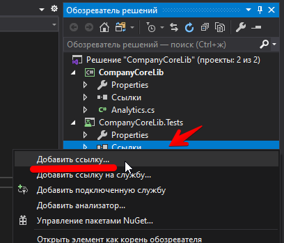
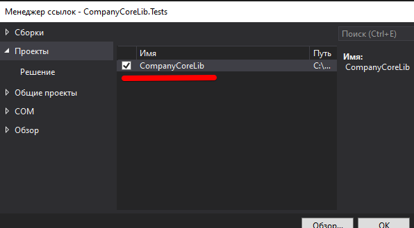
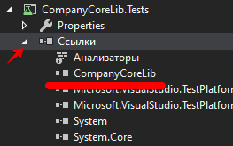

# Тестирование

Никто не ждёт, что в вашем приложении будет что тестировать. Поэтому скорее всего для сессии "Тестирование" будет задача разработать библиотеку классов и протестировать её.

+ Создание библиотеки классов
- Тестирующий класс (Unit-test)
+ [Тестовые сценарии](#Тестовые-сценарии)

## Создание библиотеки классов

### Описание задачи

Вам необходимо создать класс с названием **Analytics**, который будет позволять проводить аналитику различных процессов в рамках компании.

Реализуйте метод, который принимает в себя список объектов даты и времени по совершенным покупкам/заказам в рамках нашей компании, а возвращает список дат (без времени), отсортированный в порядке уменьшения частоты заказов. Это необходимо, чтобы наша компания могла прогнозировать наиболее высокий спрос на следующий год для обеспечения более качественного оказания услуг.
Возвращаемые данные должны содержать только даты для первого числа каждого месяца и 00:00 минут.

Например, вам поступили следующие данные: `2019-12-12 14:43, 2019-12-01 15:05, 2019-11-04 09:01`, а, значит, самый популярный месяц - декабрь. Вам необходимо вернуть следующие данные: `2019-12-01 00:00, 2019-11-01 00:00`. В случае совпадения характеристик популярности сперва нужно вывести более ранние месяцы.

Прогноз строится на основе предыдущего года. Так что данные Вам будут выдаваться строго за предыдущий год.

Спецификация метода представлена в отдельном файле в ресурсах.

### Реализация

Создаем **новый** проект, установив нужные фильтры (C#, Windows, Библиотека) и выбрав проект для соответствующей платформы. Мы всё делаем для **.NET Framework**.


Не забываем указать название проекта. Как вы тут напишете, так dll и будет называться.


В итоге студия создаст нам "рыбу" с одним файлом:

```cs
using System;
using System.Collections.Generic;
using System.Linq;
using System.Text;
using System.Threading.Tasks;

namespace CompanyCoreLib
{
    public class Class1
    {
    }
}
```

**Создать класс с названием *Analytics***

Можно, конечно, прямо в этом файле переименовать класс, но это нарушение логической структуры проекта (файл то будет называться по-старому). Поэтому создаем новый класс (1), а рыбу удаляем (2).

1. *Контекстное меню проекта -> Добавить -> Создать элемент*. Далее в списке находим "Класс" и не забываем задать ему название (Analytics в нашем случае). Получится аналогичная "рыба" с нужным названием класса:

    ```cs
    using System;
    using System.Collections.Generic;
    using System.Linq;
    using System.Text;
    using System.Threading.Tasks;

    namespace CompanyCoreLib
    {
        class Analytics
        {
        }
    }
    ```

    Убедитесь, что у класса установлен модификатор доступа **public**. В какой-то версии *Visual Studio* модификатор не установлен (а, значит, по умолчанию равен **private**) и тестирующее приложение потом не видит этот класс.


2. *Контекстное меню Class1 -> Удалить*

**Реализация класса аналитики**

В *спецификации метода* (был и такой файл в материалах сессии 3) указано название метода и его параметры, добавляем в наш класс:

```cs
public class Analytics
{
    public List<DateTime> PopularMonths(List<DateTime> dates) {
        return dates;
    }
}
```

**Во-первых**, обращаем внимание на ключевое слово "public" перед названием КЛАССА. Студия его автоматом не пишет, а для экспорта оно нужно. На эти грабли мы уже наступали при тестировании, напоминаю еще раз.

**Во-вторых**, на этом этапе не надо ничего придумывать - и типы данных, и название метода, и даже название параметра метода явно указаны в спецификации.

Собственно уже эта реализация дает почти целый балл в оценке (хотя она ничего и не делает, просто возвращает то что пришло обратно)

**Полная реализация**

Реализация не оптимальная, позже мы делали через словари (Dictionary), но что-то я ту реализацию не нашел...

```cs
namespace CompanyCoreLib
{
    // вспомогательный класс, который поможет отсортировать даты по частоте использования
    class DateTimeWithCounter
    {
        public DateTime DateTimeProp;
        public int Counter;
    }

    public class Analytics
    {
        public List<DateTime> PopularMonths(List<DateTime> dates)
        {
            // объавляем временный массив объектов "ДатаСоСчетчиком"
            var DateTimeWithCounterList = new List<DateTimeWithCounter>();

            // тут сразу можно сделать проверку на длину исходного массива

            // перебираем исходный массив
            foreach (DateTime date in dates) {
                // вычисляем начало месяца для даты текущего элемента массива
                var DateMonthStart = new DateTime(date.Year, date.Month, 1, 0, 0, 0);

                // ищем эту дату во вспомогательном массиве    
                var index = DateTimeWithCounterList.
                    FindIndex(item => item.DateTimeProp == DateMonthStart);

                // index содержит позицию найденного элемента в массиве или -1, если не найдно
                if (index == -1)
                {
                    // такой даты нет - добавляю
                    // в C# есть замечательная фишка - инициализаторы: можно после создания экземпляра класса задать любые публичные свойства, т.е. конструктор писать не обязательно
                    DateTimeWithCounterList.
                        Add(
                            new DateTimeWithCounter {
                                DateTimeProp = DateMonthStart,
                                Counter = 1
                            }
                        );
                }
                else {
                    // дата есть - увеличиваем счетчик
                    DateTimeWithCounterList[index].Counter++;
                }
            }

            // вспомогательный массив сортируем по убыванию по счетчику (самые популярные попадают в начало списка) 
            // ЗАТЕМ сортируем ПО дате по возрастанию
            // выбираем из объекта только дату, счетчик нам уже не нужен
            return DateTimeWithCounterList
                .OrderByDescending(item => item.Counter)
                .ThenBy(item => item.DateTimeProp)
                .Select(item => item.DateTimeProp)
                .ToList();

        }
    }
}
```

## Разработка модульных тестов

### Создание проекта для модульных тестов

В контекстном меню **РЕШЕНИЯ** выбираете *Добавить -> Создать проект*

При создании проекта можете воспользоваться фильтрами "языки", "платформа" и "типы проектов". В итоге надо выбрать "Проект модульного теста (.NET Framework)"


Правила формирования имени тестового проекта были в лекции, у меня получилось **CompanyCoreLib.Tests**. Расположение не трогаем, по-умолчанию тестовый проект сохранится в том же решении (рядом с основным проектом)

### Связь с основным проектом

Дальше нужно добавить связь с основным проектом:

В тестовом проекте находим пункт "ссылки" (раньше назывался "зависимости") и в контекстном меню "добавить ссылку"



Выбрать основной проект (их может быть несколько), у нас он называется **CompanyCoreLib**.



Проверить, добавлен ли проект в зависимости, можно раскрыв "ссылки"



### Написание тестов

Реализация теста, проверяющего результат работы метода *PopularMonths*:

```cs
namespace CompanyCoreLib.Tests
{
    [TestClass]
    public class AnalyticsTest
    {
        static Analytics AnalyticsClass = null;

        [ClassInitialize]
        static public void Init(TestContext tc)
        {
            AnalyticsClass = new Analytics();
        }


        [TestMethod]
        public void PopularMonths_Await3ItemsWithSortByDate()
        {
            List<DateTime> dates = new List<DateTime>() {
                new DateTime(2020, 12, 17),
                new DateTime(2020, 12, 15),
                new DateTime(2020, 11, 17),
                new DateTime(2020, 10, 1) };

            dates = AnalyticsClass.PopularMonths(dates);

            // должно вернуть 3 записи
            Assert.AreEqual(dates.Count, 3);

            // первой должен быть декабрь
            // тут лучше использовать CollectionAssert
            Assert.AreEqual(dates[0], new DateTime(2020, 12, 1));
        }
    }
}
```


## Тестовые сценарии

### Шаблон тестового сценария по стандартам WorldSkills (демо-экзамен) с комментариями

>Для выполнения процедуры тестирования удаления товаров Вам нужно описать пять сценариев.
>
>Удаление может быть выполнимо, а может быть отклонено согласно требованиям предметной области.
>
>Необходимо, чтобы варианты тестирования демонстрировали различные исходы работы алгоритма. Для описания тестовых сценариев в ресурсах предоставлен шаблон `testing-template.docx` (есть в этом репозитории в каталоге `docs/DEMO2020/Сессия 3`).

### Расшифровка тестовых информационных полей:

Поле | Описание
---|---
Название проекта | Название тестируемого проекта
Рабочая версия | Версия проекта/программного обеспечения (первый тест считается 1.0).
Имя тестирующего | Имя того, кто проводил тесты
Дата(ы) теста | Дата(ы) проведения тестов – это один или несколько дней. Если тесты проводились в более протяженный период времени, нужно отметить отдельную дату для каждого теста. 
Тестовый пример # | Уникальный ID для каждого тестового примера.  Следуйте некоторым конвенциям, чтобы указать типы тестов. Например,‘TC_UI_1′ означает‘user interface test case #1′ ( ТС_ПИ_1: тестовый случай пользовательского интерфейса#1)
Приоритет тестирования *(Низкий/Средний/Высокий)* | Насколько важен каждый тест. Приоритет тестирования для бизнес-правил и функциональных тестовых случаев может быть средним или высоким, в то время как незначительные случаи пользовательского интерфейса могут иметь низкий приоритет. 
Заголовок/название теста | Название тестового случая. Например, Подтвердите страницу авторизации с действительным именем пользователя и паролем.  
Краткое изложение теста | Описание того, что должен достичь тест. 
Этапы теста | Перечислите все этапы теста подробно. Запишите этапы теста в том порядке, в котором они должны быть реализованы. Предоставьте как можно больше подробностей и разъяснений. Пронумерованный список – хорошая идея. 
Тестовые данные | Перечислите/опишите все тестовые данные, используемые для данного тестового случая. Так, фактические используемые входные данные можно отслеживать по результатам тестирования.  Например, Имя пользователя и пароль для подтверждения входа. 
Ожидаемый результат | Каким должен быть вывод системы после выполнения теста? Подробно опишите ожидаемый результат, включая все сообщения/ошибки, которые должны отображаться на экране. 
Фактический результат | Каким должен быть фактический результат после выполнения теста? Опишите любое релевантное поведение системы после выполнения теста. 
Предварительное условие | Любые предварительные условия, которые должны быть выполнены до выполнения теста. Перечислите все предварительные условия для выполнения этого тестового случая. 
Постусловие | Каким должно быть состояние системы после выполнения теста? 
Статус  *(Зачет/Незачет)* | Если фактический результат не соответствует ожидаемому результату, отметьте тест как неудачный. В ином случае обновление пройдено. 
Примечания/комментарии | Используйте эту область для любых дополнительных заметок/комментариев/вопросов. Эта область предназначена для поддержки вышеуказанных полей (например, если есть некоторые особые условия, которые не могут быть описаны в любом из вышеуказанных полей, или если есть вопросы, связанные с ожидаемыми или фактическими результатами). 

### Аннотация теста

&nbsp;|&nbsp;| Мои комментарии
---|---|---
Название проекта | DoeduSam |
Рабочая версия | 1.0 | Эту версию не плохо бы вписать в свойства проекта
Имя тестирующего | DEMO_xx | 
Дата(ы) теста | 21.12.2020 | текущая

---

### Тестовый пример #1:

&nbsp;|&nbsp;| Мои комментарии
---|---|---
Тестовый пример # | TC_DP_1 | расшифровывается: TestCase_DeleteProduct_x
Приоритет тестирования | средний | бизнес-правило
Заголовок/название теста | Удаление товара без продаж и дополнительных товаров |
Краткое изложение теста | Товар должен без ошибок удалиться из таблицы товаров |
Этапы теста | 1. Очистить таблицы продаж, дополнительных товаров, дополнительных картинок и товаров. 2. Добавить тестовый товар в таблицу **Products**<br/>3. Вызвать метод удаления товара<br/>4. Проверить наличие удаленной записи в таблице |
Тестовые данные | Название: *Моторное масло Motor Oil KE900-90042-R*<br/>Изображение: *Товары автосервиса\8FE07916.jpg*<br/>Производитель: *Nissan*<br/>Активен: *да*<br/>Цена: *2060* | Тут нужно вставить содержимое любой записи из *products_a_import*
Ожидаемый результат | Запись должна быть удалена из таблицы без ошибок и исключений |
Фактический результат | Запись удалена | 
Статус | зачет | 
Предварительное условие | В базу должны быть загружен тестовый продукт |
Постусловие | Таблица товаров должна быть пустой |
Примечания/комментарии | Т.к. мы добавили только товар без продаж и дополнительных товаров, то ошибок в принципе быть не может ни по вине кода ни по ограничениям базы | 


### Что еще можно проверить

* **№2** - удаление товара с дополнительными товарами. Если ограничения настроены правильно (каскадное удаление), то тоже долно удаляться нормально.

* **№3** - удаление товара с дополнительными картинками. Аналогично №2.

* **№4** - удаление товара с продажами. Вариант без предварительной проверки - база должна вернуть ошибку, приложение это исключение должно перехватить и выдать сообщение, что удалять нельзя.

* **№5** - удаление товара с продажами. Вариант с предварительной проверкой - в коде нужно проверить есть ли у товара продажи и при наличии продаж вывести сообщение, что удалять товар нельзя.
