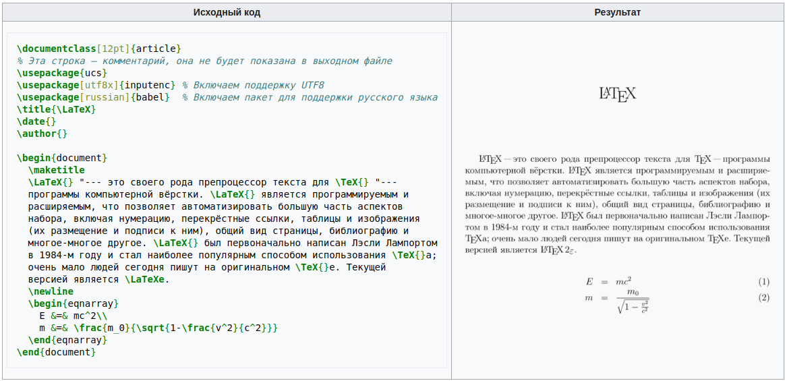

Здравствуйте укажаемые коллеги!

Так как я давно занимаюсь программированием, то часть технологий, используемых в работе, применил и для написания/хранения лекций и методических материалов. Чем и хочу с Вами поделиться.

Набор используемых технологий:

* система контроля версий
* язык текстовой разметки [MarkDown](https://ru.wikipedia.org/wiki/Markdown)
* визуальный текстовый редактор Visual Studio Code

## Система контроля версий GitHub

> Вообще, эта технология используется для отслеживания версий программного обеспечения и возможности её намного шире тех, которые я опишу дальше.

1. Публичный репозиторий (хранилище) проектов. Т.е. доступ к проекту (в нашем случае текст лекции) доступен всем в интернете (есть еще приватные репозитории, если вдруг вы захотите использовать СКВ в других целях)

2. Поддержка языка текстовой разметки MarkDown

Таким образом, используя репозиторий на GitHab-е мы избавляемся от необходимости печатать лекции на бумаге, таскать их на флешке или пересылать по почте.

## Язык текстовой разметки MarkDown

**Markdown** (произносится маркда́ун) — облегчённый язык разметки, созданный с целью обозначения форматирования в простом тексте, с максимальным сохранением его читаемости человеком, и пригодный для машинного преобразования (на GitHub-е как раз и отображается преобразованный текст)

Раз это *простой текст*, то редактировать его можно даже в блокноте, но есть и более удобные редакторы, про которые я расскажу позже.

Примеры разметки:

### Текст с выделением

\*выделение\* (например, *курсив*)

\*\*сильное выделение\*\* (например, **полужирное** начертание)

\_\*\*_**комбинация**_\*\*\_ курсива и полужирного начертания

>Причем без разницы в каком порядке использовать символы ``*`` и ``_``

\~\~~~зачёркнутый~~\~\~ текст

### Программный код

Выделяется знаком апострофа "\`", может быть как `внутри строки`

\`\`\`
```
так 
и 
отдельным
блоком
```
\`\`\`

>Так можно оформлять не только программный код, но и любой текст, в котором нужно сохранить оригинальное форматирование. Дело в том, что MarkDown, как и практически любой язык верстки обрезает пустые строки и пробелы

### Списки

1. 1\. Нумерованные
2. 2\. Причем порядок цифр
9. 9\. На результат не влияет

* обычные списки
    - с любым уровнем вложенности
        1. можно комбинировать нумерованные и не нумерованные списки 

### Заголовки

Создание заголовков производится путём помещения знака решетки перед текстом заголовка. Количество знаков «#» соответствует уровню заголовка. Поддерживается 6 уровней заголовков.

# \# Заголовок первого уровня
...
### \#\#\# Заголовок третьего уровня
...
###### \#\#\#\#\#\# Заголовок шестого уровня

### Цитаты (комментарии)

>Любой элемент разметки (текст, список, картинка) могут быть помечены как цитата, если добавить в начале строки знак "\>"

### Ссылки

* Ссылки на внешние ресурсы

    ```
    [Текст ссылки](http://example.com/ "Необязательный заголовок ссылки")
    ```

* Ссылки внутри документа

    ```
    [Текст ссылки](#якорь)
    ```

    В качестве "якоря" может выступать [заголовок](#Заголовки) или html-тег \<a\> (но это уже нетривиальное использование разметки)

* Ссылки внутри репозитория

    ```
    [Текст ссылки](относительный путь на файл внутри репозитория)
    ```

### Таблицы

столбец 1 | столбец 2
:---:|---:
1 | sfbvstb
2 | sbstbn

Как это выглядит в разметке (обратите внимание, содержимое столбцов можно центрировать или выравнивать по правому краю):

```
столбец 1 | столбец 2
:---:|---:
1 | sfbvstb
2 | sbstbn
```

### Изображения

С помощью MarkDown-а нельзя нарисовать схему или формулу, в таком случае можно использовать картинки

```

```

> Ссылка может быть и на рисунок расположенный в репозитории


## Редактор кода

И последний компонент из набора технологий - редактор **Visual Studio Code** (VSC). Как я писал выше редактировать MarkDown можно и в обычном блокноте (но не в Word-e), но VSC позволяет сразу видеть получившийся результат и автоматизировать работу с репозиторием.


## P.S.

Для тех, кому тема показалась интересной, но возможностей MarkDown-а недостаточно (формулы, схемы - математика, физика и т.п.).

Существуют другие форматы текстовой разметки, в частности [LaTeX](https://ru.wikipedia.org/wiki/LaTeX). 



Единственное ограничение этого формата в выбранном стеке технологий, то что он не преобразуется автоматически в "реальный" отображаемый вид на GitHub-e, придется преобразовывать его в PDF и уже PDF размещать в репозитории. У GitHub-а, правда есть технология CI (Continuous Integration), обычно она используется для тестирования нового кода, но можно настроить ее и для автоматического преобразования LaTeX-а в PDF.