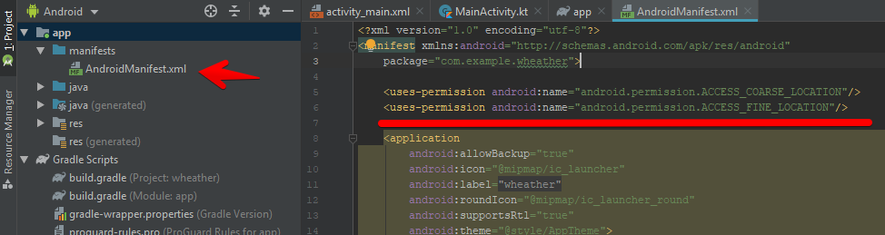

# Проект **Погода**

Цели:
* получить текущую локацию
* по сети получить погоду для текущей локации
* отобразить погоду на форме

## Получение текущей локации

### Стандартные средства

[Тут](https://developers.google.com/android/reference/com/google/android/gms/location/package-summary) описаны стандартные интерфейсы для работы с геолокацией


[На основе этого примера можно посмотреть как это работает](https://en.proft.me/2019/01/3/how-get-location-latitude-longitude-android-kotlin/)

1. В манифест добавляем разрешения для работы с геолокацией  
```
<uses-permission android:name="android.permission.ACCESS_COARSE_LOCATION"/>
<uses-permission android:name="android.permission.ACCESS_FINE_LOCATION"/>
```



2. В build.graddle (Module: app) добавляем зависимость  
```
implementation 'com.google.android.gms:play-services-location:11.8.0'
```


Полный текст программы:

```kt
package com.example.wheather

import android.Manifest
import android.app.AlertDialog
import android.content.pm.PackageManager
import android.location.Location
import androidx.appcompat.app.AppCompatActivity
import android.os.Bundle
import androidx.core.app.ActivityCompat
import androidx.core.content.ContextCompat
import com.google.android.gms.location.FusedLocationProviderClient
import com.google.android.gms.location.LocationServices
import kotlinx.android.synthetic.main.activity_main.*

class MainActivity : AppCompatActivity() {

    var fusedLocationClient: FusedLocationProviderClient? = null

    override fun onCreate(savedInstanceState: Bundle?) {
        super.onCreate(savedInstanceState)
        setContentView(R.layout.activity_main)

        // инициализируем объект
        fusedLocationClient = LocationServices.
            getFusedLocationProviderClient(this)

        // запрашиваем разрешение
        if (checkPermission(
            Manifest.permission.ACCESS_COARSE_LOCATION,
            Manifest.permission.ACCESS_FINE_LOCATION)) 
        {
            fusedLocationClient?.lastLocation?.
                addOnSuccessListener(this,
                    // Got last known location. In some rare
                    // situations this can be null.
                    {location : Location? ->
                        // полученные координаты выводим на экран
                        if(location == null) {
                            textView.text = "location == null"
                        } else location.apply {
                            textView.text = location.toString()
                        }
                    })
        }
    }

    private fun checkPermission(vararg perm:String) : Boolean {
        val PERMISSION_ID = 42

        val havePermissions = perm.toList().all {
            ContextCompat.checkSelfPermission(this,it) ==
                    PackageManager.PERMISSION_GRANTED
        }

        if (!havePermissions) {
            if(perm.toList().any {
                ActivityCompat.
                    shouldShowRequestPermissionRationale(this, it)
            }){
                val dialog = AlertDialog.Builder(this)
                    .setTitle("Permission")
                    .setMessage("Permission needed!")
                    .setPositiveButton("OK", {id, v ->
                        ActivityCompat.requestPermissions(
                            this, perm, PERMISSION_ID)
                    })
                    .setNegativeButton("No", {id, v -> })
                    .create()
                dialog.show()
            } else {
                ActivityCompat.requestPermissions(this, perm, PERMISSION_ID)
            }
            return false
        }
        return true
    }
}
```

### Сторонние библиотеки

В стандартной реализации, как обычно, слишком много букв, к счастью есть [библиотека](https://github.com/BirjuVachhani/locus-android), в которой вся рутина скрыта:

1. Добавляем репозиторий в build.graddle (Project) ()

```
maven { url 'https://jitpack.io' }
```


2. Добавляем зависимости в build.graddle (Module app)

```
implementation 'com.google.android.gms:play-services-location:17.0.0'
implementation 'com.github.BirjuVachhani:locus-android:3.0.1'
```


3. В конструктор добавляем запрос геолокации:

```kt
Locus.getCurrentLocation(this) { result ->
    result.location?.let {
        tv.text = "${it.latitude}, ${it.longitude}"
    } ?: run {
        tv.text = result.error?.message
    }
}
```


Полный текст программы:

```kt
package com.example.locator2

import androidx.appcompat.app.AppCompatActivity
import android.os.Bundle
import com.birjuvachhani.locus.Locus
import kotlinx.android.synthetic.main.activity_main.*

class MainActivity : AppCompatActivity() {

    override fun onCreate(savedInstanceState: Bundle?) {
        super.onCreate(savedInstanceState)
        setContentView(R.layout.activity_main)

        Locus.getCurrentLocation(this) { result ->
            result.location?.let {
                tv.text = "${it.latitude}, ${it.longitude}"
            } ?: run {
                tv.text = result.error?.message
            }
        }

    }
}
```

## Http запросы

В Kotlin-е есть встроенные функции работы с http-запросами, но стандартный код для сетевых запросов сложен, излишен и в реальном мире почти не используется. Используются библиотеки.
Самые популярные: [OkHttp](https://square.github.io/okhttp/) и Retrofit.

Рассмотрим работу к **OkHttp**

https://square.github.io/okhttp/recipes/ - примеры синхронных и асинхронных запросов на котлине

### Подключение библиотеки к проекту:
   


1. На закладке **Project** в **Gradle Scripts** открываем файл **build.gradle (Module: app)**

2. В файле находим секцию **dependencies** (зависимости)

3. Добавляем нашу библиотеку ``implementation 'com.squareup.okhttp3:okhttp:4.2.1'``. На момент написания методички последняя версия была 4.2.1, вы можете уточнить актуальную версию на сайте.

4. Синхронизируйте измения (Gradle скачает обновившиеся зависимости)
    
5. В манифест добавляем права на доступ в интернет
```
<uses-permission android:name="android.permission.INTERNET" />
```    

6. В функцию определения координат вместо вывода координат на экран вставаляем вызов функции, запрашивающей погоду для этих координат


```kt
Locus.getCurrentLocation(this) { result ->
    result.location?.let {
        //tv.text = "${it.latitude}, ${it.longitude}"

        getWheather(it.longitude, it.latitude)

    } ?: run {
        tv.text = result.error?.message
    }
}
```

## Вывод иконки погоды

Для отображения иконки погоды используем компонент ImageView и библиотеку Glide. Для установки библиотеки:

    * добавить репозиторий mavenCentral() в build.graddle (Project)
    * добавить зависимость ``implementation 'com.github.bumptech.glide:glide:4.10.0'`` в build.graddle (Module)

Функция запроса погоды

```kt
// http клиент
private val client = OkHttpClient()

fun getWheather(lon: Double, lat: Double) {
    val token = "d4c9eea0d00fb43230b479793d6aa78f"
    val url = "https://api.openweathermap.org/data/2.5/weather?lat=${lat}&lon=${lon}&units=metric&appid=${token}"

    val request = Request.Builder().url(url).build()

    client.newCall(request).enqueue(object : Callback {

        override fun onFailure(call: Call, e: IOException) {
            setText( e.toString() )
        }

        override fun onResponse(call: Call, response: Response) {
            response.use {
                if (!response.isSuccessful) throw IOException("Unexpected code $response")

                // так можно достать заголовки http-ответа
                //for ((name, value) in response.headers) {
                //  println("$name: $value")
                //}

                //строку преобразуем в JSON-объект
                var jsonObj = JSONObject(response.body!!.string())


                // обращение к визуальному объекту из потока может вызвать исключение
                // нужно присвоение делать в UI-потоке
                setText( jsonObj )
            }
        }
    })
}

fun setText(t: JSONObject){
    runOnUiThread { 
        // достаем из ответа сервера название иконки погоды
        val wheather = t.getJSONArray("weather")
        val icoName = wheather.getJSONObject(0).getString("icon")
        val icoUrl = "https://openweathermap.org/img/w/${icoName}.png"

        // аналогично достаньте значение температуры и выведите на экран

        // загружаем иконку и выводим ее на icon (ImageView)
        Glide.with(this).load( icoUrl ).into( icon )
    }
}
```
