[задание взято отсюда]: https://docplayer.ru/49945157-Zadaniya-demonstracionnogo-ekzamena-kompetenciya-programmirovanie-v-kompyuternyh-sistemah-specialnost-programmirovanie-v-kompyuternyh-sistemah.html

[C# + DB]: https://it-black.ru/rabota-s-bazoj-dannyh-v-ci_sharp/

>[Скринкаст: Подготовка к демо-экзамену по компетенции "Программные решения для бизнеса"](https://lawreps-my.sharepoint.com/:f:/g/personal/zy691_nig3_a1p_me/EtAw5Adn5-JEsCa_16SIRSABDyllhE5-pOsH94pMDtcLrQ?e=5VtQq7)
>
>
>

# Подготовка к демо-экзамену по компетенции "Программные решения для бизнеса"

[like, count, lenght, between, timediff]: //TODO

[хранимые процедуры]: _

Используемые технологии: MSSQL, C#

>экзаменов у нас еще не было, далее идет примерная компиляция по тому что нашел в интернете

Модули задания (не все из них у нас будут)

* [Проектирование структуры данных](#Проектирование-структуры-данных)
* [Составление запросов](#Составление-запросов)
* [Импорт данных](#Импорт-данных)
* [SQL Server Management Studio](#SQL-Server-Management-Studio)
* [Программирование](#Программирование)
    * [Расшифровка скринкаста ч2](#Расшифровка-скринкаста-ч2)
    * [Расшифровка скринкаста ч3 (ORM)](#Расшифровка-скринкаста-ч3-ORM)
* ~~Реализация отчетов~~
* ~~Проектирование архитектуры~~
* Тестирование
* ~~Разработка мобильного приложения~~
* Документация
* ~~Общий профессионализм решения~~

## Проектирование структуры данных

У строительной организации несколько складов. 

Создайте базу данных, учитывая что:
* В базе данных должны содержаться сведения о:
    - складах  (данными  о  складе  являются  его  номер,  адрес,  вид хранящихся   строительных материалов, расстояние до областного центра);
    - строительных  материалах  (данными  о  материалах  являются  его номер, наименование, единица измерения, остаток, склад).
* Первая таблица связана со второй связью «один ко многим»; 
* Значения первого поля в каждой таблице должно быть уникальными и не содержать значений NULL; 
* Первые поля в таблицах являются первичными ключами; 
* Последнее поле во второй таблице является внешним ключом.

### Таблица Склад

№ склада | Адрес | Вид материалов | Расстояние
:-------:|-------|----------------|:---:
1 | д.Крутово | сыпучие | 5
2 | пос.Веканово | отделочные | 10
3 | пос.Заскочиха | отделочные | 15
4 | д.Орлово | отделочные | 8
5 | д.Комарово | кирпич | 12

### Таблица Стройматериал

№ материала | Наименование | Ед_изм | Остаток | Склад
:----------:|--------------|:------:|:-------:|:---:
5466 | Цемент | кг | 680 | 1
7898 | Краска | кг | 350 | 4
1232 | Шпатлевка | кг | 260 | 2
4565 | Кирпич глиняный | м3 | 68 | 5
7535 | Песок | т | 250 | 1
1595 | Известь | т | 9 | 3
8542 | Кирпич силикатный | м3 | 120 | 5

>Виды материалов и единицы измерения являются справочниками и по идее должны быть вынесены в отдельные таблицы.

Для создания таблиц в MySQL используется команда CREATE TEBLE. Рассмотрим ее синтаксис и напишем запросы для создания наших таблиц:

>Квадратными скобками отмечаются не обязательные параметры

```sql
CREATE TABLE [IF NOT EXISTS] [db_name.]tbl_name [(create_definition,...)] [table_options];
```

, где:
* *CREATE TABLE* - команда "создать таблицу"
* *IF NOT EXISTS* - создавать только, если таблица не существует (если таблица существует и повторно попытаться выполнить команду CREATE TABLE, то драйвер БД вернет ошибку и в программе будет вызвано исключение, что может поломать логику работы тем, кто забыл про обработку исключений).
* *[db_name.]* - название базы данных в которой создается таблица;
* *tbl_name* - название создаваемой таблицы. Название должно быть из латинских букв без пробелов.
    >В примерах часто названия таблиц и полей пишут русскими буквами, но у нас не 1С, поэтому все делаем латиницей трансилитом

    в нашем случае первую таблицу назовем **sklad**, а вторую **stroy_material**
* *(create_definition,...)* - список создаваемых полей,индексов и т.п.; 
* *table_options* - параметры таблицы (тип, комментарий и т.д.). Мы в эти дебри пока не лезем;

Рассмотрим подробнее параметр *create_definition* (он имеет несколько вариантов):

1. Создание поля:

    ```
    col_name type [NOT NULL | NULL] [DEFAULT default_value] [AUTO_INCREMENT] [PRIMARY KEY] [COMMENT '']
    ```            

    , где:

    * *col_name* - название поля;
    * *type* - тип поля. Вообще типов полей достаточно много, но мы рассмотрим только основные:
        - *TINYINT[(размер)]* - буквально "крошечное целое". Обычно используется для логических полей: TINYINT(1);
        - *INT[(размер)]* - обычное целое, размер по умолчанию = 11;
        - *DECIMAL(размер, количество знаков после запятой)* - вещественные числа (с запятой);
        - *VARCHAR(размер)* - строка;
        - *TEXT* - текст произвольной длины.
    * *NOT NULL | NULL* - может ли быть поле не заполненным. В нашем задании явно сказано что поля "№ склада" и "№ материала" не могут быть пустыми. Если для поля указан параметр "NOT NULL", то при попытке вставить запись без этого поля возникнет ошибка. Если не указывается ни NULL, ни NOT NULL, то столбец интерпретируется так, как будто указано NULL;
    * *DEFAULT default_value* - значение по-умолянию. Например поле  остаток не должно быть пустым и при создании таблицы можно указать ему "DEFAULT 0"
    * *[AUTO_INCREMENT]* - Целочисленный столбец может иметь дополнительный атрибут AUTO_INCREMENT. При записи величины NULL (рекомендуется) или 0 в столбец AUTO_INCREMENT данный столбец устанавливается в значение value+1, где value представляет собой наибольшее для этого столбца значение в таблице на момент записи;
    * *[PRIMARY KEY]* - PRIMARY KEY представляет собой уникальный ключ KEY (индекс) с дополнительным ограничением, что все столбцы с данным ключом должны быть определены как NOT NULL. Таблица может иметь только один первичный ключ PRIMARY KEY. Хотя этот парамтер и не обязательный, но первичный ключ требуется во многих фреймворках и считается хорошей практикой первым полем в базе сделать ``id INT AUTO_INCREMENT PRIMARY KEY``
    * *[COMMENT 'текст комментария']*

2. Создание внешних ключей

    Внешние ключи позволяют установить связи между таблицами. Внешний ключ устанавливается для столбцов из зависимой, подчиненной таблицы, и указывает на один из столбцов из главной таблицы. Как правило, внешний ключ указывает на первичный ключ из связанной главной таблицы.

    Тут надо понимать, что KEY это синоним INDEX, т.е. FOREIGN KEY не просто ограничение поля (в такое поле нельзя записать значение, которого нет в связанном поле основной таблицы и, по-умолчанию, нельзя удалять записи основной таблицы, если у них есть связи в зависимой таблице), но и индексированный поиск в дочерней таблице по связанным полям.

    ```
    [CONSTRAINT имя_ограничения] FOREIGN KEY (столбец1, столбец2, ... столбецN) REFERENCES главная_таблица (столбец_главной_таблицы1, столбец_главной_таблицы2, ... столбец_главной_таблицыN)
    ```

    , где:
    * *[CONSTRAINT имя_ограничения]* - задает имя ограничения, обычно в виде "текущая таблица"_"главная таблица"_fk;
    * *FOREIGN KEY (столбец1, столбец2, ... столбецN)* - внешний ключ: поле (или поля), которые служат для связи с главной таблицей;
    * *REFERENCES главная_таблица (столбец_главной_таблицы1, столбец_главной_таблицы2, ... столбец_главной_таблицыN)* - ссылка на поля главной таблицы;

Теперь, зная синтаксис, напишем команды для создания наших таблиц:

```sql
-- два минуса - это комментарий в SQL-запросах

CREATE TABLE IF NOT EXISTS user1.sklad (
    -- в задании явно сказано, что номер склада должен быть уникальным, для этого идеально подходит PRIMARY KEY
    num INT NOT NULL PRIMARY KEY COMMENT 'номер склада',
    adress VARCHAR(255),
    vid VARCHAR(32) COMMENT 'вид материалов',
    rast INT COMMENT 'расстояние до областного центра'
);

CREATE TABLE IF NOT EXISTS user1.stroy_material (
    num INT NOT NULL PRIMARY KEY COMMENT 'номер материала',
    name VARCHAR(255) COMMENT 'название',
    ed_izm VARCHAR(16) COMMENT 'единицы измерения',
    ost INT NOT NULL DEFAULT 0  COMMENT 'остаток',
    -- при ссылке на другую таблицу поле обычно называют "таблица"_"поле для связи"
    sklad_num INT NOT NULL,
    CONSTRAINT material_sklad_fk FOREIGN KEY (sklad_num) REFERENCES sklad (num) 
);
```

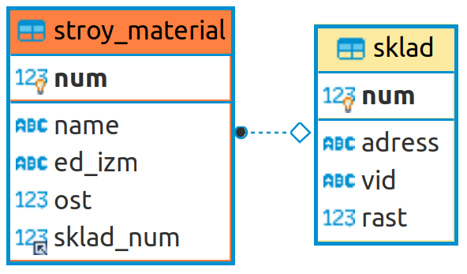

## Составление запросов

Составьте запросы к базе данных (использование языка запросов SQL оценивается дополнительными баллами):

>Существует несколько видов запросов:  
**INSERT** - добавление записей;  
**UPDATE** - изменение;  
**DELETE** - удаление;  
**SELECT** - выборка;  

### INSERT

Упрощенная схема запроса:

```
INSERT [INTO] название_таблицы [(название_поля,...)]
    VALUES (выражение,...),(...),...
```

,где:
* *[(название_поля,...)]* - список полей таблицы, которые мы заполняем. Если заполняются все поля, то этот параметр можно пропустить.
* *VALUES (выражение,...),(...),...* - несколько наборов значений для вставки в таблицу. Порядок значений должен быть тот же что и в списке *названий полей* (или тот, в котором поля определены в таблице, если список названий полей не используется)

Примеры:

```sql
-- обратите внимание: строковые значения передаются в кавычках
INSERT INTO sklad (num, adress, vid, rast)
    VALUES  (1,"д.Крутово","сыпучие",5),(2,"пос.Веканово","отделочные",10),
            (3,"пос.Заскочиха","отделочные",15),(4,"д.Орлово","отделочные",8),
            (5,"д.Комарово","кирпич",12);

-- в этом примере мы заполняем все поля, поэтому список полей пропущен
INSERT INTO stroy_material
    VALUES  (5466,"Цемент","кг",680,1),(7898,"Краска","кг",350,4),
            (1232,"Шпатлевка","кг",260,2),(4565,"Кирпич глиняный","м3",68,5);

-- а в этом примере в списке полей пропущен "остаток"
INSERT INTO stroy_material (num, name, ed_izm, sklad_num)
    VALUES  (7535,"Песок","т",1),(1595,"Известь","т",3),
            (8542,"Кирпич силикатный","м3",5);
```

### SELECT

Выборка данных из таблицы (или нескольких таблиц).

Упрощенная схема запроса:

```
SELECT [DISTINCT | DISTINCTROW | ALL]
    select_expression,...
    FROM название_таблицы
        [WHERE условие]
        [GROUP BY {unsigned_integer | col_name | formula} [ASC | DESC], ...]
        [HAVING условие]
        [ORDER BY {unsigned_integer | col_name | formula} [ASC | DESC], ...]
        [LIMIT [offset,] rows]
```

Рассмотрим на примерах:

* Напишите запрос, который выводит Адрес, Вид_материалов и Расстояние из таблицы Склад.

    ```sql
    SELECT adress,vid,rast FROM sklad;
    ```

* Напишите  запрос,  который  вывел  бы  список  всех  стройматериалов, находящихся на складе в д.Комарово.

    Тут возможны два варианта, когда мы знаем номер склада:

    ```sql
    SELECT name 
	    FROM stroy_material
	    WHERE sklad_num = 5;
    ```

    и поиск по названию склада:

    ```sql
    SELECT sm.name 
	    FROM sklad s, stroy_material sm
	    WHERE s.adress = 'д.Комарово' AND sm.sklad_num = s.num ;
    ```

    - если выборка идет из нескольких таблиц, то можно после названия таблицы указать алиас и перед полями указывать алиас, а не полное название таблицы

    - условие выборки состоит из двух логических выражений объединенных логическим "И"

* Напишите запрос, который вывел бы таблицу Стройматериал со столбцами в обратном порядке.

    В условиях задачи не сказано по какому полю сортировать, считаем что по первичному ключу. Для задания сортировки используется команда *ORDER BY название_поля ASC | DESC*. Где ASC - сортировка по возрастанию (используется по-умолчанию), DESC - по убыванию:

    ```sql
    SELECT * 
        FROM stroy_material 
        ORDER BY num DESC;
    ```

* Напишите запрос, извлекающий из таблицы Стройматериал список складов, где хранятся эти стройматериалы. Склады не должны повторяться.

    Для выборки уникальных полей служит клчевое слово DISTINCT. 
    
    Условие WHERE позволяет выбирает только те склады, в которых есть материалы

    ```sql
    SELECT DISTINCT s.num, s.adress 
	    FROM stroy_material sm, sklad s 
	    WHERE s.num = sm.sklad_num;
    ```

    Можно усложнить запрос и в условие добавить проверку остатка, чтобы не ехать на склад за материалом, которого не осталось (хотя запись в таблице осталась):

    ```sql
    SELECT DISTINCT s.num, s.adress 
	    FROM stroy_material sm, sklad s 
	    WHERE sm.ost > 0 AND s.num = sm.sklad_num;
    ```

* Напишите запрос, выводящий наименование и номер склада стройматериала с самым большим остатком.

    >Задача не совсем корректная, единицы измерения у материалов разные

    >Поиск по неиндексированному полю (остаток) может занять много времени. Если такие запросы действительно нужны, то нужно создать индекс по этому полю

    Вариант с сортировкой по убыванию и лимитом:

    ```sql
    SELECT s.num, s.adress
	    FROM stroy_material sm, sklad s 
	    WHERE s.num = sm.sklad_num
	    ORDER BY sm.ost DESC 
	    LIMIT 1
    ```
* Напишите  запрос  на  создание  списка, состоящего  из  Наименования стройматериала  и  Адреса  склада,  где  он хранится  для  всех  складов, расположенных на расстоянии не менее 12 км от областного центра.

    ```sql
    SELECT sm.name, s.adress 
        FROM stroy_material sm, sklad s
        WHERE sm.sklad_num=s.num AND s.rast<12;
    ```

### UPDATE

Изменение данных.

```
UPDATE название_таблицы
    SET название_поля1=выражение1 [, название_поля2=выражение2, ...]
    [WHERE условие]
```

* Напишите  запрос, который  уменьшает остаток  всех  строительных материалов на 10%.

    ```sql
    UPDATE stroy_material 
	    SET ost = ost - ost*0.1
	    WHERE ost>0
    ```

* Напишите  запрос, переводящий  строительные  материалы,  находящиеся  на складе в пос. Веканово на склад в пос. Заскочиха.

    Вариант, когда нам известны номера складов (Веканово = 2, Заскочиха = 3):

    ```sql
    UPDATE stroy_material 
	    SET sklad_num = 3
	    WHERE sklad_num = 2;
    ```

    И вариант, когда номер не известен:

    ```sql
    UPDATE stroy_material sm, sklad s 
 	    SET sm.sklad_num = (SELECT num FROM sklad WHERE adress="пос.Веканово")
 	    WHERE s.adress = "пос.Заскочиха" and s.num = sm.sklad_num 
    ```

    Обратите внимание: 

    - после ключевого слова **UPDATE** мы перечисляем все таблицы, которые учавствуют в запросе (как **FROM** у **SELECT**);
    - в качестве выражения используем вложенный **SELECT**.

### DELETE

Удаление записей

```sql
DELETE FROM название_таблицы
    [WHERE условие]
```

* Напишите запрос на удаление всех стройматериалов, хранящихся на складе №1.

    ```sql
    DELETE 
        FROM stroy_material 
        WHERE sklad_num = 1;
    ```

Для закрепления материала пройдитесь по урокам в [онлайн тренажере](https://sql-academy.org/ru/trainer?sort=byIncreasingDifficulty). Там же можно почитать Учебник.

## Импорт данных

Стандартом *де-факто* для импорта/экспорта данных является формат CSV.

### Что такое CSV-файлы

Формат CSV используют, чтобы хранить таблицы в текстовых файлах. Данные очень часто упаковывают именно в таблицы, поэтому CSV-файлы очень популярны.

CSV расшифровывается как comma-separated values — «значения, разделенные запятыми». Но разделителями столбцов в CSV-файле могут служить и точки с запятой, и знаки табуляции. Это все равно будет CSV-файл.

У CSV куча плюсов перед тем же форматом Excel: текстовые файлы просты как пуговица, открываются быстро, читаются на любом устройстве и в любой среде без дополнительных инструментов.

Из-за своих преимуществ CSV — сверхпопулярный формат обмена данными, хотя ему уже лет 40. CSV используют прикладные промышленные программы, в него выгружают данные из баз.

Одна беда — текстового редактора для работы с CSV мало. Еще ничего, если таблица простая: в первом поле ID одной длины, во втором дата одного формата, а в третьем какой-нибудь адрес. Но когда поля разной длины и их больше трех, начинаются мучения.

Еще хуже с анализом данных — попробуй «Блокнотом» хотя бы сложить все числа в столбце. Я уж не говорю о красивых графиках.

Поэтому CSV-файлы анализируют и редактируют в Excel и аналогах: Open Office, LibreOffice и прочих.

### Как Excel портит данные: из классики

Все бы ничего, но Excel, едва открыв CSV-файл, начинает свои лукавые выкрутасы. Он без спроса меняет данные так, что те приходят в негодность. Причем делает это совершенно незаметно. Из-за этого в свое время мы схватили ворох проблем.

Большинство казусов связано с тем, что программа без спроса преобразует строки с набором цифр в числа.

**Округляет**. Например, в исходной ячейке два телефона хранятся через запятую без пробелов: «5235834,5235835». Что сделает Excel? Лихо превратит номера́ в одно число и округлит до двух цифр после запятой: «5235834,52». Так мы потеряем второй телефон.

**Приводит к экспоненциальной форме**. Excel заботливо преобразует «123456789012345» в число «1,2E+15». Исходное значение потеряем напрочь.

Проблема актуальна для длинных, символов по пятнадцать, цифровых строк. Например, КЛАДР-кодов (это такой государственный идентификатор адресного объекта: го́рода, у́лицы, до́ма).

**Удаляет лидирующие плюсы**. Excel считает, что плюс в начале строки с цифрами — совершенно лишний символ. Мол, и так ясно, что число положительное, коль перед ним не стоит минус. Поэтому лидирующий плюс в номере «+74955235834» будет отброшен за ненадобностью — получится «74955235834». (В реальности номер пострадает еще сильнее, но для наглядности обойдусь плюсом).

Потеря плюса критична, например, если данные пойдут в стороннюю систему, а та при импорте жестко проверяет формат.

**Разбивает по три цифры**. Цифровую строку длиннее трех символов Excel, добрая душа, аккуратно разберет. Например, «8 495 5235834» превратит в «84 955 235 834».

Форматирование важно как минимум для телефонных номеров: пробелы отделяют коды страны и города от остального номера и друг от друга. Excel запросто нарушает правильное членение телефона.

**Удаляет лидирующие нули**. Строку «00523446» Excel превратит в «523446».
А в ИНН, например, первые две цифры — это код региона. Для Республики Алтай он начинается с нуля — «04». Без нуля смысл номера исказится, а проверку формата ИНН вообще не пройдет.

**Меняет даты под локальные настройки**. Excel с удовольствием исправит номер дома «1/2» на «01.фев». Потому что Windows подсказал, что в таком виде вам удобнее считывать даты.

### Побеждаем порчу данных правильным импортом

Если серьезно, в бедах виноват не Excel целиком, а неочевидный способ импорта данных в программу.

По умолчанию Excel применяет к данным в загруженном CSV-файле тип «General» — общий. Из-за него программа распознает цифровые строки как числа. Такой порядок можно победить, используя встроенный инструмент импорта.

**Запускаем** встроенный в Excel механизм импорта.

**Выбирем** CSV-файл с данными, открывается диалог. В диалоге кликем на тип файла Delimited (с разделителями). Кодировка — та, что в файле, обычно определяется автоматом. Если первая строка файла — шапка, отмечем «My Data Has Headers».

**Переходим** ко второму шагу диалога. Выбираем разделитель полей (обычно это запятая). Отключаем «Treat consecutive delimiters as one», а «Text qualifier» выставляем в «{none}». (Text qualifier — это символ начала и конца текста. Если разделитель в CSV — запятая, то text qualifier нужен, чтобы отличать запятые внутри текста от запятых-разделителей.)

На третьем шаге выбираем формат полей, ради него все и затевалось. Для всех столбцов выставляем тип «Text». Кстати, если кликнуть на первую колонку, зажать шифт и кликнуть на последнюю, выделятся сразу все столбцы. Удобно.

Дальше Excel спросит, куда вставлять данные из CSV — можно просто нажать «OK», и данные появятся в открытом листе.

**Но! Если мы планируем экспортировать данные в CSV из Excel, придется сделать еще кое-что.**

После импорта нужно принудительно привести все-все ячейки на листе к формату «Text». Иначе новые поля приобретут все тот же тип «General».

* Нажимаем два раза Ctrl+A, Excel выбирает все ячейки на листе;
* кликаем правой кнопкой мыши;
* выбираем в контекстном меню «Format Cells»;
* в открывшемся диалоге выбираем слева тип данных «Text».

### Visual Studio Code

Можно для проверки структуры CSV использовать Visual Studio Code:

* кроссплатформенный;
* есть плагины для работы с CSV
* не портит данные

#### Плагин Rainbow CSV

Раскрашивает столбцы данных в разные цвета, что позволяет с одного взгляда определить ошибки в структуре и сразу исправить.

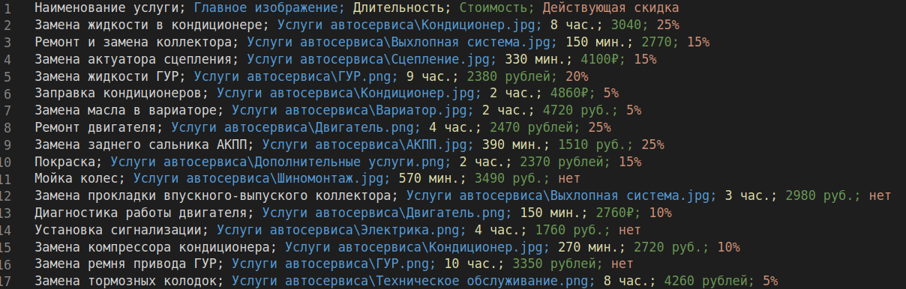

#### Плагин Edit CSV

Отображает файл в виде таблицы - удобно редактировать данные.

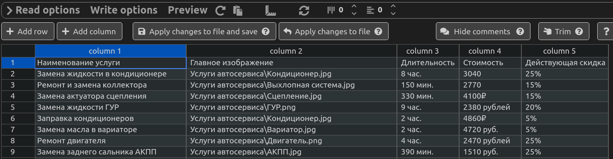


## SQL Server Management Studio

Скачайте и установите SQL Server Management Studio: https://docs.microsoft.com/ru-ru/sql/ssms/download-sql-server-management-studio-ssms?view=sql-server-ver15

1. Подключение к серверу

    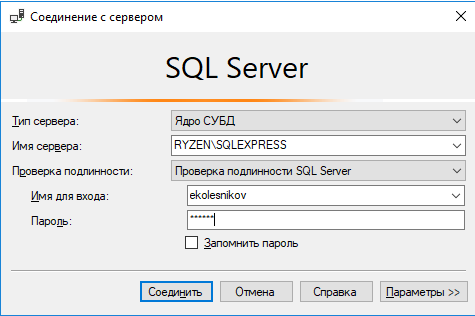

* Тип сервера: **ядро СУБД**
* Имя сервера: открываем выпадающий список, выбираем *Browse for more*, переходим на закладку *Network Servers*. Должен найтись сервер **SERVER253/SQLEXPRESS**
* Проверка подлинности
    * локальный (проверка подлинности Windows)
    * удаленный (проверка подлинности SQL Server / логин + пароль)

2. Создание баз

    На курсах учат создавать SQL-запросами, посмотрим...

    Откройте новое окно редактирования SQL-запросов:

    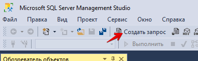

    Пример SQL-запроса создания таблицы:

    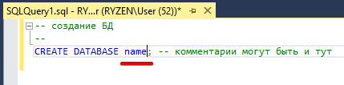

    **Ограничения и соглашения:**

    * служебные слова (в нашем случае CREATE DATABASE) пишутся большими буквами.
    * названия объектов пишутся одним словом (в нашем случае *name*) в *паскаль стиле* (все слова с большой буквы) или *CamelCase*
    * первым символом объекта не может быть цифра

    >Обращайте внимание на расцветку кода: в примере название БД *name* подсвечено синим - это означает, что это служебное слова

    **Выполнение запроса:**

    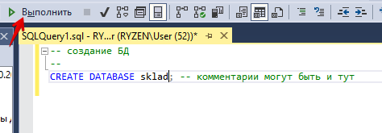

    В окне *Сообщения* должно появиться "Выполнение команд успешно завершено" и наша база появится в *обозревателе объектов* (нужно обновить)

    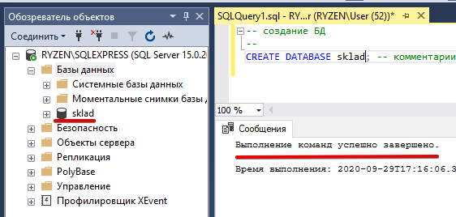

    **Создание таблиц:**

    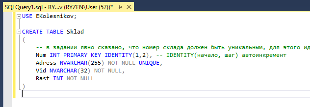

    * команда *USE* указывает в какой БД мы создаем таблицу
    * не забываем про **N**VARCHAR
    * 80 символов
    * один оператор в строке
    * отступы
    * не рекомендуется в названиях использовать множественное число

    **Редактирование средствами *Management Studio*:**

    В контекстном меню таблицы выберите *Проект*

    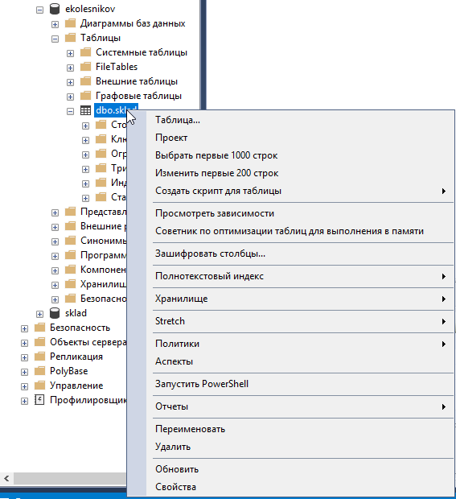

    Можем менять/добавлять поля таблицы

    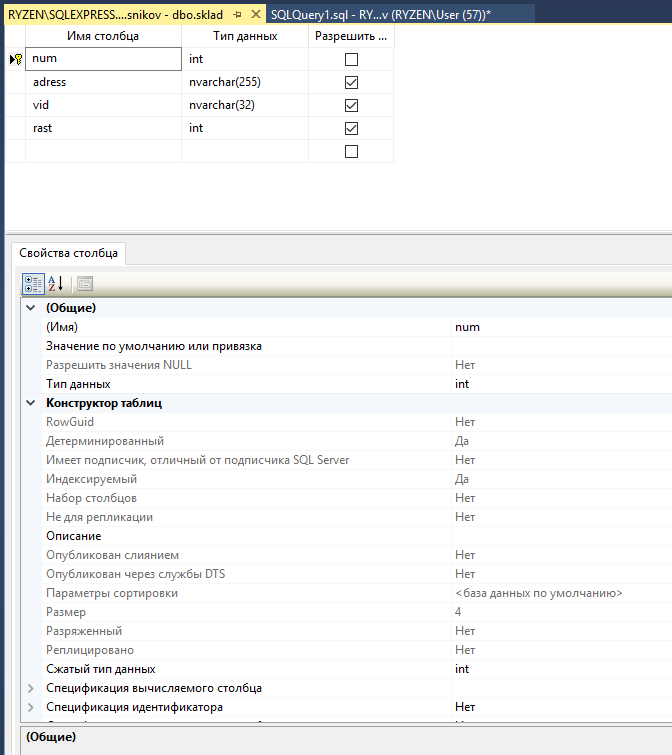

    *Изменить первые 200 строк* позволяет вручную добавить данные

    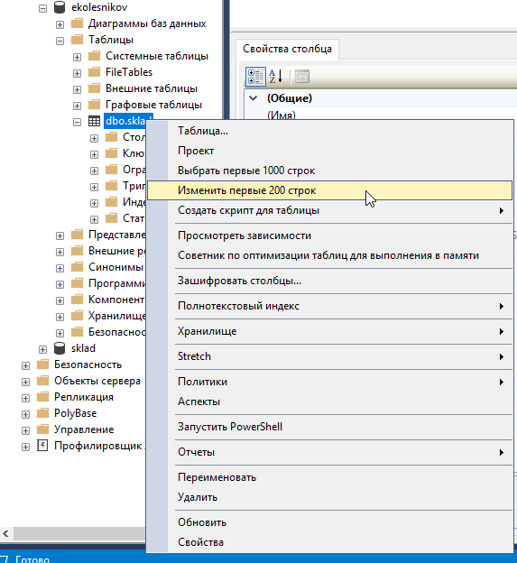

    **Изменение базы данных SQL-запросом:**

    Добавление поля:

    ```sql
    USE EKolesnikov;

    ALTER TABLE Sklad
	    ADD Prim NVARCHAR(256);
    ```

    Удаление поля: 

    ```sql
    USE EKolesnikov;

    ALTER TABLE Sklad
	    DROP COLUMN Prim;
    ```

    **Импорт/экспорт данных:**

    В контекстном меню **базы данных** *Задачи -> Импорт данных*

    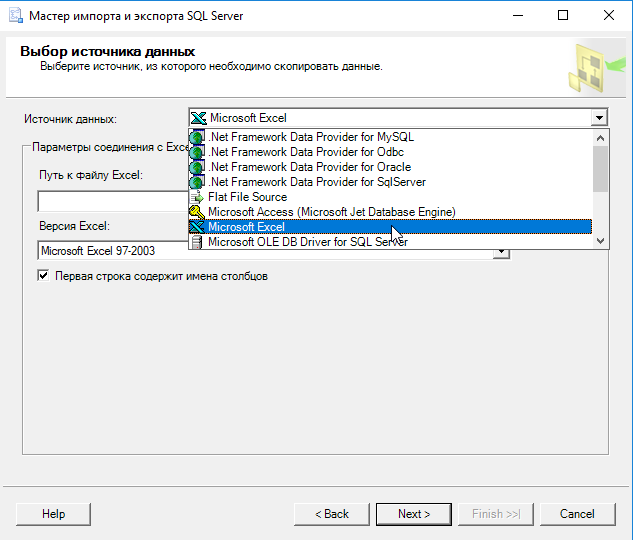

    Выберите файл с данными и, в зависимости от наличия заголовков в файле, установите или снимите "галочку" *Первая строка содержит имена столбцов*

    //TODO разобраться с импортом из Excel

    **Импорт неструктурированных данных**

    Тут все просто

    >на курсах не рекомендуют менять типы данных в мастере импорта. Менять позже в проекте.

    **Экспорт в SQL-скрипт**

    В контекстном меню БД *Задачи -> Сформировать скрипты*

    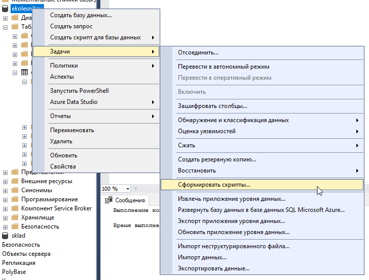

    Можно экспортировать как всю БД целиком, так и отдельные таблицы

    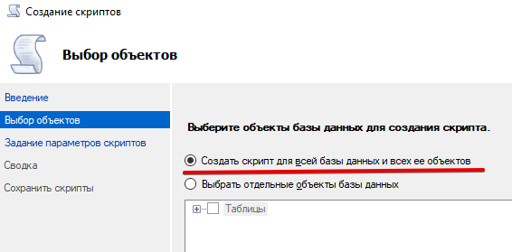

    Выбираем пункт *Сохранить как файл скрипта*, меняем, еси надо расположение и имя файла, и жмем *дополнительно*

    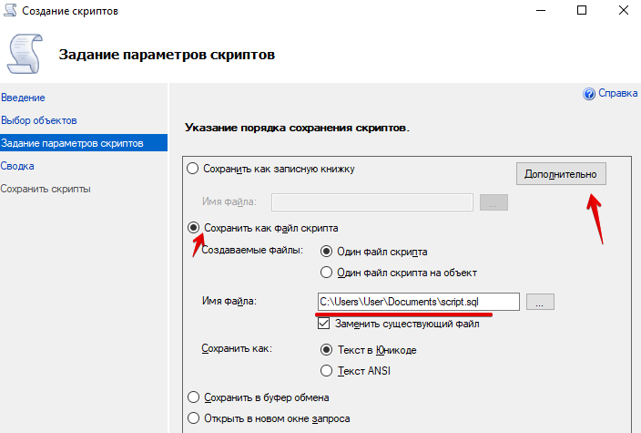

    В параметре *Типы данных для внесения в скрипт* обязательно выбираем *схема и данные*

    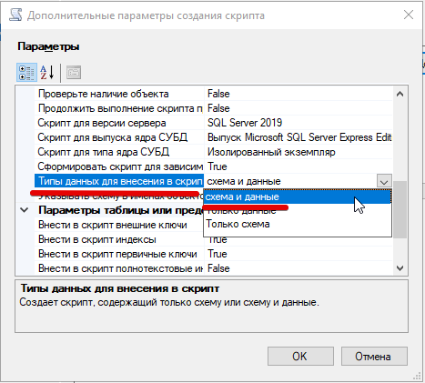

    Дальше все по-умолчанию.

    **Восстановление из SQL-скрипта**

    В проводнике просто запустить скрипт - он откроется в SQL-htlfrnjht Management Studio и его можно выполнить (только нужно убедиться что нет базы с таким именем)

    **Бэкап (резервная копия)**

    В контекстном меню БД *Задачи -> Создать резервную копию*

    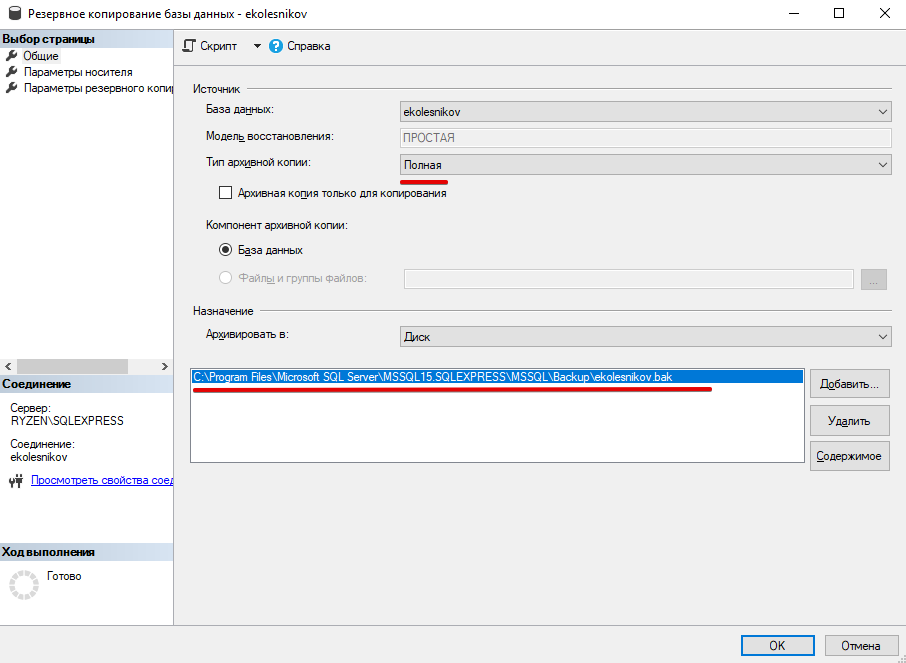

    >Путь к бэкапу поменять нельзя, причем путь указан для сервера, а не для локальной машины.

    Восстановление бэкапа аналогично: *Задачи -> Восстановить -> Базу данных*

## Программирование

### Установка Microsoft Visual Studio 2019 Community Edition

Скачайте и установите [Microsoft Visual Studio 2019 Community Edition](https://visualstudio.microsoft.com/ru/vs/community/)

>Устанавливать нужно только "Классические приложения .NET"


### Расшифровка скринкаста:

Как уже говорилось выше, разрабатывать оконные приложения мы будем на C#, но у Microsoft есть несколько технологий для этого:

1. Фреймворки для создания оконных приложений:
    * **Windows Forms** - разработка "классических" приложений Windows (а-ля XP), считается устаревшей
    * **WPF** (Window Presentation Foundation) - основной фреймворк, на котором мы дальше и будем работать
    * **UWP** (Universal Windows Platform) - вроде как "последний писк", рассчитанный на разработку универсальных приложений под Windows Phone, Windows 8 и.т.д

2. Запустите *Microsoft Visual Studio* (MVS) и создайте новое приложение:

    Тип приложения WPF (.NET Framework)

    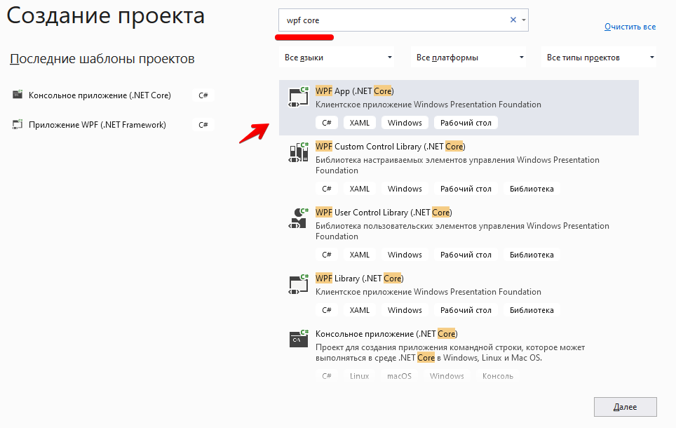

    При создании задаете *Имя проекта* и, если нужно, *Расположение*. Остальные параметры оставляем по-умолчанию.

3. Обзор MVS и структура проекта:

    По-умолчанию IDE MVS разбито на 3 части:

    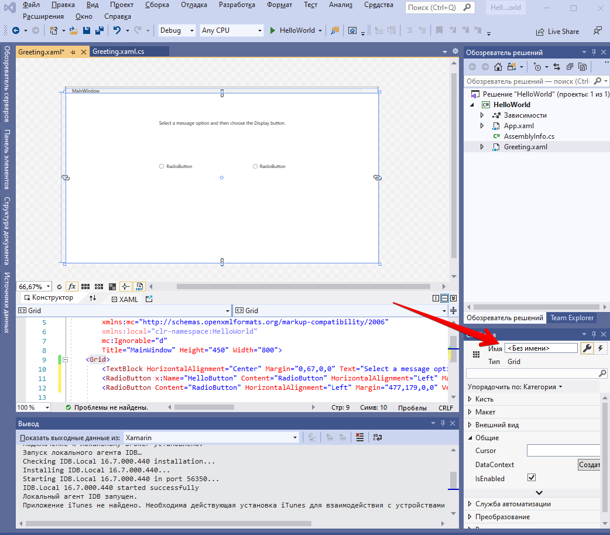

    * слева *панель элементов* - список визуальных элементов (кнопки, токстовые поля и т.п.)
    * в центре основное окно, предназначенное для редактирования исходного кода. При отображении файлов XAML (читается как "замл") разбито на две части: визуальное отображение и текст разметки
    * справа *Обозреватель решений* и структура проекта: Properties (Свойства); Ссылки (Зависимости); App.config - настройки проекта; App.xaml - разметка проекта и MainWindow.xaml - разметка окна.

    Если каких-то панелей нет на экране, то можно их найти в меню **Вид**.

4. Основные типы файлов проекта:

    * **.XAML** eXtended Application Markup Languale - язык разметки, очень похож на XML
    * **.cs** - файлы с исходным кодом на C#

5. Окно свойств

    Свойства элементов можно задавать прямо в файле XAML, но можно использовать **Окно свойств**, которое включается из меню *Вид* - *Окно свойств*. 
   
6. Визуальные элементы

    Для добавления элемента на форму достаточно перетащить его мышкой из *Панели инструментов* (например, кнопку)

    

    Обратите внимание, элемент появляется и на форме и в разметке XAML.

    Размеры, положение и другие свойства окна и любых его компонентов можно менять несколькими способами:

    * непосредственно в окне визуального редактора - подходит только для грубого позиционирования;
    * в разметке XAML - наиболее быстрый способ
    * в свойствах элемента - если не помните название свойства

    >Сейчас модно делать "адаптивную" верстку, когда контент (содержимое) подстраивается под размер окна. Но, естественно, есть минимальный размер окна, при котором компоненты еще помещаются и маньше которого смысла менять нет. Хорошим тоном считается задать минимальные размеры окна:
    >
    >```xml
    ><Window 
    >   ...
    >   Title="MainWindow" Height="450" Width="800" 
    >   MinHeight="400" MinWidth="500">

    Кроме самого элемента на форме отображаются еще какие-то линии с цифрами - это расстояние до края окна (границы) и выравнивание

    ```xml
    <Grid>
        <Button Content="Button" 
            HorizontalAlignment="Left" 
            Margin="335,169,0,0" 
            VerticalAlignment="Top" 
            Width="75"/>
    </Grid>
    ```

7. Grid

    Пока поведение наших элементов не отличается от аналогичных в Windows Forms, они привязаны к границам формы, что затрудняет масштабирование окна.

    В WPF для автоматизации разметки используется Grid (сетка):

    Удалите кнопку, кликните по слову Grid и в окне свойств добавьте 3 колонки:

    

    

    ширину колонок можно поменять в визуальном редакторе (перетащив за треугольники вверху окна) или добавив аттрибут *Width* в элемент *ColumnDefinition*

    В размете увидим что-то подобное:

    ```xml
    <Grid.ColumnDefinitions>
        <ColumnDefinition Width="33*"/>
        <ColumnDefinition Width="41*"/>
        <ColumnDefinition Width="25*"/>
    </Grid.ColumnDefinitions>
    ```

    Обратите внимание, в значении аттрибута *Width* используется звездочка - это признак того, что размеры ячеек сетки вычисляются динамически, т.е. весовой коэффициент. Можно убрать звездочку, тогда размер ячейки будет фиксирован и не изменится при изменении размеров окна. 

    Такм образом удобно зафиксировать панель для кнопок, а последнюю колонку оставить со звездочкой, тогда она будет занимать все свободное место.

    ```xml
    <Grid.ColumnDefinitions>
        <ColumnDefinition Width="60"/>
        <ColumnDefinition Width="300"/>
        <ColumnDefinition Width="1*"/>
    </Grid.ColumnDefinitions>
    ```

    Добавим для эксперимента несколько цветных прямоугольников в сетку:

    

    Все прямоугольники попали в первую колонку и наложились друг на друга. Чтобы расположить элемент в конкретную ячейку нужно добавить аттрибут Grid.Column="номер колонки" (по-умолчанию он равен 0, поэтому все элементы и рисуются в первой колонке)

    Теперь добавим в разметку несколько кнопок:

    ```xml
        ...
        <Button Content="Настройки"/>
        <Button Content="Выход"/>
    </Grid>
    ```

    Мы обнаружим, что мало того, что кнопки рисуются в одной ячейке сетки, но они еще и занимают всю ячейку целиком. 
    
    Нам такое поведение не нужно. Можно задать фиксированные размеры кнопок, но это не наш метод (будут косяки при масштабировании).
    
8. StackPanel

    Для автоматического выстраивания элементов есть элемент StackPanel. По умолчанию элементы выстриваются по вертикали (при этом высота элемента определяется его содержимым, а ширина по прежнему по размеру родителя), но можно выстроить и по горизонтали, за это отвечает аттрибут *Orientation*.

    Элемент StackPanel по-умолчанию выравнивается по верхнему краю родителя, можно поменять выравнивание используя аттрибут *VerticalAlignment*

    

    Тут нужно учитывать, что не кнопки (или другие элементы) внутри *StackPanel* смещаются вниз, а сам элемент *StackPanel* позиционируется относительно родителя.

9. Image

    Для добавления ресурсов в проект можно создать в нем каталог (кликнуть правой кнопкой мышки на название проекта и выбрать *Добавить* - *Создать папку*) и скопировать в него нужный ресурс, в нашем случае картинку.

    >Обратите внимание, копировать нужно именно в IDE, а не средствами ОС в папку, иначе VS будет искать ресурс не в папке проекта, а в текущей папке VS.

    

    И добавим картинку в сетку (simon.png есть в этом репозитории):

    ```xml
        ...
        <StackPanel VerticalAlignment="Bottom" Background="Red">
            <Button Content="Settings"/>
            <Button Content="Exit"/>
        </StackPanel>
        
        <Image Source="./img/simon.png" VerticalAlignment="Top"/>
    </Grid>
    ```

    >Случайно нашли аттрибут *Grid.ColumnSpan* (есть и *RowSpan*), который позволяет разместить элемент не в одной ячейке, а "размазать" на несколько. Например, можно сделать фоновую картинку или горизонтальное меню в верхней строке (хотя для последнего скорее всего есть отдельные элементы)
    >
    >```xml
    ><Image Source="./img/simon.png" VerticalAlignment="Top" Grid.ColumnSpan="3"/>
    >```

10. Обрабока событий при клике на кнопку

    >вообще у элемента множество различных собыий, полный список можно посмотреть выбрав элемент (в нашем случае кнопку) и кликнув на кнопку "молния" в свойствах:<br/><br/>
    >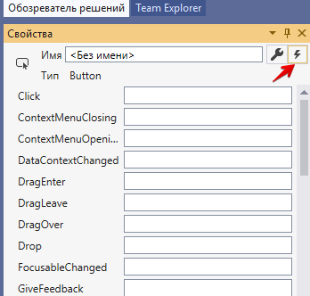

    **выход**

    Для начала нужно присвоить название кнопки, это можно сделать в свойствах:

    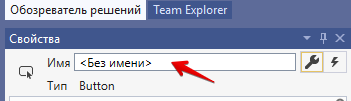

    или прямо в разметке, добавив аттрибут **Name**:

    ```xml
    <Button Name="ExitButton" Content="Exit"/>
    ```

    >Именование элементов: хорошим тоном считается называть элементы как **ДействиеТип**, в нашем случае ExitButton

    Для добавления события есть несколько вариантов:
    * в окне свойств два раза кликнуть по полю события *Click*;
    * в разметке набрать *Click=""* и выбрать существующий обработчик или создать новый
    * для создания события *Click* достаточно просто сделать двойной клик по нужной кнопке

    В результате в файле с кодом (MainWindow.xaml.cs) будет создан обработчик события:

    ```cs
    private void ExitButton_Click(object sender, RoutedEventArgs e)
    {

    }
    ```

    И в него нужно добавить метод завершения приложения:

    ```cs
    Application.Current.Shutdown();
    ```

    ---

    **Настройки**

    При клике по кнопке *настройки* мы хотим открыть окно настроек. Для этого мы сначала должны добавить в проект это окно: в *обозревателе решений* кликаем правой кнопкой по названию **проекта**, добавляем окно WPF

    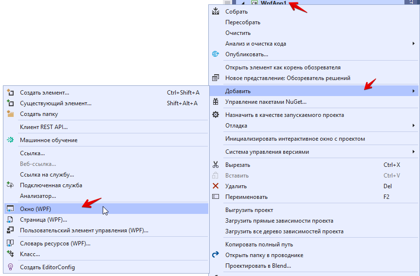

    и задаем его название, например **SettingsWindow**

    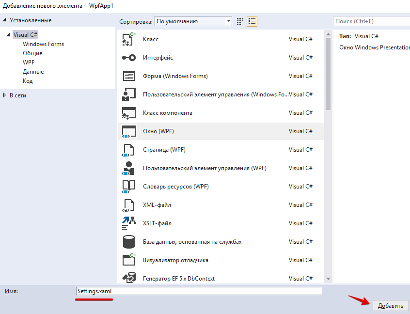

    Возвращаемся в разметку главного окна, задаем название кнопке "Настройки" (SettingsButton), создаем двойным кликом обработчик и добавляем в него создание и показ нового окна:

    ```cs
    private void SettingsButton_Click(object sender, RoutedEventArgs e)
    {
        var w = new SettingsWindow();
        w.Show();
    }
    ```

    Если мы запустим приложение и понажимаем на кнопку *Настройки*, то обнаружим, что новое окно создается при каждом нажатии. Это не совсем то что мы ожидали. Нам нужно *модальное* окно, которое не дает менять фокус на другое окно приложения. 

    Для создания *модальных* окон есть метод **ShowDialog()**

11. Фирменный стиль

    В заданиях WorldSkills и в Демо-экзамене в частности есть требование о соблюдени фирменного стиля. 

    Для создания стиля нужно открыть разметку приложения (App.xaml)

    И в тег ``<Application.Resources>`` добавить стили, например:

    ```xml
    <Application.Resources>
        <Style TargetType="Button">
            <Setter Property="Background" Value="Brown"/>
        </Style>     
    </Application.Resources>
    ```

    , где:

    * **TargetType** - тип элемента, которому задаем стиль. В нашем случае кнопкам;
    * **Property** - свойство, которое меняем
    * **Value** - значение

    Теперь у всех **Кнопок** в нашем приложении **фон** будет коричневым.

    Таким образом мы можем менять любое свойство элементов.

    Но что, если нужно задать стиль не всем кнопкам, а только некоторым?

    Для этого стилю нужно задать аттрибут ``x:Key``:

    ```xml
    <Style TargetType="Button" x:Key="BrownButtonStyle">
    ...
    ```

    и назначить этот стиль нужным элементам:

    ```xml
    <Button Name="ExitButton" Content="Exit" Click="ExitButton_Click"
                    Style="{StaticResource BrownButtonStyle}"/>
    ```

    Обратите внимание, мы указываем не просто название стиля, а выражение в фигурных скобках. Фигурные скобки означают, что внутри не фиксированное значение, а вычисляемое. В нашем случае указание получить статичный ресурс с указанным названием.

    >Небольшая разминка:
    >
    >Grid сразу ассоциируется с игрой пятнашки - попробуем сделать.
    >
    >**Во-первых**, создайте приложение с сеткой 4х4
    >
    >**Во-вторых**, рисовать одинаковые кнопки вручную для *тру* программистов моветон - создадим динамически:
    >
    >```c#
    >public MainWindow()
    >{
    >   InitializeComponent();
    >   for(int i = 0; i < 15; i++)
    >   {
    >       var b = new Button();
    >       b.Content = i+1;
    >       b.Click += Button_Click;
    >       Grid.SetRow(b, i / 4);
    >       Grid.SetColumn(b, i % 4);
    >       MainGrid.Children.Add( b );
    >   }
    >}
    >```
    >
    >Обратите внимание, в С# обработчик события в коде назначется через "+=": ``b.Click += Button_Click;``. Здесь *Button_Click* - существующий обработчик клика по кнопке.
    >
    >У элементов нет свойства *Grid*, для назначения позиции в сетке нужно пользоваться *Grid.SetRow(элемент, номер строки)* и *Grid.SetColumn(элемент, номер столбца)*. Здесь *Grid* это не название какого-то конкретного элемента, а название класса.
    >
    >*MainGrid.Children.Add( b );* а вот тут мы добавляем элемент в конкретный элемент *MainGrid* (он у меня так назван в xaml) 
    >
    >И, **в-третьих**, реализуем обработчик клика по кнопке:
    >
    >```c#
    >private void Button_Click(object sender, RoutedEventArgs ev)
    >{
    >   // определяем позицию в сетке кнопки, по которой кликнули 
    >   var x = Grid.GetColumn(sender as UIElement);
    >   var y = Grid.GetRow(sender as UIElement);
    >
    >   // теперь осталось только проверить есть ли рядом пустые ячейки и методами Grid.SetColumn и Grid.SetRow переместить кнопку. Это будет задание на дом.
    >}
    >```
    >
    >Все элементы сетки находятся в коллекции *Children*, перебрать ее можно с помощью **foreach**:
    >
    >```c#
    >foreach(Button element in MainGrid.Children)
    >{
    >   //тут пишете код 
    >}
    >```

### Расшифровка скринкаста ч2

//TODO добавить скринов

12. Binding (привязка)

    Можно привязать атрибуты одного элемента к значениям другого, а также к публичным свойствам и методам классов C# (об этом чуть позже). Для привязки служит ключевое слово **Binding**.

    Добавим в *StackPanel* слайдер (ползунок), задав ему название, минимальное и максимальное значения:

    ```xml
    <Slider 
        Minimum="10" 
        Maximum="100" 
        Name="MySlider"/>
    ```

    И в заголовке окна (Title) вместо MainWindow напишем следующее:

    ```xml
    Title="{Binding Value, ElementName=MySlider}"
    ```

    Здесь, вместо фиксированного значения мы вставляем вычисляемое выражение, где *Binding* означает привязку к аттрибуту *Value* у элемента с названием *MySlider*. 
    
    Таким образом мы можем привязать любой атрибут (в скринкасте слайдером меняют размер шрифта у кнопки).

    В качестве источника данных для вычисляемых атрибутов могут быть не только ресурсы, но и публичные свойства и методы классов C#.

    В **MainWindow.xaml.cs** добавим переменную:

    ```cs
    // объявляем переменную
    public float MyNumberValue { get; set; } = 55;

    public MainWindow()
    {
        InitializeComponent();

        // эту конструкцию нужно просто запомнить без нее разметка не 
        // увидит переменные нашего класса
        this.DataContext = this;
    }
    ```

    И в разметке, вместо заголовка окна сделем привязку к этой переменной:

    ```xml
    Title="{Binding MyNumberValue}"
    ```

    Чтение свойств работает, но таким образом можно и записывать даные в свойства. 

    Добавьте в слайдер атрибут:

    ```xml
    Value="{Binding MyNumberValue}"
    ```

    При запуске приложения и перемещении ползунка слайдера значение *MyNumberValue* меняется, но мы этого в заголовке не видим. Дело в том, что по-умолчанию приложение не опрашивает постоянно значение привязанных свойств. Чтобы это сделать, нужно в классе **MainWindow** реализовать интерфейс *INotifyPropertyChanged*:

    После добавления интерфейса IDE нас предупредит, что для этого интерфеса нет реализации - добавляем:

    >Интерфейс *INotifyPropertyChanged* определен в пространстве имен *System.ComponentModel*, если оно еще не подключено, то добавьте в заголовке using System.ComponentModel;

    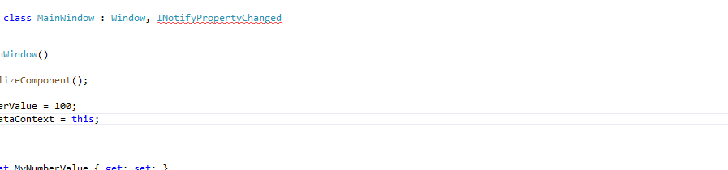

    в классе у нас появится событие
    
    ```cs
    public event PropertyChangedEventHandler PropertyChanged;
    ```

    И, чтобы все привязанные объекты узнали что свойство изменилось, реализуем геттер и сеттер для нашего свойства:

    ```cs
    private float _myNumberValue = 100;

    public float MyNumberValue {
        get
        {
            return _myNumberValue;
        }
        set {
            _myNumberValue = value;
            PropertyChanged(this, new PropertyChangedEventArgs("MyNumberValue"));
        } 
    }
    ```

    Можно привязать это свойство к произвольному количеству визуальных элементов и все они будут меняться при изменнии свойства.

    >Добавьте кнопке привязку атрибута *Height* к этому свойству.


13. Навигация

    >Реализуется аналог проводника - при клике на каталог отобразить в соседнем окне его содержимое.

    Добавим в третью колонку компонент Frame:

    ```xml
        <Frame x:Name="MainFrame" 
            Grid.Column="2" 
            Background="GreenYellow"/>
    </Grid>
    ```

    **Frame** - это компонент, который позволяет перемещаться между страницами, созданными в проекте.

    Для хранения страниц создадим отдельный каталог **Pages** (обратите внимание: не стоит давать каталогам имена классов), как мы это делали для каталога с картинками.

    И создадим в нем страницу **MainPage**:

    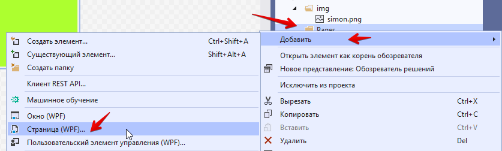

    В резметке созданной страницы (MainPage.xaml) добавим заливку:

    ```xml
    ...
    Title="MainPage" Background="Yellow">
    ...
    ```

    И в конструкторе главного окна создадим эту страницу:

    ```cs
    public MainWindow()
    {
        InitializeComponent();
        this.DataContext = this;
        MainFrame.Navigate( new MainPage() );
    }
    ```

    Запустив приложение увидим, что фон третей колонки стад желтый, значит там отображатеся наша страница.

    Но главная фишка фрейма в том, что он позволяет отображать несколько страниц, храня историю (как в браузере).

    Создайте еще одну страницу, SettingsPage с другим фоном.

    И в обработчике *SettingsButton_Click*, вместо создания отдельного окна, создайте страницу:

    ```cs
    private void SettingsButton_Click(object sender, RoutedEventArgs e)
    {
        //var w = new SettingsWindow();
        //w.ShowDialog();
        MainFrame.Navigate(new SettingsPage());
    }
    ```

    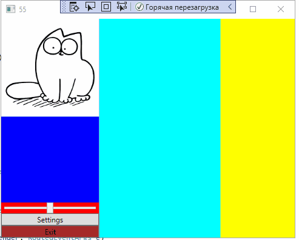

    Вверху элемента **Frame** появляются кнопки навигации, но нам они могут не подходить по дизайну.

    Для начала добавьте в StackPanel две кнопки: "Вперед" и "Назад" для реализации ручной навигации.

    В обрабочиках события Click этих кнопок напишите:

    ```cs
    private void BackButton_Click(object sender, RoutedEventArgs e)
    {
        if(MainFrame.CanGoBack)
            MainFrame.GoBack();
    }

    private void ForwardButton_Click(object sender, RoutedEventArgs e)
    {
        if(MainFrame.CanGoForward)
            MainFrame.GoForward();
    }
    ```

    >Перед навигацией проверяем есть ли куда переходить, если этого не делать, то произойдет исключение.

    А во Frame добавить атрибут NavigationUIVisibility="Hidden"

    ```xml
    <Frame x:Name="MainFrame" 
        Grid.Column="2" 
        Background="GreenYellow" 
        NavigationUIVisibility="Hidden"/>
    ```

14. ListView

    Для отображения списка служит элемент ListView (напоминаю, что мы рисуем эмулятор проводника и сейчас нам нужен список каталогов/приложений)

    Сначала в классе создадим данные для этого списка:

    ```cs
    private List<string> _myElements = new List<string>();

    public List<string> MyElements
    {
        get { return _myElements; }
        set { _myElements = value; }
    }

    public MainWindow()
    {
        InitializeComponent();
        _myElements.Add("Word");
        _myElements.Add("Excel");
        _myElements.Add("Powerpoint");
        _myElements.Add("Visio");
        ...
    ```

    Затем в верстку добавим элемент **ListView**:

    ```xml
    <ListView 
        x:Name="MainListView" 
        Grid.Column="1" 
        ItemsSource="{Binding MyElements}"/>
    ```

    ,где атрибут *ItemsSource* привязан к данным приложения.

    Можно изменить отображение элементов списка, для этого нужно реализовать внутри тега ListView шаблон:

    ```xml
    <ListView x:Name="MainListView" 
        Grid.Column="1" 
        ItemsSource="{Binding MyElements}">
        <ListView.ItemTemplate>
            <DataTemplate>
                <Label Content="{Binding}" 
                    Background="Beige"/>
            </DataTemplate>
        </ListView.ItemTemplate>
    </ListView>
    ```

    Вместо элемента **Label** можно использовать и другие, например **Button**

    Обратите внимание, тег *DataTemplate* может содержать только один дочерний элемент. Поэтому если кроме Label (или Button) мы хотим показать еще что-то (иконку, например), то мы должны добавить контейнер, который позволяет добавлять потомков, например, *StackPanel*.

    ```xml
    <DataTemplate>
        <StackPanel Orientation="Horizontal">
            <Label Content="Название"/>
            <Label Content="{Binding}" 
                Background="Beige"/>
        </StackPanel>
    </DataTemplate>
    ```

    Теперь обработаем событие выбора элемента списка. Для начала создайте страницу **ApplicationPage** с содержимым:

    ```xml
    <Grid>
        <Label Name="ApplicationLabel" 
            Content="NoName"/>
    </Grid>
    ```

    В эдемент ListView (на главном экране) добавьте обрабочик события: 
    
    ```xml
    SelectionChanged="MainListView_SelectionChanged"
    ```

    И в обработчике события напишем:

    ```cs
    var item = (sender as ListView).SelectedItem;
    var appPage = new ApplicationPage();
    appPage.ApplicationLabel.Content = item;
    MainFrame.Navigate( appPage );
    ```

    Тут мы вынуждены запоминать экземпляр *ApplicationPage* (appPage) и менять его свойства (в нашем случае содержимое элемента ApplicationLabel). Хотя это работает, но архитектурно это не верно.

    Поправим конструктор **ApplicationPage**:

    ```cs
    public ApplicationPage(string name)
    {
        InitializeComponent();
        ApplicationLabel.Content = name;
    }
    ```

    И исправим содержимое метода *MainListView_SelectionChanged*:

    ```cs
    private void MainListView_SelectionChanged(object sender, SelectionChangedEventArgs e)
    {
        MainFrame.Navigate(
            new ApplicationPage(
                (sender as ListView).SelectedItem as string
        ));
    }
    ```

### Расшифровка скринкаста ч3 (ORM)

ORM (Object-Relational Mapping) – технология программирования, которая связывает базы данных с концепциями объектно-ориентированных языков программирования, создавая «виртуальную объектную базу данных»

Сначала в *Management Studio* запоминаем как называется наш сервер:

В контекстном меню **сервера** выбираем *свойства* 

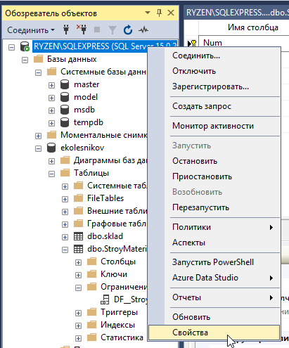

и запоминаем **имя** сервера

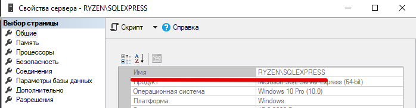


Подключаем БД:

1. Кликаем правой кнопкой мыши по названию проекта и выбираем пункты *Добавить -> Создать элемент*

    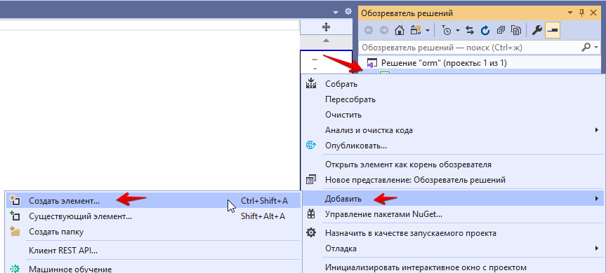

2. Выбираем в разделе *Данные* элемент *Модель ADO.NET EDM*, не забывая отредактировать *имя* модели:

    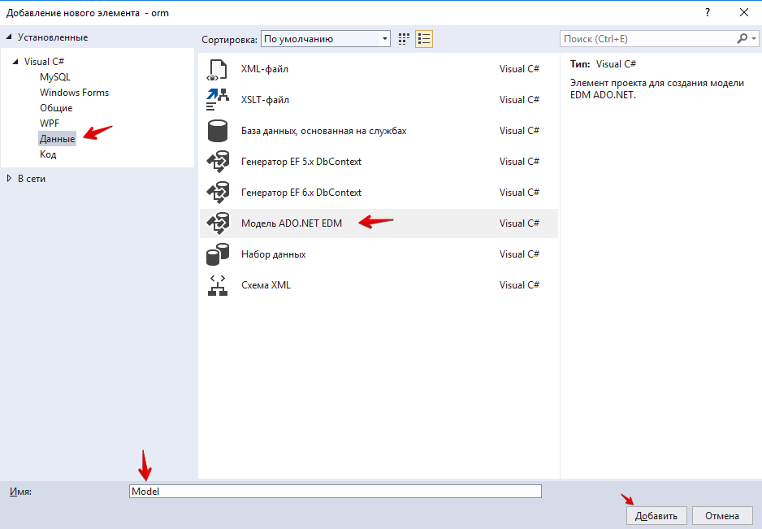

    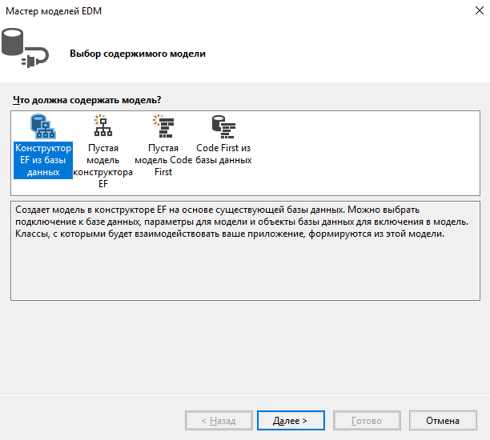

    Далее выбираем источником данных *Microsoft SQL Server*

    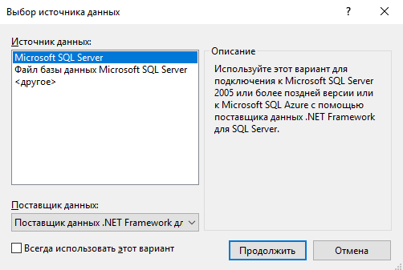

3. В мастере моделей *создаем соединение*

    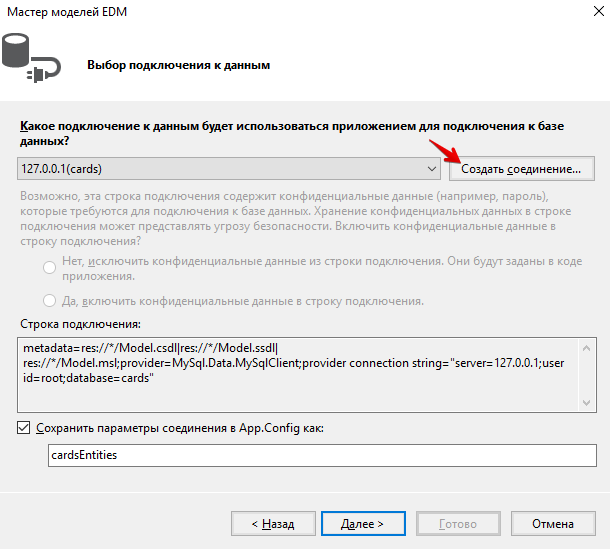

    **Имя сервера** вставляем то, которое запомнили в Management Studio 

    **Проверка подлинности** *SQL Server*

    Имя и пароль вам выдавали в начале курса.

    **Проверяем подключение**, если все нормально, то выбираем свою базу данных (должна быть та же что и логин).

    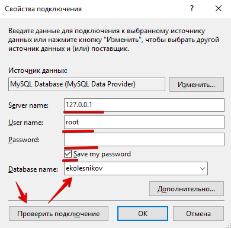

    Ставим галочку "Да, включить конфиденциальные данные в строку подключения".

4. После выбора подключения мастер спросит какие объекты базы данных нам нужны, выбираем нужные таблицы (sklad, stroy_material)

    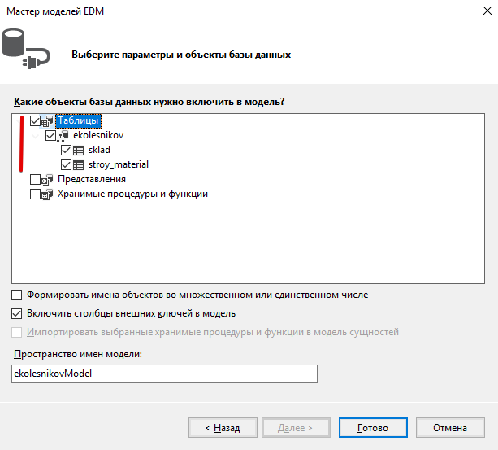

5. При формировании модели система может выдать предупреждения, что скрипт может быть потенциально вредоносным - соглашаемся.

После формирования модели отобразится диаграмма и создадутся файлы модели:

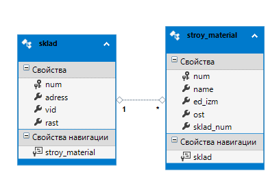

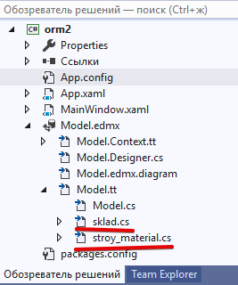

>Если в процессе разработки вы что-то измените в структуре БД, то заново модель создавать не нужно, а просто в модели кликнуть правой кнопкой мыши и *Обновить модель из базы данных*

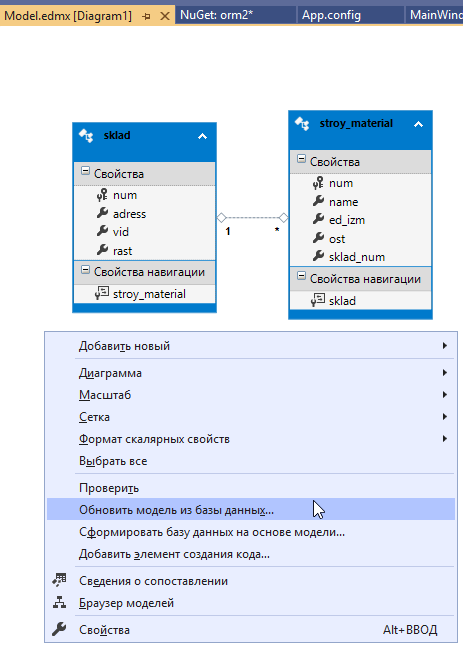


Подробнее о C# https://metanit.com/sharp/tutorial/
